# 🌐 AI Landscape - Complete Overview

## 📑 Table of Contents

| # | Section | Description |
|---|---------|-------------|
| 1 | [AI History Timeline](#1-ai-history-timeline-1950-2025) | Complete AI evolution journey |
| 2 | [AI Domain Hierarchy](#2-ai-domain-hierarchy) | AI → ML → DL → GenAI tree |
| 3 | [Generative AI Ecosystem](#3-generative-ai-ecosystem) | Models, tools, databases, apps |
| 4 | [AI/ML Job Roles](#4-aiml-job-roles-hierarchy) | Career paths in AI |
| 5 | [ML Types & Algorithms](#5-ml-types--algorithms) | Supervised, Unsupervised, RL |
| 6 | [Deep Learning Architectures](#6-deep-learning-architectures) | CNN, RNN, Transformers |
| 7 | [NLP Evolution](#7-nlp-evolution-timeline) | From rule-based to LLMs |
| 8 | [Computer Vision Tasks](#8-computer-vision-tasks) | Detection, Segmentation, Gen |
| 9 | [MLOps Pipeline](#9-mlops-pipeline) | Data → Train → Deploy → Monitor |
| 10 | [AI Tech Stack](#10-ai-tech-stack) | Languages, frameworks, tools |
| 11 | [GenAI Applications](#11-genai-application-types) | Text, Image, Code, Audio |
| 12 | [AI Ethics & Safety](#12-ai-ethics--safety) | Bias, Privacy, Alignment |
| 13 | [Learning Roadmap](#13-learning-roadmap) | Beginner to Advanced path |
| 14 | [AI Agents](#14-ai-agents-architecture) | Agentic AI architecture |
| 15 | [RAG Basics](#15-rag-retrieval-augmented-generation) | Retrieval-Augmented Generation |
| 16 | [Advanced RAG](#16-advanced-rag-patterns) | GraphRAG, Agentic RAG, Self-RAG |
| 17 | [RAG Techniques](#17-rag-evolution--techniques) | HyDE, RAPTOR, Reranking |
| 18 | [Emerging Tech](#18-emerging-ai-technologies-2024-2025) | MCP, Function Calling, Small LLMs |
| 19 | [LLM Customization](#19-llm-customization-approaches) | Prompting, RAG, Fine-tuning |
| 20 | [Multimodal AI](#20-multimodal-ai) | Vision, Audio, Video models |
| 21 | [AI Cloud Platforms](#21-ai-cloud-platforms) | AWS, GCP, Azure |
| 22 | [AI Companies & Models](#22-key-ai-companies--models) | OpenAI, Anthropic, Google, Meta |
| 23 | [LLMOps & Evaluation](#23-llmops--evaluation) | Benchmarks, Evals, Monitoring |
| 24 | [AI Security & Governance](#24-ai-security--governance) | Prompt Injection, PII, Compliance |
| 25 | [Hardware & Inference](#25-hardware--inference-stack) | GPUs, TPUs, Serving, Optimization |
| 26 | [Hybrid Search & Retrieval](#26-hybrid-search--retrieval) | BM25, Vectors, Rerankers |
| 27 | [ML Application Domains](#27-ml-application-domains) | Recommenders, Time Series, Anomaly |
| 28 | [Future Trends 2025+](#28-future-trends-2025) | AGI, Embodied AI, Neuromorphic |
| 29 | [Robotics & Control](#29-robotics--control) | SLAM, Motion Planning, ROS, Sim |
| 30 | [Classical AI](#30-classical-ai--symbolic-reasoning) | Search, Knowledge Rep, Expert Systems |
| 31 | [Probabilistic ML](#31-probabilistic-ml--bayesian-methods) | PGMs, MCMC, Gaussian Processes |
| 32 | [Speech & Audio AI](#32-speech--audio-ai) | ASR, TTS, Voice Cloning, Music Gen |
| 33 | [Distributed Training](#33-distributed-training--systems) | DeepSpeed, FSDP, ZeRO, Parallelism |
| 34 | [Model Optimization](#34-model-optimization--compilers) | XLA, TVM, ONNX, Quantization |
| 35 | [Data-Centric AI](#35-data-centric-ai) | Labeling, Weak Supervision, Feature Stores |
| 36 | [Adversarial ML](#36-adversarial-ml--robustness) | Attacks, Defenses, Model Security |
| 37 | [Privacy-Preserving ML](#37-privacy-preserving-ml) | Federated Learning, Differential Privacy |
| 38 | [Decision-Making ML](#38-decision-making-ml) | Bandits, Offline RL, Causal Discovery |
| 39 | [Explainability & XAI](#39-explainability--xai) | SHAP, LIME, Mechanistic Interp |
| 40 | [Model Calibration](#40-model-calibration--uncertainty) | Temperature Scaling, Conformal Prediction |
| 41 | [Content Provenance](#41-content-provenance--authenticity) | Watermarking, C2PA, Deepfake Detection |

---

## 1. AI History Timeline (1950-2025)


### Key Milestones Table

| Year | Event | Impact |
|------|-------|--------|
| 1950 | Alan Turing's "Computing Machinery and Intelligence" | Proposed Turing Test |
| 1956 | Dartmouth Conference | Term "Artificial Intelligence" coined |
| 1958 | Frank Rosenblatt's Perceptron | First neural network |
| 1966 | ELIZA chatbot | Early NLP conversation |
| 1969 | Minsky & Papert's "Perceptrons" | Exposed limitations → AI Winter |
| 1980 | Expert Systems (MYCIN, XCON) | Rule-based AI in industry |
| 1986 | Backpropagation popularized | Enabled training deep networks |
| 1989 | Yann LeCun's LeNet | Pioneered CNNs |
| 1997 | LSTM networks | Solved vanishing gradient |
| 1997 | IBM DeepBlue beats Kasparov | AI defeats chess champion |
| 2006 | Geoffrey Hinton's Deep Belief Networks | Sparked Deep Learning revival |
| 2012 | AlexNet wins ImageNet | CNN revolution begins |
| 2014 | GANs, Seq2Seq, Attention | Generative models emerge |
| 2016 | AlphaGo beats Lee Sedol | AI masters Go |
| 2017 | "Attention Is All You Need" | Transformer architecture |
| 2018 | BERT, GPT-1 | Pre-trained language models |
| 2020 | GPT-3 (175B params) | Few-shot learning capability |
| 2021 | DALL-E, Codex | Text-to-image, Code generation |
| 2022 | ChatGPT, Stable Diffusion | GenAI goes mainstream |
| 2023 | GPT-4, Claude, Gemini, LLaMA | Multimodal, Open-source LLMs |
| 2024 | Sora, Claude 3.5, AI Agents | Video generation, Agentic AI |
| 2025 | MCP, GraphRAG, Small LLMs | Enterprise AI, Efficient models |

---

## 2. AI Domain Hierarchy

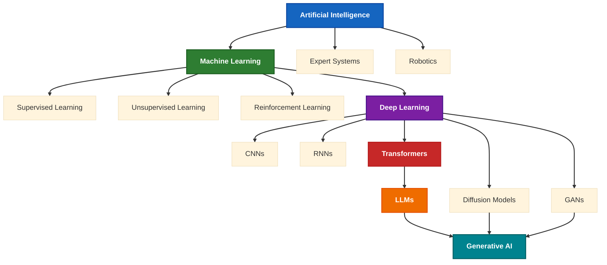

---

## 3. Generative AI Ecosystem

```mermaid
%%{init: {'theme': 'base', 'themeVariables': { 'fontSize': '14px', 'lineColor': '#333333'}}}%%
flowchart LR
    subgraph Foundation["FOUNDATION MODELS"]
        direction TB
        GPT[GPT-4]
        CLAUDE[Claude]
        LLAMA[Llama]
    end
    
    subgraph Orchestration["ORCHESTRATION"]
        direction TB
        LC[LangChain]
        LI[LlamaIndex]
    end
    
    subgraph VectorDB["VECTOR DBs"]
        direction TB
        PC[Pinecone]
        CH[ChromaDB]
    end
    
    subgraph Apps["APPLICATIONS"]
        direction TB
        RAG[RAG]
        AGENTS[Agents]
    end
    
    Foundation ==> Orchestration ==> VectorDB ==> Apps
    
    click GPT "https://platform.openai.com/docs" "OpenAI API Docs" _blank
    click CLAUDE "https://docs.anthropic.com/" "Anthropic Claude Docs" _blank
    click LLAMA "https://llama.meta.com/" "Meta Llama" _blank
    click LC "https://python.langchain.com/docs/" "LangChain Docs" _blank
    click LI "https://docs.llamaindex.ai/" "LlamaIndex Docs" _blank
    click PC "https://docs.pinecone.io/" "Pinecone Docs" _blank
    click CH "https://docs.trychroma.com/" "ChromaDB Docs" _blank
    click RAG "https://www.promptingguide.ai/techniques/rag" "RAG Guide" _blank
    click AGENTS "https://lilianweng.github.io/posts/2023-06-23-agent/" "LLM Agents Guide" _blank
    click Foundation "https://huggingface.co/models" "Foundation Models" _blank
    click Orchestration "https://python.langchain.com/" "Orchestration Frameworks" _blank
    click VectorDB "https://www.pinecone.io/learn/vector-database/" "Vector Databases" _blank
    click Apps "https://www.deeplearning.ai/short-courses/" "GenAI Applications" _blank
    
    style Foundation fill:#1565C0,stroke:#0D47A1,color:#FFFFFF
    style Orchestration fill:#2E7D32,stroke:#1B5E20,color:#FFFFFF
    style VectorDB fill:#F57C00,stroke:#E65100,color:#FFFFFF
    style Apps fill:#7B1FA2,stroke:#4A148C,color:#FFFFFF
    
    linkStyle default stroke:#333333,stroke-width:3px
```

---

## 4. AI/ML Job Roles Hierarchy

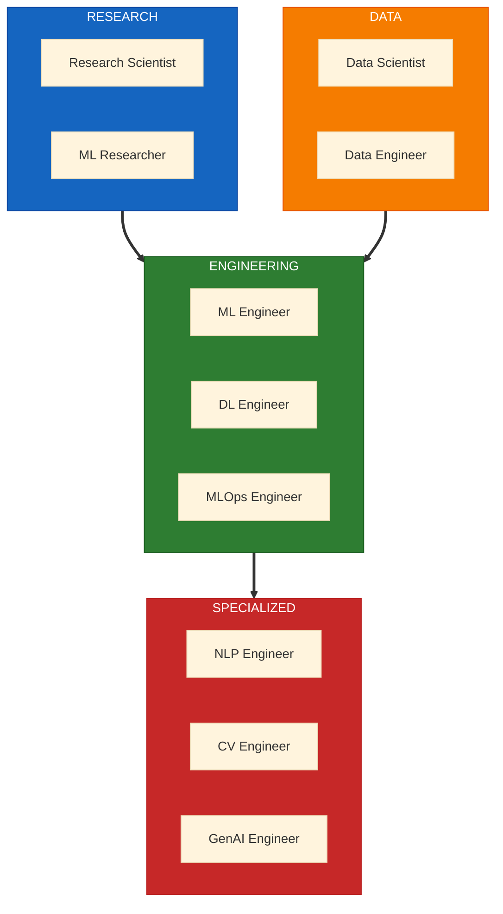

---

## 5. ML Types & Algorithms

```mermaid
%%{init: {'theme': 'base', 'themeVariables': { 'fontSize': '14px', 'lineColor': '#333333'}}}%%
flowchart TD
    ML[<b>MACHINE LEARNING</b>]
    
    ML ==> SL[<b>Supervised</b>]
    ML ==> UL[<b>Unsupervised</b>]
    ML ==> RL[<b>Reinforcement</b>]
    
    SL --> CLASS[Classification]
    SL --> REG[Regression]
    
    CLASS --> C1[Logistic Reg]
    CLASS --> C2[Random Forest]
    CLASS --> C3[SVM]
    
    REG --> R1[Linear Reg]
    REG --> R2[XGBoost]
    
    UL --> CLUST[Clustering]
    UL --> DIM[Dim Reduction]
    
    CLUST --> K1[K-Means]
    CLUST --> K2[DBSCAN]
    
    DIM --> D1[PCA]
    DIM --> D2[t-SNE]
    
    RL --> RL1[Q-Learning]
    RL --> RL2[PPO]
    
    click ML "https://scikit-learn.org/stable/" "Scikit-learn Docs" _blank
    click SL "https://scikit-learn.org/stable/supervised_learning.html" "Supervised Learning" _blank
    click UL "https://scikit-learn.org/stable/unsupervised_learning.html" "Unsupervised Learning" _blank
    click RL "https://spinningup.openai.com/" "OpenAI Spinning Up" _blank
    click CLASS "https://scikit-learn.org/stable/supervised_learning.html#classification" "Classification" _blank
    click REG "https://scikit-learn.org/stable/supervised_learning.html#regression" "Regression" _blank
    click C1 "https://scikit-learn.org/stable/modules/linear_model.html#logistic-regression" "Logistic Regression" _blank
    click C2 "https://scikit-learn.org/stable/modules/ensemble.html#forest" "Random Forest" _blank
    click C3 "https://scikit-learn.org/stable/modules/svm.html" "SVM Guide" _blank
    click R1 "https://scikit-learn.org/stable/modules/linear_model.html#ordinary-least-squares" "Linear Regression" _blank
    click R2 "https://xgboost.readthedocs.io/" "XGBoost Docs" _blank
    click CLUST "https://scikit-learn.org/stable/modules/clustering.html" "Clustering" _blank
    click DIM "https://scikit-learn.org/stable/modules/decomposition.html" "Dimensionality Reduction" _blank
    click K1 "https://scikit-learn.org/stable/modules/clustering.html#k-means" "K-Means" _blank
    click K2 "https://scikit-learn.org/stable/modules/clustering.html#dbscan" "DBSCAN" _blank
    click D1 "https://scikit-learn.org/stable/modules/decomposition.html#pca" "PCA Guide" _blank
    click D2 "https://scikit-learn.org/stable/modules/manifold.html#t-sne" "t-SNE Guide" _blank
    click RL1 "https://www.gymlibrary.dev/" "Q-Learning - Gym" _blank
    click RL2 "https://stable-baselines3.readthedocs.io/" "Stable Baselines3" _blank
    
    style ML fill:#1565C0,stroke:#0D47A1,color:#FFFFFF
    style SL fill:#2E7D32,stroke:#1B5E20,color:#FFFFFF
    style UL fill:#F57C00,stroke:#E65100,color:#FFFFFF
    style RL fill:#7B1FA2,stroke:#4A148C,color:#FFFFFF
    style CLASS fill:#43A047,stroke:#2E7D32,color:#FFFFFF
    style REG fill:#66BB6A,stroke:#43A047,color:#FFFFFF
    style CLUST fill:#FB8C00,stroke:#F57C00,color:#FFFFFF
    style DIM fill:#FFA726,stroke:#FB8C00,color:#FFFFFF
    
    linkStyle default stroke:#333333,stroke-width:2px
```

---

## 6. Deep Learning Architectures

```mermaid
%%{init: {'theme': 'base', 'themeVariables': { 'fontSize': '14px', 'lineColor': '#333333'}}}%%
flowchart TD
    DL[<b>DEEP LEARNING</b>]
    
    DL ==> CNN[<b>CNN</b>]
    DL ==> RNN[<b>RNN</b>]
    DL ==> TR[<b>Transformers</b>]
    DL ==> GEN[<b>Generative</b>]
    
    CNN --> C1[ResNet]
    CNN --> C2[VGG]
    CNN --> C3[EfficientNet]
    
    RNN --> R1[LSTM]
    RNN --> R2[GRU]
    
    TR --> T1[BERT]
    TR --> T2[GPT]
    TR --> T3[ViT]
    
    GEN --> G1[GAN]
    GEN --> G2[Diffusion]
    GEN --> G3[VAE]
    
    G2 --> SD[Stable Diffusion]
    G2 --> DALLE[DALL-E]
    
    click DL "https://pytorch.org/tutorials/" "PyTorch Tutorials" _blank
    click CNN "https://cs231n.stanford.edu/" "Stanford CS231n" _blank
    click RNN "https://colah.github.io/posts/2015-08-Understanding-LSTMs/" "Understanding LSTMs" _blank
    click TR "https://jalammar.github.io/illustrated-transformer/" "Illustrated Transformer" _blank
    click GEN "https://lilianweng.github.io/posts/2021-07-11-diffusion-models/" "Generative Models" _blank
    click C1 "https://arxiv.org/abs/1512.03385" "ResNet Paper" _blank
    click C2 "https://arxiv.org/abs/1409.1556" "VGG Paper" _blank
    click C3 "https://arxiv.org/abs/1905.11946" "EfficientNet Paper" _blank
    click R1 "https://colah.github.io/posts/2015-08-Understanding-LSTMs/" "LSTM Guide" _blank
    click R2 "https://arxiv.org/abs/1406.1078" "GRU Paper" _blank
    click T1 "https://huggingface.co/docs/transformers/model_doc/bert" "BERT on HuggingFace" _blank
    click T2 "https://huggingface.co/docs/transformers/model_doc/gpt2" "GPT-2 on HuggingFace" _blank
    click T3 "https://huggingface.co/docs/transformers/model_doc/vit" "ViT on HuggingFace" _blank
    click G1 "https://developers.google.com/machine-learning/gan" "Google GAN Tutorial" _blank
    click G2 "https://huggingface.co/docs/diffusers/" "HuggingFace Diffusers" _blank
    click G3 "https://keras.io/examples/generative/vae/" "VAE Tutorial" _blank
    click SD "https://stability.ai/" "Stability AI" _blank
    click DALLE "https://openai.com/dall-e-3" "DALL-E 3" _blank
    
    style DL fill:#1565C0,stroke:#0D47A1,color:#FFFFFF
    style CNN fill:#2E7D32,stroke:#1B5E20,color:#FFFFFF
    style RNN fill:#F57C00,stroke:#E65100,color:#FFFFFF
    style TR fill:#C62828,stroke:#B71C1C,color:#FFFFFF
    style GEN fill:#7B1FA2,stroke:#4A148C,color:#FFFFFF
    
    linkStyle default stroke:#333333,stroke-width:2px
```

---

## 7. NLP Evolution Timeline

```mermaid
%%{init: {'theme': 'base', 'themeVariables': { 'fontSize': '14px', 'lineColor': '#333333'}}}%%
flowchart LR
    subgraph Classic["1950s-1990s"]
        C1[Rule-based]
        C2[Bag of Words]
    end
    
    subgraph Statistical["2000s"]
        S1[Word2Vec]
        S2[TF-IDF]
    end
    
    subgraph Neural["2014-2017"]
        N1[Seq2Seq]
        N2[Attention]
    end
    
    subgraph Transformer["2017-2020"]
        T1[BERT]
        T2[GPT-2]
    end
    
    subgraph LLM["2020+"]
        L1[GPT-4]
        L2[Claude]
    end
    
    Classic ==> Statistical ==> Neural ==> Transformer ==> LLM
    
    click C1 "https://en.wikipedia.org/wiki/Rule-based_machine_translation" "Rule-based NLP" _blank
    click C2 "https://scikit-learn.org/stable/modules/feature_extraction.html#the-bag-of-words-representation" "Bag of Words" _blank
    click S1 "https://radimrehurek.com/gensim/models/word2vec.html" "Word2Vec Gensim" _blank
    click S2 "https://scikit-learn.org/stable/modules/feature_extraction.html#tfidf" "TF-IDF Guide" _blank
    click N1 "https://jalammar.github.io/illustrated-transformer/" "Seq2Seq Visualization" _blank
    click N2 "https://jalammar.github.io/illustrated-transformer/" "Attention Mechanism" _blank
    click T1 "https://huggingface.co/docs/transformers/model_doc/bert" "BERT Docs" _blank
    click T2 "https://huggingface.co/docs/transformers/model_doc/gpt2" "GPT-2 Docs" _blank
    click L1 "https://platform.openai.com/docs/models/gpt-4" "GPT-4 API" _blank
    click L2 "https://docs.anthropic.com/" "Claude Docs" _blank
    click Classic "https://en.wikipedia.org/wiki/Natural_language_processing#History" "Classic NLP History" _blank
    click Statistical "https://web.stanford.edu/~jurafsky/slp3/" "Statistical NLP - Jurafsky" _blank
    click Neural "https://www.deeplearning.ai/resources/natural-language-processing/" "Neural NLP" _blank
    click Transformer "https://arxiv.org/abs/1706.03762" "Transformer Architecture" _blank
    click LLM "https://www.promptingguide.ai/" "LLM Era" _blank
    
    style Classic fill:#1565C0,stroke:#0D47A1,color:#FFFFFF
    style Statistical fill:#2E7D32,stroke:#1B5E20,color:#FFFFFF
    style Neural fill:#F57C00,stroke:#E65100,color:#FFFFFF
    style Transformer fill:#C62828,stroke:#B71C1C,color:#FFFFFF
    style LLM fill:#7B1FA2,stroke:#4A148C,color:#FFFFFF
    
    linkStyle default stroke:#333333,stroke-width:3px
```

---

## 8. Computer Vision Tasks

```mermaid
%%{init: {'theme': 'base', 'themeVariables': { 'fontSize': '14px', 'lineColor': '#333333'}}}%%
flowchart TD
    CV[<b>COMPUTER VISION</b>]
    
    CV ==> IC[Classification]
    CV ==> OD[Object Detection]
    CV ==> SEG[Segmentation]
    CV ==> GEN[Generation]

    IC --> VGG[VGG]
    IC --> RES[ResNet]
    IC --> EFF[EfficientNet]
    
    OD --> YOLO[YOLO]
    OD --> RCNN[R-CNN]
    
    SEG --> UNET[U-Net]
    SEG --> DEEPLAB[DeepLab]
    
    GEN --> GANV[GANs]
    GEN --> DIFFV[Diffusion]
    
    click CV "https://www.coursera.org/learn/convolutional-neural-networks" "Stanford CV Course" _blank
    click IC "https://paperswithcode.com/task/image-classification" "Image Classification Papers" _blank
    click VGG "https://arxiv.org/abs/1409.1556" "VGG Paper" _blank
    click RES "https://arxiv.org/abs/1512.03385" "ResNet Paper" _blank
    click EFF "https://arxiv.org/abs/1905.11946" "EfficientNet Paper" _blank
    click OD "https://paperswithcode.com/task/object-detection" "Object Detection Papers" _blank
    click YOLO "https://docs.ultralytics.com/" "YOLO Ultralytics" _blank
    click RCNN "https://github.com/facebookresearch/detectron2" "Detectron2" _blank
    click SEG "https://paperswithcode.com/task/semantic-segmentation" "Segmentation Papers" _blank
    click UNET "https://arxiv.org/abs/1505.04597" "U-Net Paper" _blank
    click DEEPLAB "https://github.com/google-research/deeplab2" "DeepLab" _blank
    click GEN "https://paperswithcode.com/task/image-generation" "Image Generation Papers" _blank
    click GANV "https://arxiv.org/abs/1406.2661" "GANs Paper" _blank
    click DIFFV "https://arxiv.org/abs/2006.11239" "Diffusion Models Paper" _blank
    
    style CV fill:#1565C0,stroke:#0D47A1,color:#FFFFFF
    style IC fill:#2E7D32,stroke:#1B5E20,color:#FFFFFF
    style OD fill:#F57C00,stroke:#E65100,color:#FFFFFF
    style SEG fill:#C62828,stroke:#B71C1C,color:#FFFFFF
    style GEN fill:#7B1FA2,stroke:#4A148C,color:#FFFFFF
    
    linkStyle default stroke:#333333,stroke-width:2px
```

---

## 9. MLOps Pipeline

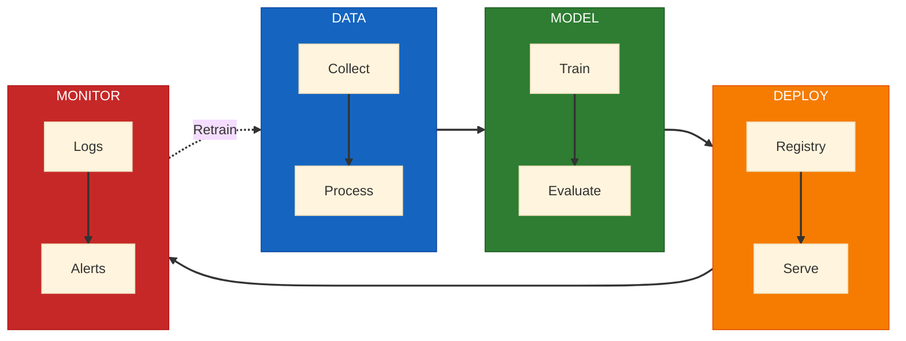

---

## 10. AI Tech Stack

```mermaid
%%{init: {'theme': 'base', 'themeVariables': { 'fontSize': '14px', 'lineColor': '#333333'}}}%%
flowchart LR
    subgraph Lang["LANGUAGES"]
        PY[Python]
        CPP[C++]
    end
    
    subgraph Frame["FRAMEWORKS"]
        PT[PyTorch]
        TF[TensorFlow]
    end
    
    subgraph LLM["LLM TOOLS"]
        LC[LangChain]
        HF[HuggingFace]
    end
    
    subgraph VDB["VECTOR DBs"]
        PC[Pinecone]
        CH[Chroma]
    end
    
    Lang ==> Frame ==> LLM ==> VDB
    
    click Lang "https://www.python.org/" "Programming Languages" _blank
    click Frame "https://pytorch.org/" "ML Frameworks" _blank
    click VDB "https://www.pinecone.io/" "Vector Databases" _blank
    click PY "https://python.org/" "Python.org" _blank
    click CPP "https://isocpp.org/" "C++ Standard" _blank
    click PT "https://pytorch.org/docs/" "PyTorch Docs" _blank
    click TF "https://www.tensorflow.org/tutorials" "TensorFlow Tutorials" _blank
    click LC "https://python.langchain.com/docs/" "LangChain Docs" _blank
    click HF "https://huggingface.co/docs" "HuggingFace Docs" _blank
    click PC "https://docs.pinecone.io/" "Pinecone Docs" _blank
    click CH "https://docs.trychroma.com/" "ChromaDB Docs" _blank
    
    style Lang fill:#1565C0,stroke:#0D47A1,color:#FFFFFF
    style Frame fill:#2E7D32,stroke:#1B5E20,color:#FFFFFF
    style LLM fill:#F57C00,stroke:#E65100,color:#FFFFFF
    style VDB fill:#7B1FA2,stroke:#4A148C,color:#FFFFFF
    
    linkStyle default stroke:#333333,stroke-width:3px
```

---

## 11. GenAI Application Types

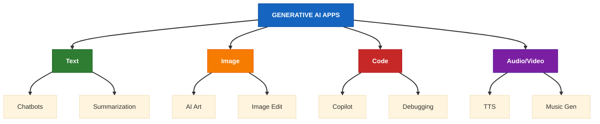

---

## 12. AI Ethics & Safety

```mermaid
%%{init: {'theme': 'base', 'themeVariables': { 'fontSize': '14px', 'lineColor': '#333333'}}}%%
flowchart TD
    ETHICS[<b>AI ETHICS & SAFETY</b>]
    
    ETHICS ==> BIAS[<b>Bias/Fairness</b>]
    ETHICS ==> PRIV[<b>Privacy</b>]
    ETHICS ==> TRANS[<b>Transparency</b>]
    ETHICS ==> SAFE[<b>Safety</b>]
    
    BIAS --> B1[Data Bias]
    BIAS --> B2[Algo Bias]
    
    PRIV --> P1[Federated Learning]
    PRIV --> P2[Anonymization]
    
    TRANS --> TR1[Explainable AI]
    TRANS --> TR2[Interpretability]
    
    SAFE --> S1[Alignment]
    SAFE --> S2[Red Teaming]
    
    click ETHICS "https://www.anthropic.com/research" "Anthropic Safety Research" _blank
    click BIAS "https://developers.google.com/machine-learning/crash-course/fairness" "Bias & Fairness" _blank
    click PRIV "https://privacytools.io/" "Privacy Tools" _blank
    click TRANS "https://christophm.github.io/interpretable-ml-book/" "Interpretable ML Book" _blank
    click SAFE "https://www.safe.ai/" "AI Safety" _blank
    click B1 "https://developers.google.com/machine-learning/crash-course/fairness" "Google ML Fairness" _blank
    click B2 "https://fairlearn.org/" "Fairlearn Library" _blank
    click P1 "https://flower.ai/" "Flower Federated Learning" _blank
    click P2 "https://microsoft.github.io/presidio/" "Microsoft Presidio" _blank
    click TR1 "https://interpret.ml/" "InterpretML" _blank
    click TR2 "https://captum.ai/" "Captum (PyTorch)" _blank
    click S1 "https://aligned.ai/" "Alignment Research" _blank
    click S2 "https://atlas.mitre.org/" "MITRE ATLAS" _blank
    
    style ETHICS fill:#C62828,stroke:#B71C1C,color:#FFFFFF
    style BIAS fill:#1565C0,stroke:#0D47A1,color:#FFFFFF
    style PRIV fill:#2E7D32,stroke:#1B5E20,color:#FFFFFF
    style TRANS fill:#F57C00,stroke:#E65100,color:#FFFFFF
    style SAFE fill:#7B1FA2,stroke:#4A148C,color:#FFFFFF
    
    linkStyle default stroke:#333333,stroke-width:2px
```

---

## 13. Learning Roadmap

```mermaid
%%{init: {'theme': 'base', 'themeVariables': { 'fontSize': '14px', 'lineColor': '#333333'}}}%%
flowchart LR
    subgraph S1["1. FOUNDATIONS"]
        F1[Python]
        F2[Math/Stats]
        F3[Pandas/NumPy]
    end
    
    subgraph S2["2. MACHINE LEARNING"]
        M1[Algorithms]
        M2[Scikit-learn]
        M3[Evaluation]
    end
    
    subgraph S3["3. DEEP LEARNING"]
        D1[Neural Nets]
        D2[PyTorch]
        D3[CNNs/RNNs]
    end
    
    subgraph S4["4. SPECIALIZATION"]
        SP1[NLP / CV]
        SP2[Transformers]
        SP3[LLMs]
    end
    
    subgraph S5["5. PRODUCTION"]
        P1[MLOps]
        P2[Deployment]
    end
    
    S1 ==> S2 ==> S3 ==> S4 ==> S5
    
    click F1 "https://www.python.org/about/gettingstarted/" "Python Getting Started" _blank
    click F2 "https://www.khanacademy.org/math/statistics-probability" "Khan Academy Stats" _blank
    click F3 "https://pandas.pydata.org/docs/getting_started/" "Pandas Docs" _blank
    click M1 "https://www.coursera.org/learn/machine-learning" "Andrew Ng ML Course" _blank
    click M2 "https://scikit-learn.org/stable/user_guide.html" "Scikit-learn Tutorial" _blank
    click M3 "https://scikit-learn.org/stable/modules/model_evaluation.html" "Model Evaluation" _blank
    click D1 "http://neuralnetworksanddeeplearning.com/" "Neural Networks Book" _blank
    click D2 "https://pytorch.org/tutorials/beginner/deep_learning_60min_blitz.html" "PyTorch 60min" _blank
    click D3 "https://cs231n.stanford.edu/" "Stanford CS231n" _blank
    click SP1 "https://huggingface.co/learn/nlp-course/" "HF NLP Course" _blank
    click SP2 "https://huggingface.co/docs/transformers/" "Transformers Docs" _blank
    click SP3 "https://www.deeplearning.ai/short-courses/" "DeepLearning.AI" _blank
    click P1 "https://madewithml.com/" "Made With ML" _blank
    click P2 "https://fullstackdeeplearning.com/" "Full Stack DL" _blank
    click S1 "https://www.python.org/" "Foundations" _blank
    click S2 "https://scikit-learn.org/" "Machine Learning" _blank
    click S3 "https://pytorch.org/" "Deep Learning" _blank
    click S4 "https://huggingface.co/" "Specialization" _blank
    click S5 "https://mlops.community/" "Production" _blank
    
    style S1 fill:#1565C0,stroke:#0D47A1,color:#FFFFFF
    style S2 fill:#2E7D32,stroke:#1B5E20,color:#FFFFFF
    style S3 fill:#F57C00,stroke:#E65100,color:#FFFFFF
    style S4 fill:#C62828,stroke:#B71C1C,color:#FFFFFF
    style S5 fill:#7B1FA2,stroke:#4A148C,color:#FFFFFF
    
    linkStyle default stroke:#333333,stroke-width:3px
```

---

## 14. AI Agents Architecture

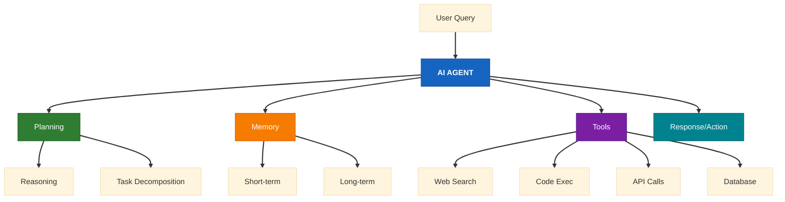

---

## 15. RAG (Retrieval-Augmented Generation)

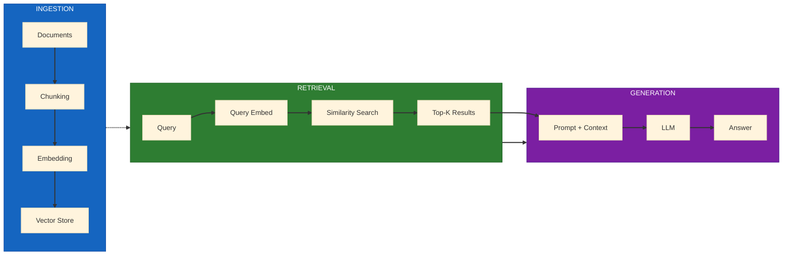

---

## 16. Advanced RAG Patterns

```mermaid
%%{init: {'theme': 'base', 'themeVariables': { 'fontSize': '14px', 'lineColor': '#333333'}}}%%
flowchart TD
    RAG[<b>ADVANCED RAG</b>]
    
    RAG ==> GRAPH[<b>GraphRAG</b>]
    RAG ==> AGENT[<b>Agentic RAG</b>]
    RAG ==> SELF[<b>Self-RAG</b>]
    RAG ==> CORRECT[<b>Corrective RAG</b>]
    
    GRAPH --> G1[Knowledge Graphs]
    GRAPH --> G2[Entity Relations]
    GRAPH --> G3[Community Detection]
    
    AGENT --> A1[Tool-based Retrieval]
    AGENT --> A2[Multi-step Reasoning]
    AGENT --> A3[Dynamic Planning]
    
    SELF --> S1[Self-Reflection]
    SELF --> S2[Relevance Scoring]
    
    CORRECT --> C1[Retrieval Grading]
    CORRECT --> C2[Web Fallback]
    
    click RAG "https://www.promptingguide.ai/techniques/rag" "RAG Guide" _blank
    click GRAPH "https://microsoft.github.io/graphrag/" "Microsoft GraphRAG" _blank
    click AGENT "https://langchain-ai.github.io/langgraph/" "LangGraph Agents" _blank
    click SELF "https://arxiv.org/abs/2310.11511" "Self-RAG Paper" _blank
    click CORRECT "https://arxiv.org/abs/2401.15884" "CRAG Paper" _blank
    click G1 "https://neo4j.com/developer/" "Neo4j Developer" _blank
    click G2 "https://neo4j.com/docs/graph-data-science/current/" "Entity Relations" _blank
    click G3 "https://microsoft.github.io/graphrag/index/overview/" "Community Detection" _blank
    click A1 "https://python.langchain.com/docs/modules/tools/" "Tool-based Retrieval" _blank
    click A2 "https://langchain-ai.github.io/langgraph/" "LangGraph Tutorials" _blank
    click A3 "https://blog.langchain.dev/planning-agents/" "Dynamic Planning" _blank
    click S1 "https://arxiv.org/abs/2310.11511" "Self-Reflection" _blank
    click S2 "https://docs.llamaindex.ai/en/stable/examples/node_postprocessor/" "Relevance Scoring" _blank
    click C1 "https://arxiv.org/abs/2401.15884" "Retrieval Grading" _blank
    click C2 "https://python.langchain.com/docs/integrations/tools/tavily_search/" "Web Fallback" _blank
    
    style RAG fill:#1565C0,stroke:#0D47A1,color:#FFFFFF
    style GRAPH fill:#2E7D32,stroke:#1B5E20,color:#FFFFFF
    style AGENT fill:#F57C00,stroke:#E65100,color:#FFFFFF
    style SELF fill:#C62828,stroke:#B71C1C,color:#FFFFFF
    style CORRECT fill:#7B1FA2,stroke:#4A148C,color:#FFFFFF
    
    linkStyle default stroke:#333333,stroke-width:2px
```

---

## 17. RAG Evolution & Techniques

```mermaid
%%{init: {'theme': 'base', 'themeVariables': { 'fontSize': '14px', 'lineColor': '#333333'}}}%%
flowchart LR
    subgraph Basic["BASIC RAG"]
        B1[Naive RAG]
        B2[Sentence Window]
    end
    
    subgraph Advanced["ADVANCED RAG"]
        A1[HyDE]
        A2[Multi-Query]
        A3[Parent-Child]
    end
    
    subgraph Modular["MODULAR RAG"]
        M1[Reranking]
        M2[Fusion]
        M3[Compression]
    end
    
    subgraph Cutting["CUTTING EDGE"]
        C1[GraphRAG]
        C2[Agentic RAG]
        C3[RAPTOR]
    end
    
    Basic ==> Advanced ==> Modular ==> Cutting
    
    click Basic "https://python.langchain.com/docs/tutorials/rag/" "Basic RAG" _blank
    click Advanced "https://docs.llamaindex.ai/en/stable/" "Advanced RAG" _blank
    click Modular "https://arxiv.org/abs/2407.21059" "Modular RAG" _blank
    click Cutting "https://microsoft.github.io/graphrag/" "Cutting Edge RAG" _blank
    click B1 "https://python.langchain.com/docs/tutorials/rag/" "LangChain RAG Tutorial" _blank
    click B2 "https://docs.llamaindex.ai/en/stable/examples/node_postprocessor/" "Sentence Window Retrieval" _blank
    click A1 "https://arxiv.org/abs/2212.10496" "HyDE Paper" _blank
    click A2 "https://docs.llamaindex.ai/en/stable/examples/query_transformations/query_transform_cookbook/" "Multi-Query RAG" _blank
    click A3 "https://docs.llamaindex.ai/en/stable/examples/retrievers/auto_merging_retriever/" "Parent-Child Retrieval" _blank
    click M1 "https://docs.llamaindex.ai/en/stable/examples/node_postprocessor/" "Reranking Guide" _blank
    click M2 "https://arxiv.org/abs/2402.03367" "Fusion Retrieval" _blank
    click M3 "https://docs.llamaindex.ai/en/stable/examples/node_postprocessor/" "Contextual Compression" _blank
    click C1 "https://microsoft.github.io/graphrag/" "Microsoft GraphRAG" _blank
    click C2 "https://blog.langchain.dev/agentic-rag-with-langgraph/" "Agentic RAG" _blank
    click C3 "https://arxiv.org/abs/2401.18059" "RAPTOR Paper" _blank
    
    style Basic fill:#1565C0,stroke:#0D47A1,color:#FFFFFF
    style Advanced fill:#2E7D32,stroke:#1B5E20,color:#FFFFFF
    style Modular fill:#F57C00,stroke:#E65100,color:#FFFFFF
    style Cutting fill:#C62828,stroke:#B71C1C,color:#FFFFFF
    
    linkStyle default stroke:#333333,stroke-width:3px
```

### RAG Techniques Explained

| Technique | Description | Use Case |
|-----------|-------------|----------|
| **Naive RAG** | Basic vector similarity search | Simple Q&A |
| **HyDE** | Hypothetical Document Embeddings - generate hypothetical answer first | Better semantic matching |
| **Multi-Query** | Generate multiple query variations | Broader retrieval coverage |
| **Parent-Child** | Retrieve child chunks, return parent for context | Better context preservation |
| **Reranking** | Use cross-encoder to rerank results | Higher precision |
| **GraphRAG** | Build knowledge graph + community summaries | Complex reasoning, multi-hop |
| **Agentic RAG** | Agent decides what/when/how to retrieve | Dynamic, multi-step tasks |
| **Self-RAG** | LLM reflects on retrieval quality | Self-correction |
| **CRAG** | Corrective RAG - grade & fallback to web | Reliability |
| **RAPTOR** | Recursive tree summarization | Long documents |
| **Fusion RAG** | Combine multiple retrieval methods | Hybrid search |
| **Contextual Compression** | Compress retrieved docs to relevant parts | Token efficiency |

---

## 18. Emerging AI Technologies (2024-2025)

```mermaid
%%{init: {'theme': 'base', 'themeVariables': { 'fontSize': '14px', 'lineColor': '#333333'}}}%%
flowchart TD
    EMERGING[<b>EMERGING TECH</b>]
    
    EMERGING ==> MCP[<b>MCP</b>]
    EMERGING ==> FC[<b>Function Calling</b>]
    EMERGING ==> STRUCT[<b>Structured Output</b>]
    EMERGING ==> SMALL[<b>Small LLMs</b>]
    
    MCP --> M1[Model Context Protocol]
    MCP --> M2[Tool Standardization]
    MCP --> M3[Anthropic Standard]
    
    FC --> F1[OpenAI Functions]
    FC --> F2[Tool Use]
    FC --> F3[JSON Mode]
    
    STRUCT --> S1[Pydantic]
    STRUCT --> S2[Instructor]
    STRUCT --> S3[Outlines]
    
    SMALL --> SM1[Phi-3]
    SMALL --> SM2[Gemma]
    SMALL --> SM3[Llama 3.2]
    
    click EMERGING "https://www.deeplearning.ai/the-batch/" "AI News - The Batch" _blank
    click MCP "https://modelcontextprotocol.io/" "MCP Documentation" _blank
    click M1 "https://modelcontextprotocol.io/introduction" "MCP Introduction" _blank
    click M2 "https://modelcontextprotocol.io/docs/concepts/tools" "MCP Tool Standardization" _blank
    click M3 "https://www.anthropic.com/news/model-context-protocol" "Anthropic MCP Announcement" _blank
    click FC "https://platform.openai.com/docs/guides/function-calling" "OpenAI Function Calling" _blank
    click F1 "https://platform.openai.com/docs/guides/function-calling" "Function Calling Guide" _blank
    click F2 "https://docs.anthropic.com/en/docs/build-with-claude/tool-use" "Claude Tool Use" _blank
    click F3 "https://platform.openai.com/docs/guides/structured-outputs" "JSON Mode" _blank
    click STRUCT "https://python.useinstructor.com/" "Structured Output" _blank
    click S1 "https://docs.pydantic.dev/" "Pydantic Docs" _blank
    click S2 "https://python.useinstructor.com/" "Instructor Library" _blank
    click S3 "https://dottxt-ai.github.io/outlines/" "Outlines Docs" _blank
    click SMALL "https://huggingface.co/collections/microsoft/phi-3-6626e15e9585a200d2d761e3" "Small LLMs" _blank
    click SM1 "https://azure.microsoft.com/en-us/products/phi-3" "Microsoft Phi-3" _blank
    click SM2 "https://ai.google.dev/gemma" "Google Gemma" _blank
    click SM3 "https://llama.meta.com/" "Meta Llama" _blank
    
    style EMERGING fill:#1565C0,stroke:#0D47A1,color:#FFFFFF
    style MCP fill:#2E7D32,stroke:#1B5E20,color:#FFFFFF
    style FC fill:#F57C00,stroke:#E65100,color:#FFFFFF
    style STRUCT fill:#C62828,stroke:#B71C1C,color:#FFFFFF
    style SMALL fill:#7B1FA2,stroke:#4A148C,color:#FFFFFF
    
    linkStyle default stroke:#333333,stroke-width:2px
```

### Key Emerging Technologies

| Technology | Description | Why Important |
|------------|-------------|---------------|
| **MCP (Model Context Protocol)** | Anthropic's standard for LLM-tool integration | Universal tool connectivity |
| **Function Calling** | LLMs calling external functions/APIs | Structured agent actions |
| **Structured Outputs** | Guaranteed JSON/schema responses | Reliable integrations |
| **Small LLMs** | Efficient models (Phi, Gemma, Llama 3.2) | Edge deployment, cost savings |
| **Mixture of Experts (MoE)** | Sparse activation (Mixtral, GPT-4) | Efficiency at scale |
| **Speculative Decoding** | Faster inference with draft models | Speed optimization |
| **KV Cache Optimization** | PagedAttention, vLLM | Memory efficiency |
| **Quantization** | GGUF, AWQ, GPTQ | Run large models locally |
| **Long Context** | 100K-1M+ token windows | Full document processing |
| **Voice AI** | Real-time voice (GPT-4o, Gemini Live) | Conversational AI |

---

## 19. LLM Customization Approaches

```mermaid
%%{init: {'theme': 'base', 'themeVariables': { 'fontSize': '14px', 'lineColor': '#333333'}}}%%
flowchart TD
    CUSTOM[<b>LLM CUSTOMIZATION</b>]
    
    CUSTOM ==> PROMPT[<b>Prompting</b>]
    CUSTOM ==> RAG[<b>RAG</b>]
    CUSTOM ==> PEFT[<b>PEFT</b>]
    CUSTOM ==> ALIGN[<b>Alignment</b>]
    CUSTOM ==> ADV[<b>Advanced</b>]
    
    PROMPT --> P1[Zero/Few-shot]
    PROMPT --> P2[Chain-of-Thought]
    PROMPT --> P3[System Prompts]
    
    RAG --> R1[Vector RAG]
    RAG --> R2[GraphRAG]
    
    PEFT --> F1[LoRA/QLoRA]
    PEFT --> F2[Adapters]
    PEFT --> F3[Prefix Tuning]
    
    ALIGN --> A1[RLHF]
    ALIGN --> A2[DPO/ORPO]
    ALIGN --> A3[Constitutional AI]
    
    ADV --> AD1[Steering Vectors]
    ADV --> AD2[Model Merging]
    ADV --> AD3[Distillation]
    
    click CUSTOM "https://www.deeplearning.ai/short-courses/" "DeepLearning.AI Courses" _blank
    click PROMPT "https://www.promptingguide.ai/" "Prompting Guide" _blank
    click P1 "https://www.promptingguide.ai/techniques/fewshot" "Few-Shot Prompting" _blank
    click P2 "https://www.promptingguide.ai/techniques/cot" "Chain-of-Thought" _blank
    click P3 "https://docs.anthropic.com/en/docs/build-with-claude/prompt-caching" "System Prompts" _blank
    click RAG "https://docs.llamaindex.ai/" "LlamaIndex RAG" _blank
    click R1 "https://python.langchain.com/docs/tutorials/rag/" "Vector RAG" _blank
    click R2 "https://microsoft.github.io/graphrag/" "Microsoft GraphRAG" _blank
    click PEFT "https://huggingface.co/docs/peft/" "HuggingFace PEFT" _blank
    click F1 "https://huggingface.co/docs/peft/conceptual_guides/lora" "LoRA Guide" _blank
    click F2 "https://huggingface.co/docs/peft/conceptual_guides/adapter" "Adapters" _blank
    click F3 "https://huggingface.co/docs/peft/conceptual_guides/prompting" "Prefix Tuning" _blank
    click ALIGN "https://huggingface.co/docs/trl/" "TRL Library" _blank
    click A1 "https://huggingface.co/blog/rlhf" "RLHF Explained" _blank
    click A2 "https://huggingface.co/docs/trl/dpo_trainer" "DPO Trainer" _blank
    click A3 "https://www.anthropic.com/research" "Constitutional AI" _blank
    click ADV "https://www.lesswrong.com/posts/5spBue2z2tw4JuDCx/steering-vectors" "Advanced Techniques" _blank
    click AD1 "https://www.lesswrong.com/posts/5spBue2z2tw4JuDCx/steering-vectors" "Steering Vectors" _blank
    click AD2 "https://huggingface.co/blog/mlabonne/merge-models" "Model Merging Guide" _blank
    click AD3 "https://huggingface.co/docs/transformers/tasks/knowledge_distillation" "Knowledge Distillation" _blank
    
    style CUSTOM fill:#1565C0,stroke:#0D47A1,color:#FFFFFF
    style PROMPT fill:#2E7D32,stroke:#1B5E20,color:#FFFFFF
    style RAG fill:#F57C00,stroke:#E65100,color:#FFFFFF
    style PEFT fill:#C62828,stroke:#B71C1C,color:#FFFFFF
    style ALIGN fill:#7B1FA2,stroke:#4A148C,color:#FFFFFF
    style ADV fill:#00695C,stroke:#004D40,color:#FFFFFF
    
    linkStyle default stroke:#333333,stroke-width:2px
```

### Complete LLM Customization Spectrum

| Category | Technique | Description | Effort | When to Use |
|----------|-----------|-------------|--------|-------------|
| **Prompting** | Zero-shot | Direct instruction without examples | ⚡ Very Low | Simple tasks |
| | Few-shot | Examples in prompt | ⚡ Low | Pattern-based tasks |
| | Chain-of-Thought | Step-by-step reasoning | ⚡ Low | Complex reasoning |
| | System Prompts | Persona/behavior instructions | ⚡ Low | Consistent behavior |
| **RAG** | Vector RAG | Retrieve from embeddings | ⚡⚡ Medium | External knowledge |
| | GraphRAG | Knowledge graph retrieval | ⚡⚡⚡ High | Multi-hop reasoning |
| | Agentic RAG | Dynamic retrieval with tools | ⚡⚡⚡ High | Complex workflows |
| **PEFT** | LoRA | Low-Rank Adaptation matrices | ⚡⚡ Medium | Task adaptation |
| | QLoRA | Quantized LoRA | ⚡⚡ Medium | Memory-constrained |
| | DoRA | Weight-Decomposed LoRA | ⚡⚡ Medium | Better performance |
| | Adapters | Bottleneck adapter layers | ⚡⚡ Medium | Multi-task |
| | Prefix Tuning | Learned soft prompts | ⚡⚡ Medium | Lightweight tuning |
| | (IA)³ | Infused Adapter by Inhibiting | ⚡⚡ Medium | Few parameters |
| **Alignment** | RLHF | Reinforcement Learning Human Feedback | ⚡⚡⚡⚡ Very High | Safety, helpfulness |
| | RLAIF | RL from AI Feedback | ⚡⚡⚡ High | Scalable alignment |
| | DPO | Direct Preference Optimization | ⚡⚡⚡ High | Simpler than RLHF |
| | ORPO | Odds Ratio Preference Optimization | ⚡⚡⚡ High | Single-stage training |
| | KTO | Kahneman-Tversky Optimization | ⚡⚡⚡ High | Binary feedback |
| | Constitutional AI | Self-critique & revision | ⚡⚡⚡ High | Value alignment |
| | IPO | Identity Preference Optimization | ⚡⚡⚡ High | Robust alignment |
| **Steering** | Activation Steering | Add vectors to activations | ⚡⚡ Medium | Behavior control |
| | Representation Engineering | Modify internal representations | ⚡⚡⚡ High | Fine-grained control |
| | CAA | Contrastive Activation Addition | ⚡⚡ Medium | Trait modification |
| | Steering Vectors | Direction vectors in latent space | ⚡⚡ Medium | Runtime control |
| **Merging** | Model Merging | Combine multiple fine-tuned models | ⚡⚡ Medium | Multi-capability |
| | TIES | Task vectors with interference | ⚡⚡ Medium | Efficient merging |
| | DARE | Drop And REscale | ⚡⚡ Medium | Sparse merging |
| | Model Soup | Average multiple checkpoints | ⚡⚡ Medium | Robust models |
| **Distillation** | Knowledge Distillation | Large → Small model transfer | ⚡⚡⚡ High | Deployment efficiency |
| | Self-Distillation | Model teaches itself | ⚡⚡⚡ High | Improvement |
| **Full Training** | Full Fine-Tune | Update all parameters | ⚡⚡⚡⚡ Very High | Major adaptation |
| | Continued Pre-Training | Domain corpus training | ⚡⚡⚡⚡ Very High | New domain |
| | Pre-Training | Train from scratch | ⚡⚡⚡⚡⚡ Extreme | New model |

### Steering Vectors Deep Dive


### Alignment Methods Comparison

| Method | Training Data | Reward Model | Complexity | Key Innovation |
|--------|--------------|--------------|------------|----------------|
| **SFT** | Demonstrations | Not needed | Low | Supervised examples |
| **RLHF** | Preferences | Trained RM | Very High | Human feedback loop |
| **RLAIF** | Preferences | AI-generated | High | Scalable feedback |
| **DPO** | Preferences | Implicit | Medium | No separate RM |
| **ORPO** | Preferences | Implicit | Medium | Single training stage |
| **KTO** | Binary (👍/👎) | Implicit | Medium | No pairs needed |
| **IPO** | Preferences | Implicit | Medium | Avoids overfitting |
| **Constitutional** | Principles | Self-critique | High | Self-improvement |

### Future Customization Trends (2025+)

| Trend | Description | Status | Expected Impact |
|-------|-------------|--------|-----------------|
| **Mixture of LoRAs** | Dynamic LoRA selection per token | Emerging | Multi-task efficiency |
| **Continuous Learning** | Models that learn without forgetting | Research | Always up-to-date |
| **Self-Evolving Models** | Models that improve autonomously | Research | Reduced human effort |
| **Steering at Scale** | Production-ready activation steering | Emerging | Runtime control |
| **Sparse Fine-Tuning** | Update only relevant neurons | Emerging | Efficient adaptation |
| **Federated Fine-Tuning** | Distributed private training | Emerging | Privacy-preserving |
| **Meta-Learning Adapters** | Learn to adapt quickly | Research | Few-shot adaptation |
| **Neural Architecture Search** | Auto-optimize adapter structure | Research | Better PEFT |
| **Mechanistic Interpretability** | Understand & edit model circuits | Research | Precise control |
| **Synthetic Data Tuning** | AI-generated training data | Mainstream | Scalable data |

### Tools & Frameworks

| Tool | Purpose | Key Features |
|------|---------|--------------|
| **PEFT (HF)** | Parameter-efficient methods | LoRA, Adapters, Prefix |
| **TRL** | Alignment training | RLHF, DPO, ORPO, KTO |
| **Axolotl** | Fine-tuning framework | Multi-method, easy config |
| **LLaMA-Factory** | End-to-end fine-tuning | 100+ methods, WebUI |
| **Unsloth** | Fast fine-tuning | 2x faster, 60% less memory |
| **mergekit** | Model merging | TIES, DARE, linear, slerp |
| **RepE** | Representation engineering | Steering vectors, CAA |
| **TransformerLens** | Mechanistic interpretability | Activation analysis |
| **Pyreft** | Representation fine-tuning | Intervention-based |

---

## 20. Multimodal AI

```mermaid
%%{init: {'theme': 'base', 'themeVariables': { 'fontSize': '14px', 'lineColor': '#333333'}}}%%
flowchart TD
    MULTI[<b>MULTIMODAL AI</b>]
    
    MULTI ==> INPUT[<b>Inputs</b>]
    MULTI ==> OUTPUT[<b>Outputs</b>]
    MULTI ==> MODELS[<b>Models</b>]
    
    INPUT --> TEXT[Text]
    INPUT --> IMG[Image]
    INPUT --> AUD[Audio]
    INPUT --> VID[Video]
    
    OUTPUT --> GEN_T[Text Gen]
    OUTPUT --> GEN_I[Image Gen]
    OUTPUT --> GEN_A[Audio Gen]
    
    MODELS --> GPT4V[GPT-4 Vision]
    MODELS --> GEMINI[Gemini]
    MODELS --> CLAUDE_V[Claude Vision]
    MODELS --> CLIP[CLIP]
    
    click MULTI "https://huggingface.co/models?pipeline_tag=image-text-to-text" "HF Multimodal" _blank
    click INPUT "https://huggingface.co/tasks" "Input Modalities" _blank
    click OUTPUT "https://huggingface.co/tasks" "Output Modalities" _blank
    click MODELS "https://huggingface.co/models?pipeline_tag=image-text-to-text" "Multimodal Models" _blank
    click TEXT "https://huggingface.co/tasks/text-generation" "Text Processing" _blank
    click IMG "https://huggingface.co/tasks/image-to-text" "Image Understanding" _blank
    click VID "https://huggingface.co/tasks/video-classification" "Video Processing" _blank
    click GEN_T "https://huggingface.co/tasks/text-generation" "Text Generation" _blank
    click GEN_I "https://huggingface.co/docs/diffusers/" "Diffusers" _blank
    click GEN_A "https://huggingface.co/docs/transformers/model_doc/bark" "Audio Generation - Bark" _blank
    click GPT4V "https://platform.openai.com/docs/guides/vision" "GPT-4 Vision" _blank
    click GEMINI "https://ai.google.dev/" "Google AI" _blank
    click CLAUDE_V "https://docs.anthropic.com/en/docs/build-with-claude/vision" "Claude Vision" _blank
    click CLIP "https://openai.com/research/clip" "CLIP Research" _blank
    click AUD "https://huggingface.co/docs/transformers/model_doc/whisper" "Whisper" _blank
    
    style MULTI fill:#1565C0,stroke:#0D47A1,color:#FFFFFF
    style INPUT fill:#2E7D32,stroke:#1B5E20,color:#FFFFFF
    style OUTPUT fill:#F57C00,stroke:#E65100,color:#FFFFFF
    style MODELS fill:#7B1FA2,stroke:#4A148C,color:#FFFFFF
    
    linkStyle default stroke:#333333,stroke-width:2px
```

---

## 21. AI Cloud Platforms

```mermaid
%%{init: {'theme': 'base', 'themeVariables': { 'fontSize': '14px', 'lineColor': '#333333'}}}%%
flowchart LR
    subgraph AWS["AWS"]
        S1[SageMaker]
        S2[Bedrock]
    end
    
    subgraph GCP["GOOGLE CLOUD"]
        G1[Vertex AI]
        G2[Gemini API]
    end
    
    subgraph Azure["AZURE"]
        A1[Azure ML]
        A2[OpenAI Service]
    end
    
    subgraph Other["OTHERS"]
        O1[Hugging Face]
        O2[Replicate]
        O3[Modal]
    end
    
    click S1 "https://aws.amazon.com/sagemaker/" "AWS SageMaker" _blank
    click S2 "https://aws.amazon.com/bedrock/" "AWS Bedrock" _blank
    click G1 "https://cloud.google.com/vertex-ai" "Vertex AI" _blank
    click G2 "https://ai.google.dev/" "Google AI" _blank
    click A1 "https://azure.microsoft.com/en-us/products/machine-learning" "Azure ML" _blank
    click A2 "https://azure.microsoft.com/en-us/products/ai-services/openai-service" "Azure OpenAI" _blank
    click O1 "https://huggingface.co/" "Hugging Face" _blank
    click O2 "https://replicate.com/" "Replicate" _blank
    click O3 "https://modal.com/" "Modal" _blank
    click AWS "https://aws.amazon.com/machine-learning/" "AWS ML" _blank
    click GCP "https://cloud.google.com/ai-platform" "Google Cloud AI" _blank
    click Azure "https://azure.microsoft.com/en-us/solutions/ai/" "Azure AI" _blank
    click Other "https://huggingface.co/" "Other Cloud Platforms" _blank
    
    style AWS fill:#FF9900,stroke:#CC7A00,color:#000000
    style GCP fill:#4285F4,stroke:#3367D6,color:#FFFFFF
    style Azure fill:#0078D4,stroke:#005A9E,color:#FFFFFF
    style Other fill:#7B1FA2,stroke:#4A148C,color:#FFFFFF
    
    linkStyle default stroke:#333333,stroke-width:2px
```

---

## 22. Key AI Companies & Models

```mermaid
%%{init: {'theme': 'base', 'themeVariables': { 'fontSize': '14px', 'lineColor': '#333333'}}}%%
flowchart TD
    subgraph OpenAI["OPENAI"]
        OA1[GPT-4o / o1]
        OA2[DALL-E 3]
        OA3[Whisper / Sora]
    end
    
    subgraph Anthropic["ANTHROPIC"]
        AN1[Claude 3.5 Sonnet]
        AN2[Claude Opus]
    end
    
    subgraph Google["GOOGLE"]
        GO1[Gemini 2.0]
        GO2[Gemma 2]
    end
    
    subgraph Meta["META"]
        ME1[Llama 3.2 / 3.3]
        ME2[SAM 2]
    end
    
    subgraph Mistral["MISTRAL"]
        MI1[Mistral Large]
        MI2[Mixtral 8x22B]
    end
    
    subgraph xAI["xAI"]
        XA1[Grok 2]
    end
    
    click OA1 "https://platform.openai.com/docs/models" "OpenAI Models" _blank
    click OA2 "https://openai.com/dall-e-3" "DALL-E 3" _blank
    click OA3 "https://openai.com/sora" "Sora" _blank
    click AN1 "https://docs.anthropic.com/" "Claude Docs" _blank
    click AN2 "https://www.anthropic.com/claude" "Claude" _blank
    click GO1 "https://deepmind.google/technologies/gemini/" "Gemini" _blank
    click GO2 "https://ai.google.dev/gemma" "Gemma" _blank
    click ME1 "https://llama.meta.com/" "Llama" _blank
    click ME2 "https://segment-anything.com/" "SAM 2" _blank
    click MI1 "https://mistral.ai/" "Mistral AI" _blank
    click MI2 "https://mistral.ai/news/mixtral-of-experts/" "Mixtral" _blank
    click XA1 "https://x.ai/" "xAI" _blank
    click OpenAI "https://openai.com/" "OpenAI" _blank
    click Anthropic "https://www.anthropic.com/" "Anthropic" _blank
    click Google "https://ai.google/" "Google AI" _blank
    click Meta "https://ai.meta.com/" "Meta AI" _blank
    click Mistral "https://mistral.ai/" "Mistral AI" _blank
    click xAI "https://x.ai/" "xAI" _blank
    
    style OpenAI fill:#10A37F,stroke:#0D8C6D,color:#FFFFFF
    style Anthropic fill:#D4A574,stroke:#C4956A,color:#000000
    style Google fill:#4285F4,stroke:#3367D6,color:#FFFFFF
    style Meta fill:#0668E1,stroke:#0553B8,color:#FFFFFF
    style Mistral fill:#F57C00,stroke:#E65100,color:#FFFFFF
    style xAI fill:#1DA1F2,stroke:#1991DB,color:#FFFFFF
    
    linkStyle default stroke:#333333,stroke-width:2px
```

---

## 23. LLMOps & Evaluation

```mermaid
%%{init: {'theme': 'base', 'themeVariables': { 'fontSize': '14px', 'lineColor': '#333333'}}}%%
flowchart TD
    LLMOPS[<b>LLMOps & EVALUATION</b>]
    
    LLMOPS ==> EVAL[<b>Evaluation</b>]
    LLMOPS ==> MONITOR[<b>Monitoring</b>]
    LLMOPS ==> VERSION[<b>Versioning</b>]
    LLMOPS ==> TEST[<b>Testing</b>]
    
    EVAL --> E1[Benchmarks]
    EVAL --> E2[Human Eval]
    EVAL --> E3[LLM-as-Judge]
    
    MONITOR --> M1[Quality Metrics]
    MONITOR --> M2[Drift Detection]
    MONITOR --> M3[Toxicity/Safety]
    MONITOR --> M4[Cost Tracking]
    
    VERSION --> V1[Prompt Versioning]
    VERSION --> V2[Model Registry]
    VERSION --> V3[Experiment Tracking]
    
    TEST --> T1[A/B Testing]
    TEST --> T2[Regression Tests]
    TEST --> T3[Red Teaming]
    
    click LLMOPS "https://www.deeplearning.ai/short-courses/evaluating-debugging-generative-ai/" "LLMOps Course" _blank
    click EVAL "https://huggingface.co/open-llm-leaderboard" "Evaluation" _blank
    click MONITOR "https://langfuse.com/" "Monitoring" _blank
    click VERSION "https://mlflow.org/" "Versioning" _blank
    click TEST "https://www.promptfoo.dev/" "Testing" _blank
    click E1 "https://huggingface.co/open-llm-leaderboard" "Open LLM Leaderboard" _blank
    click E2 "https://www.humaneval.com/" "HumanEval" _blank
    click E3 "https://docs.smith.langchain.com/evaluation" "LLM-as-Judge" _blank
    click M1 "https://langfuse.com/" "Langfuse" _blank
    click M2 "https://docs.arize.com/phoenix/" "Arize Phoenix" _blank
    click M3 "https://huggingface.co/meta-llama/Llama-Guard-3-8B" "Toxicity Detection - LlamaGuard" _blank
    click M4 "https://www.helicone.ai/" "Cost Tracking - Helicone" _blank
    click V1 "https://promptlayer.com/" "PromptLayer" _blank
    click V2 "https://mlflow.org/docs/latest/model-registry.html" "MLflow Model Registry" _blank
    click V3 "https://docs.wandb.ai/" "Weights & Biases" _blank
    click T1 "https://www.promptfoo.dev/" "Promptfoo" _blank
    click T2 "https://docs.pytest.org/" "Regression Testing - Pytest" _blank
    click T3 "https://atlas.mitre.org/" "MITRE ATLAS" _blank
    
    style LLMOPS fill:#1565C0,stroke:#0D47A1,color:#FFFFFF
    style EVAL fill:#2E7D32,stroke:#1B5E20,color:#FFFFFF
    style MONITOR fill:#F57C00,stroke:#E65100,color:#FFFFFF
    style VERSION fill:#C62828,stroke:#B71C1C,color:#FFFFFF
    style TEST fill:#7B1FA2,stroke:#4A148C,color:#FFFFFF
    
    linkStyle default stroke:#333333,stroke-width:2px
```

### LLMOps Tools & Benchmarks

| Category | Tools/Benchmarks |
|----------|------------------|
| **Benchmarks** | MMLU, HellaSwag, HumanEval, MT-Bench, LMSYS Arena |
| **Eval Frameworks** | RAGAS, DeepEval, TruLens, Promptfoo, Langsmith |
| **Monitoring** | Langfuse, Helicone, Weights & Biases, Arize |
| **Prompt Management** | PromptLayer, Humanloop, Agenta |
| **Experiment Tracking** | MLflow, W&B, Neptune, Comet |

### Observability Standards (OpenTelemetry)

```mermaid
%%{init: {'theme': 'base', 'themeVariables': { 'fontSize': '14px', 'lineColor': '#333333'}}}%%
flowchart TD
    OTEL[<b>OPENTELEMETRY FOR AI</b>]
    
    OTEL ==> TRACE[<b>Distributed Tracing</b>]
    OTEL ==> METRICS[<b>Metrics</b>]
    OTEL ==> LOGS[<b>Structured Logs</b>]
    OTEL ==> SEM[<b>Semantic Conventions</b>]
    
    TRACE --> T1[LLM Spans]
    TRACE --> T2[RAG Pipeline Traces]
    TRACE --> T3[Agent Action Traces]
    TRACE --> T4[Latency Breakdown]
    
    METRICS --> M1[Token Throughput]
    METRICS --> M2[Latency Percentiles]
    METRICS --> M3[Error Rates]
    METRICS --> M4[Cost Tracking]
    
    LOGS --> L1[Prompt/Response Logs]
    LOGS --> L2[Error Context]
    LOGS --> L3[Retrieval Logs]
    LOGS --> L4[Audit Trail]
    
    SEM --> S1[GenAI Semantic Conventions]
    SEM --> S2[LLM Span Attributes]
    SEM --> S3[Vector DB Conventions]
    SEM --> S4[Agent Conventions]
    
    click OTEL "https://opentelemetry.io/" "OpenTelemetry" _blank
    click TRACE "https://opentelemetry.io/docs/concepts/signals/traces/" "OTel Traces" _blank
    click METRICS "https://opentelemetry.io/docs/concepts/signals/metrics/" "OTel Metrics" _blank
    click LOGS "https://opentelemetry.io/docs/concepts/signals/logs/" "OTel Logs" _blank
    click SEM "https://opentelemetry.io/docs/specs/semconv/gen-ai/" "GenAI Conventions" _blank
    click T1 "https://opentelemetry.io/docs/specs/semconv/gen-ai/" "LLM Spans" _blank
    click T2 "https://docs.traceloop.com/" "Traceloop RAG" _blank
    click T3 "https://docs.smith.langchain.com/" "Agent Tracing" _blank
    click T4 "https://opentelemetry.io/docs/concepts/signals/traces/" "Latency Traces" _blank
    click M1 "https://opentelemetry.io/docs/specs/semconv/gen-ai/" "Token Metrics" _blank
    click M2 "https://opentelemetry.io/docs/concepts/signals/metrics/" "Latency Metrics" _blank
    click M3 "https://opentelemetry.io/docs/concepts/signals/metrics/" "Error Metrics" _blank
    click M4 "https://docs.helicone.ai/" "Cost Tracking" _blank
    click L1 "https://docs.langfuse.com/" "Langfuse Logging" _blank
    click L2 "https://opentelemetry.io/docs/concepts/signals/logs/" "Error Logs" _blank
    click L3 "https://docs.llamaindex.ai/en/stable/module_guides/observability/" "Retrieval Logs" _blank
    click L4 "https://opentelemetry.io/docs/concepts/signals/logs/" "Audit Logs" _blank
    click S1 "https://opentelemetry.io/docs/specs/semconv/gen-ai/" "GenAI Conventions" _blank
    click S2 "https://opentelemetry.io/docs/specs/semconv/gen-ai/" "LLM Attributes" _blank
    click S3 "https://opentelemetry.io/docs/specs/semconv/database/" "DB Conventions" _blank
    click S4 "https://opentelemetry.io/docs/specs/semconv/" "Agent Conventions" _blank
    
    style OTEL fill:#1565C0,stroke:#0D47A1,color:#FFFFFF
    style TRACE fill:#2E7D32,stroke:#1B5E20,color:#FFFFFF
    style METRICS fill:#F57C00,stroke:#E65100,color:#FFFFFF
    style LOGS fill:#C62828,stroke:#B71C1C,color:#FFFFFF
    style SEM fill:#7B1FA2,stroke:#4A148C,color:#FFFFFF
    
    linkStyle default stroke:#333333,stroke-width:2px
```

### AI Observability Stack

| Layer | Open Source | Commercial | Standard |
|-------|-------------|------------|----------|
| **Collection** | OpenTelemetry SDK | Datadog Agent | OTel Protocol |
| **LLM-Specific** | Traceloop, OpenLLMetry | Langfuse, Helicone | GenAI Semantic Conventions |
| **Storage** | Jaeger, Prometheus | Datadog, New Relic | OTLP |
| **Visualization** | Grafana, Jaeger UI | Arize, W&B | - |
| **Alerting** | Alertmanager | PagerDuty, OpsGenie | - |

---

## 24. AI Security & Governance

```mermaid
%%{init: {'theme': 'base', 'themeVariables': { 'fontSize': '14px', 'lineColor': '#333333'}}}%%
flowchart TD
    SECURITY[<b>AI SECURITY & GOVERNANCE</b>]
    
    SECURITY ==> ATTACK[<b>Attack Vectors</b>]
    SECURITY ==> PROTECT[<b>Protection</b>]
    SECURITY ==> COMPLY[<b>Compliance</b>]
    SECURITY ==> GOVERN[<b>Governance</b>]
    
    ATTACK --> A1[Prompt Injection]
    ATTACK --> A2[Jailbreaking]
    ATTACK --> A3[Data Exfiltration]
    ATTACK --> A4[Model Extraction]
    
    PROTECT --> P1[Input Validation]
    PROTECT --> P2[Output Filtering]
    PROTECT --> P3[PII Redaction]
    PROTECT --> P4[Guardrails]
    
    COMPLY --> C1[GDPR]
    COMPLY --> C2[SOC2]
    COMPLY --> C3[HIPAA]
    COMPLY --> C4[ISO 27001]
    
    GOVERN --> G1[Model Cards]
    GOVERN --> G2[Audit Logs]
    GOVERN --> G3[Access Control]
    GOVERN --> G4[Data Lineage]
    
    click SECURITY "https://genai.owasp.org/" "OWASP LLM Top 10" _blank
    click ATTACK "https://genai.owasp.org/" "Attack Vectors" _blank
    click PROTECT "https://docs.nvidia.com/nemo/guardrails/" "Protection" _blank
    click COMPLY "https://gdpr.eu/" "Compliance" _blank
    click GOVERN "https://huggingface.co/docs/hub/model-cards" "Governance" _blank
    click A1 "https://learnprompting.org/docs/prompt_hacking/injection" "Prompt Injection Guide" _blank
    click A2 "https://arxiv.org/abs/2307.15043" "Jailbreaking Research" _blank
    click A3 "https://genai.owasp.org/" "Data Exfiltration" _blank
    click A4 "https://arxiv.org/abs/2403.06634" "Model Extraction Attacks" _blank
    click P1 "https://python.langchain.com/docs/security/" "Input Validation" _blank
    click P2 "https://docs.lakera.ai/" "Output Filtering - Lakera" _blank
    click P3 "https://microsoft.github.io/presidio/" "Microsoft Presidio" _blank
    click P4 "https://docs.nvidia.com/nemo/guardrails/" "NeMo Guardrails" _blank
    click C1 "https://gdpr.eu/" "GDPR Guide" _blank
    click C2 "https://www.aicpa-cima.com/topic/audit-assurance/audit-and-assurance-greater-than-soc-2" "SOC2 Overview" _blank
    click C3 "https://www.hhs.gov/hipaa/index.html" "HIPAA Guidelines" _blank
    click C4 "https://www.iso.org/standard/27001" "ISO 27001" _blank
    click G1 "https://huggingface.co/docs/hub/model-cards" "HF Model Cards" _blank
    click G2 "https://langfuse.com/docs/tracing" "Audit Logs - Langfuse" _blank
    click G3 "https://docs.aws.amazon.com/IAM/" "Access Control - AWS IAM" _blank
    click G4 "https://docs.datadoghq.com/" "Data Lineage" _blank
    
    style SECURITY fill:#C62828,stroke:#B71C1C,color:#FFFFFF
    style ATTACK fill:#E53935,stroke:#C62828,color:#FFFFFF
    style PROTECT fill:#2E7D32,stroke:#1B5E20,color:#FFFFFF
    style COMPLY fill:#1565C0,stroke:#0D47A1,color:#FFFFFF
    style GOVERN fill:#7B1FA2,stroke:#4A148C,color:#FFFFFF
    
    linkStyle default stroke:#333333,stroke-width:2px
```

### Security Tools & Frameworks

| Category | Tools |
|----------|-------|
| **Guardrails** | NeMo Guardrails, Guardrails AI, LlamaGuard, Rebuff |
| **PII Detection** | Presidio, AWS Comprehend, Private AI |
| **Input/Output Filtering** | LangKit, Lakera Guard, PromptArmor |
| **Secrets Management** | HashiCorp Vault, AWS Secrets Manager |
| **Audit & Compliance** | Fiddler AI, Arthur AI, Credo AI |

### Global AI Regulations Deep Dive

```mermaid
%%{init: {'theme': 'base', 'themeVariables': { 'fontSize': '14px', 'lineColor': '#333333'}}}%%
flowchart TD
    REGULATIONS[<b>GLOBAL AI REGULATIONS</b>]
    
    REGULATIONS ==> EU[<b>European Union</b>]
    REGULATIONS ==> US[<b>United States</b>]
    REGULATIONS ==> SECTOR[<b>Sector-Specific</b>]
    REGULATIONS ==> GLOBAL[<b>Global Standards</b>]
    
    EU --> EU1[EU AI Act]
    EU --> EU2[Risk-Based Classification]
    EU --> EU3[Prohibited AI Uses]
    EU --> EU4[GDPR for AI]
    
    US --> US1[Executive Orders]
    US --> US2[NIST AI RMF]
    US --> US3[State Laws CA/CO]
    US --> US4[FTC Enforcement]
    
    SECTOR --> SE1[Healthcare FDA/HIPAA]
    SECTOR --> SE2[Finance SEC/FINRA]
    SECTOR --> SE3[Automotive NHTSA]
    SECTOR --> SE4[Employment EEOC]
    
    GLOBAL --> GL1[ISO/IEC 42001]
    GLOBAL --> GL2[IEEE 7000 Series]
    GLOBAL --> GL3[OECD AI Principles]
    GLOBAL --> GL4[UNESCO Recommendations]
    
    click REGULATIONS "https://artificialintelligenceact.eu/" "AI Regulations" _blank
    click EU "https://artificialintelligenceact.eu/" "EU AI Regulation" _blank
    click US "https://www.nist.gov/itl/ai-risk-management-framework" "US AI Policy" _blank
    click SECTOR "https://www.fda.gov/medical-devices/software-medical-device-samd/artificial-intelligence-machine-learning-aiml-software-medical-device" "FDA AI" _blank
    click GLOBAL "https://www.iso.org/standard/81230.html" "ISO AI Standard" _blank
    click EU1 "https://artificialintelligenceact.eu/the-act/" "EU AI Act Full Text" _blank
    click EU2 "https://artificialintelligenceact.eu/high-level-summary/" "Risk Classification" _blank
    click EU3 "https://artificialintelligenceact.eu/article/5/" "Prohibited Practices" _blank
    click EU4 "https://gdpr.eu/" "GDPR + AI" _blank
    click US1 "https://www.nist.gov/itl/ai-risk-management-framework" "Biden AI EO" _blank
    click US2 "https://www.nist.gov/itl/ai-risk-management-framework" "NIST AI RMF" _blank
    click US3 "https://cppa.ca.gov/regulations/" "California Privacy" _blank
    click US4 "https://www.ftc.gov/business-guidance/blog/2023/02/keep-your-ai-claims-check" "FTC AI Guidelines" _blank
    click SE1 "https://www.fda.gov/medical-devices/software-medical-device-samd/artificial-intelligence-machine-learning-aiml-software-medical-device" "FDA AI/ML" _blank
    click SE2 "https://www.sec.gov/spotlight/cybersecurity" "SEC AI/Cyber" _blank
    click SE3 "https://www.nhtsa.gov/technology-innovation/automated-vehicles-safety" "NHTSA Automated" _blank
    click SE4 "https://www.eeoc.gov/laws/guidance/artificial-intelligence-and-title-vii" "EEOC AI Fairness" _blank
    click GL1 "https://www.iso.org/standard/81230.html" "ISO 42001" _blank
    click GL2 "https://standards.ieee.org/industry-connections/ec/ead-v1/" "IEEE Ethically Aligned" _blank
    click GL3 "https://oecd.ai/en/ai-principles" "OECD Principles" _blank
    click GL4 "https://www.unesco.org/en/artificial-intelligence/recommendation-ethics" "UNESCO AI Ethics" _blank
    
    style REGULATIONS fill:#1565C0,stroke:#0D47A1,color:#FFFFFF
    style EU fill:#003399,stroke:#002266,color:#FFFFFF
    style US fill:#B22234,stroke:#8B1A28,color:#FFFFFF
    style SECTOR fill:#F57C00,stroke:#E65100,color:#FFFFFF
    style GLOBAL fill:#7B1FA2,stroke:#4A148C,color:#FFFFFF
    
    linkStyle default stroke:#333333,stroke-width:2px
```

### AI Regulations Summary

| Jurisdiction | Key Regulation | Scope | Effective |
|--------------|---------------|-------|----------|
| **EU** | AI Act | Risk-based, all sectors | 2025-2027 |
| **US Federal** | Executive Order 14110 | Federal agencies, safety | 2024 |
| **US States** | CA CPRA, CO AI Act | Consumer rights, employment | 2024-2026 |
| **Healthcare** | FDA AI/ML Guidance | Medical devices, SaMD | Active |
| **Finance** | SEC AI Disclosure | Securities, trading | Active |
| **Global** | ISO 42001, OECD | Management systems | Active |

---

## 25. Hardware & Inference Stack

```mermaid
%%{init: {'theme': 'base', 'themeVariables': { 'fontSize': '14px', 'lineColor': '#333333'}}}%%
flowchart TD
    HARDWARE[<b>HARDWARE & INFERENCE</b>]
    
    HARDWARE ==> CHIPS[<b>Accelerators</b>]
    HARDWARE ==> SERVE[<b>Serving</b>]
    HARDWARE ==> OPT[<b>Optimization</b>]
    HARDWARE ==> COST[<b>Cost</b>]
    
    CHIPS --> CH1[NVIDIA GPUs]
    CHIPS --> CH2[Google TPUs]
    CHIPS --> CH3[AMD MI300]
    CHIPS --> CH4[AWS Inferentia]
    
    SERVE --> S1[vLLM]
    SERVE --> S2[TensorRT-LLM]
    SERVE --> S3[TGI]
    SERVE --> S4[Triton]
    
    OPT --> O1[Quantization]
    OPT --> O2[Batching]
    OPT --> O3[KV Cache]
    OPT --> O4[Speculative Decode]
    
    COST --> CO1[Spot Instances]
    COST --> CO2[Serverless]
    COST --> CO3[Caching]
    COST --> CO4[Model Routing]
    
    click HARDWARE "https://www.nvidia.com/en-us/data-center/" "Hardware Overview" _blank
    click CHIPS "https://www.nvidia.com/en-us/data-center/" "AI Accelerators" _blank
    click SERVE "https://docs.vllm.ai/" "Inference Serving" _blank
    click OPT "https://huggingface.co/docs/transformers/perf_train_gpu_one" "Optimization" _blank
    click COST "https://modal.com/" "Cost Optimization" _blank
    click CH1 "https://www.nvidia.com/en-us/data-center/h100/" "NVIDIA H100" _blank
    click CH2 "https://cloud.google.com/tpu" "Google TPU" _blank
    click CH3 "https://www.amd.com/en/products/accelerators/instinct/mi300.html" "AMD MI300" _blank
    click CH4 "https://aws.amazon.com/machine-learning/inferentia/" "AWS Inferentia" _blank
    click S1 "https://docs.vllm.ai/" "vLLM Docs" _blank
    click S2 "https://nvidia.github.io/TensorRT-LLM/" "TensorRT-LLM" _blank
    click S3 "https://huggingface.co/docs/text-generation-inference/" "TGI Docs" _blank
    click S4 "https://developer.nvidia.com/triton-inference-server" "Triton Server" _blank
    click O1 "https://huggingface.co/docs/transformers/quantization" "Quantization Guide" _blank
    click O2 "https://docs.vllm.ai/en/latest/" "Batching in vLLM" _blank
    click O3 "https://www.anyscale.com/blog/continuous-batching-llm-inference" "KV Cache" _blank
    click O4 "https://huggingface.co/blog/assisted-generation" "Speculative Decoding" _blank
    click CO1 "https://aws.amazon.com/ec2/spot/" "AWS Spot Instances" _blank
    click CO2 "https://modal.com/" "Modal Serverless" _blank
    click CO3 "https://redis.io/docs/interact/search-and-query/" "Redis Caching" _blank
    click CO4 "https://github.com/BerriAI/litellm" "LiteLLM Router" _blank
    
    style HARDWARE fill:#1565C0,stroke:#0D47A1,color:#FFFFFF
    style CHIPS fill:#76FF03,stroke:#64DD17,color:#000000
    style SERVE fill:#F57C00,stroke:#E65100,color:#FFFFFF
    style OPT fill:#7B1FA2,stroke:#4A148C,color:#FFFFFF
    style COST fill:#2E7D32,stroke:#1B5E20,color:#FFFFFF
    
    linkStyle default stroke:#333333,stroke-width:2px
```

### Hardware & Inference Details

| Category | Options | Notes |
|----------|---------|-------|
| **NVIDIA GPUs** | H100, A100, L40S, RTX 4090 | Dominant for training & inference |
| **Cloud TPUs** | TPU v5e, v5p | Google Cloud, great for large batch |
| **Inference Servers** | vLLM, TGI, TensorRT-LLM, Triton | PagedAttention, continuous batching |
| **Quantization** | GGUF, AWQ, GPTQ, bitsandbytes | 4-bit, 8-bit for memory savings |
| **Optimization** | Flash Attention, KV Cache, Speculative Decoding | Latency & throughput |
| **Serverless** | Modal, Replicate, Together, Fireworks | Pay-per-token |

---

## 26. Hybrid Search & Retrieval

```mermaid
%%{init: {'theme': 'base', 'themeVariables': { 'fontSize': '14px', 'lineColor': '#333333'}}}%%
flowchart LR
    subgraph Sparse["SPARSE SEARCH"]
        BM25[BM25/TF-IDF]
        KW[Keyword Match]
    end
    
    subgraph Dense["DENSE SEARCH"]
        VEC[Vector Similarity]
        EMB[Embeddings]
    end
    
    subgraph Hybrid["HYBRID"]
        FUSE[Score Fusion]
        RRF[RRF Algorithm]
    end
    
    subgraph Rerank["RERANKING"]
        CROSS[Cross-Encoder]
        COHERE[Cohere Rerank]
        BGE[BGE Reranker]
    end
    
    Sparse ==> Hybrid
    Dense ==> Hybrid
    Hybrid ==> Rerank
    
    click Sparse "https://www.elastic.co/guide/en/elasticsearch/reference/current/query-dsl-match-query.html" "Sparse Search" _blank
    click Dense "https://www.pinecone.io/learn/what-is-similarity-search/" "Dense Search" _blank
    click Hybrid "https://www.pinecone.io/learn/hybrid-search-intro/" "Hybrid Search" _blank
    click Rerank "https://docs.cohere.com/docs/reranking" "Reranking" _blank
    click BM25 "https://www.elastic.co/guide/en/elasticsearch/reference/current/index-modules-similarity.html" "BM25 in Elasticsearch" _blank
    click KW "https://www.elastic.co/guide/en/elasticsearch/reference/current/query-dsl-match-query.html" "Keyword Matching" _blank
    click VEC "https://docs.pinecone.io/guides/get-started/overview" "Vector Search" _blank
    click EMB "https://huggingface.co/sentence-transformers" "Sentence Transformers" _blank
    click FUSE "https://www.pinecone.io/learn/hybrid-search-intro/" "Score Fusion" _blank
    click RRF "https://www.elastic.co/guide/en/elasticsearch/reference/current/rrf.html" "RRF Algorithm" _blank
    click CROSS "https://www.sbert.net/docs/pretrained_cross-encoders.html" "Cross-Encoders" _blank
    click COHERE "https://docs.cohere.com/docs/reranking" "Cohere Rerank" _blank
    click BGE "https://huggingface.co/BAAI/bge-reranker-v2-m3" "BGE Reranker" _blank
    
    style Sparse fill:#1565C0,stroke:#0D47A1,color:#FFFFFF
    style Dense fill:#2E7D32,stroke:#1B5E20,color:#FFFFFF
    style Hybrid fill:#F57C00,stroke:#E65100,color:#FFFFFF
    style Rerank fill:#7B1FA2,stroke:#4A148C,color:#FFFFFF
    
    linkStyle default stroke:#333333,stroke-width:3px
```

### Retrieval Methods Comparison

| Method | Strengths | Weaknesses | Use Case |
|--------|-----------|------------|----------|
| **BM25** | Exact keyword match, fast, no training | No semantic understanding | Known terminology, IDs |
| **Vector Search** | Semantic similarity | Can miss keywords | Conceptual queries |
| **Hybrid (BM25+Vector)** | Best of both worlds | More complex | Production RAG |
| **Reranking** | High precision | Slower, costly | Top-K refinement |
| **RRF (Reciprocal Rank Fusion)** | Simple score merging | Fixed weights | Combining retrievers |

---

## 27. ML Application Domains

```mermaid
%%{init: {'theme': 'base', 'themeVariables': { 'fontSize': '14px', 'lineColor': '#333333'}}}%%
flowchart TD
    DOMAINS[<b>ML APPLICATION DOMAINS</b>]
    
    DOMAINS ==> REC[<b>Recommenders</b>]
    DOMAINS ==> TS[<b>Time Series</b>]
    DOMAINS ==> ANOM[<b>Anomaly Detection</b>]
    DOMAINS ==> CAUSAL[<b>Causal Inference</b>]
    
    REC --> R1[Collaborative Filtering]
    REC --> R2[Content-Based]
    REC --> R3[Two-Tower Models]
    
    TS --> T1[Forecasting]
    TS --> T2[Prophet/ARIMA]
    TS --> T3[Temporal Fusion]
    
    ANOM --> A1[Isolation Forest]
    ANOM --> A2[Autoencoders]
    ANOM --> A3[Statistical Methods]
    
    CAUSAL --> C1[A/B Testing]
    CAUSAL --> C2[Uplift Models]
    CAUSAL --> C3[DoWhy/CausalML]
    
    click DOMAINS "https://paperswithcode.com/" "Papers With Code" _blank
    click REC "https://nvidia-merlin.github.io/Merlin/" "NVIDIA Merlin" _blank
    click R1 "https://cloud.google.com/recommendations" "Collaborative Filtering" _blank
    click R2 "https://cloud.google.com/recommendations" "Content-Based Filtering" _blank
    click R3 "https://www.tensorflow.org/recommenders" "TensorFlow Recommenders" _blank
    click TS "https://unit8co.github.io/darts/" "Darts Time Series" _blank
    click T1 "https://otexts.com/fpp3/" "Forecasting Principles" _blank
    click T2 "https://facebook.github.io/prophet/" "Prophet" _blank
    click T3 "https://arxiv.org/abs/1912.09363" "Temporal Fusion Transformer" _blank
    click ANOM "https://pyod.readthedocs.io/" "PyOD" _blank
    click A1 "https://scikit-learn.org/stable/modules/generated/sklearn.ensemble.IsolationForest.html" "Isolation Forest" _blank
    click A2 "https://keras.io/examples/generative/vae/" "Autoencoders" _blank
    click A3 "https://scikit-learn.org/stable/modules/outlier_detection.html" "Statistical Methods" _blank
    click CAUSAL "https://www.pywhy.org/dowhy/" "DoWhy" _blank
    click C1 "https://www.exp-platform.com/" "A/B Testing" _blank
    click C2 "https://causalml.readthedocs.io/" "Uplift Models" _blank
    click C3 "https://causalml.readthedocs.io/" "CausalML" _blank
    
    style DOMAINS fill:#1565C0,stroke:#0D47A1,color:#FFFFFF
    style REC fill:#2E7D32,stroke:#1B5E20,color:#FFFFFF
    style TS fill:#F57C00,stroke:#E65100,color:#FFFFFF
    style ANOM fill:#C62828,stroke:#B71C1C,color:#FFFFFF
    style CAUSAL fill:#7B1FA2,stroke:#4A148C,color:#FFFFFF
    
    linkStyle default stroke:#333333,stroke-width:2px
```

### ML Domains Overview

| Domain | Key Techniques | Common Tools |
|--------|---------------|--------------|
| **Recommender Systems** | Collaborative filtering, Matrix factorization, Two-tower, LLM-based | Merlin, RecBole, LensKit |
| **Time Series** | ARIMA, Prophet, N-BEATS, Temporal Fusion Transformer | statsmodels, Darts, NeuralProphet |
| **Anomaly Detection** | Isolation Forest, LOF, Autoencoders, DBSCAN | PyOD, Alibi Detect, sklearn |
| **Causal Inference** | RCTs, Propensity scores, CATE, Diff-in-Diff | DoWhy, CausalML, EconML |
| **Graph ML** | GNN, Node2Vec, GraphSAGE, Knowledge Graphs | PyG, DGL, NetworkX |
| **Tabular ML** | XGBoost, LightGBM, CatBoost, TabNet | sklearn, AutoML frameworks |

### Time Series Deep Dive

```mermaid
%%{init: {'theme': 'base', 'themeVariables': { 'fontSize': '14px', 'lineColor': '#333333'}}}%%
flowchart TD
    TIMESERIES[<b>TIME SERIES ANALYSIS</b>]
    
    TIMESERIES ==> CLASSICAL[<b>Classical Methods</b>]
    TIMESERIES ==> DL[<b>Deep Learning</b>]
    TIMESERIES ==> FOUNDATION[<b>Foundation Models</b>]
    TIMESERIES ==> TOOLS[<b>Libraries</b>]
    
    CLASSICAL --> CL1[ARIMA/SARIMA]
    CLASSICAL --> CL2[Exponential Smoothing]
    CLASSICAL --> CL3[Prophet]
    CLASSICAL --> CL4[State Space Models]
    
    DL --> DL1[N-BEATS]
    DL --> DL2[Temporal Fusion Transformer]
    DL --> DL3[DeepAR]
    DL --> DL4[Informer/Autoformer]
    
    FOUNDATION --> FM1[TimeGPT]
    FOUNDATION --> FM2[Chronos Amazon]
    FOUNDATION --> FM3[Lag-Llama]
    FOUNDATION --> FM4[Moment]
    
    TOOLS --> T1[Darts]
    TOOLS --> T2[statsmodels]
    TOOLS --> T3[NeuralProphet]
    TOOLS --> T4[GluonTS]
    
    click TIMESERIES "https://unit8co.github.io/darts/" "Darts Library" _blank
    click CLASSICAL "https://otexts.com/fpp3/" "Forecasting Textbook" _blank
    click DL "https://arxiv.org/abs/1912.09363" "TFT Paper" _blank
    click FOUNDATION "https://www.nixtla.io/" "Nixtla TimeGPT" _blank
    click TOOLS "https://unit8co.github.io/darts/" "Darts" _blank
    click CL1 "https://www.statsmodels.org/stable/generated/statsmodels.tsa.arima.model.ARIMA.html" "ARIMA" _blank
    click CL2 "https://otexts.com/fpp3/expsmooth.html" "Exponential Smoothing" _blank
    click CL3 "https://facebook.github.io/prophet/" "Prophet" _blank
    click CL4 "https://www.statsmodels.org/stable/statespace.html" "State Space" _blank
    click DL1 "https://arxiv.org/abs/1905.10437" "N-BEATS Paper" _blank
    click DL2 "https://arxiv.org/abs/1912.09363" "TFT Paper" _blank
    click DL3 "https://arxiv.org/abs/1704.04110" "DeepAR Paper" _blank
    click DL4 "https://arxiv.org/abs/2012.07436" "Informer Paper" _blank
    click FM1 "https://www.nixtla.io/" "TimeGPT" _blank
    click FM2 "https://auto.gluon.ai/stable/tutorials/timeseries/forecasting-chronos.html" "Chronos" _blank
    click FM3 "https://github.com/time-series-foundation-models/lag-llama" "Lag-Llama" _blank
    click FM4 "https://github.com/moment-timeseries-foundation-model/moment" "Moment" _blank
    click T1 "https://unit8co.github.io/darts/" "Darts" _blank
    click T2 "https://www.statsmodels.org/" "statsmodels" _blank
    click T3 "https://neuralprophet.com/" "NeuralProphet" _blank
    click T4 "https://ts.gluon.ai/stable/" "GluonTS" _blank
    
    style TIMESERIES fill:#1565C0,stroke:#0D47A1,color:#FFFFFF
    style CLASSICAL fill:#2E7D32,stroke:#1B5E20,color:#FFFFFF
    style DL fill:#F57C00,stroke:#E65100,color:#FFFFFF
    style FOUNDATION fill:#C62828,stroke:#B71C1C,color:#FFFFFF
    style TOOLS fill:#7B1FA2,stroke:#4A148C,color:#FFFFFF
    
    linkStyle default stroke:#333333,stroke-width:2px
```

### Time Series Tools Comparison

| Category | Tools | Best For |
|----------|-------|----------|
| **Classical** | Prophet, ARIMA, ETS | Simple patterns, interpretability |
| **Deep Learning** | N-BEATS, TFT, DeepAR | Complex patterns, multivariate |
| **Foundation Models** | TimeGPT, Chronos, Lag-Llama | Zero-shot forecasting |
| **Libraries** | Darts, GluonTS, NeuralProphet | Unified API, experimentation |

---

## 28. Future Trends (2025+)

```mermaid
%%{init: {'theme': 'base', 'themeVariables': { 'fontSize': '14px', 'lineColor': '#333333'}}}%%
flowchart TD
    subgraph Near["🔮 2025-2026: Near Term"]
        N1["Agentic AI Mainstream"]
        N2["Small Language Models"]
        N3["On-Device AI"]
        N4["Enterprise RAG"]
        N5["AI Regulation"]
    end
    
    subgraph Mid["🚀 2027-2028: Mid Term"]
        M1["AGI Progress"]
        M2["Embodied AI / Robotics"]
        M3["Neuromorphic Computing"]
        M4["AI-Native Applications"]
        M5["Synthetic Data Dominance"]
    end
    
    subgraph Long["🌌 2029-2030+: Long Term"]
        L1["Artificial General Intelligence?"]
        L2["Brain-Computer Interfaces"]
        L3["Quantum AI"]
        L4["AI Consciousness Debate"]
        L5["Post-Transformer Architectures"]
    end
    
    Near ==> Mid ==> Long
    
    click Near "https://www.gartner.com/en/articles/what-s-new-in-artificial-intelligence-from-the-2024-gartner-hype-cycle" "Near-Term AI Trends" _blank
    click Mid "https://hai.stanford.edu/news/ai-index-state-ai-14-charts" "Mid-Term AI Outlook" _blank
    click Long "https://futureoflife.org/open-letter/pause-giant-ai-experiments/" "Long-Term AI Future" _blank
    click N1 "https://lilianweng.github.io/posts/2023-06-23-agent/" "LLM Agents" _blank
    click N2 "https://azure.microsoft.com/en-us/products/phi-3" "Microsoft Phi" _blank
    click N3 "https://developer.apple.com/machine-learning/core-ml/" "Apple Core ML" _blank
    click N4 "https://microsoft.github.io/graphrag/" "GraphRAG" _blank
    click N5 "https://artificialintelligenceact.eu/" "EU AI Act" _blank
    click M1 "https://openai.com/" "OpenAI" _blank
    click M2 "https://www.figure.ai/" "Figure Robotics" _blank
    click M3 "https://www.intel.com/content/www/us/en/research/neuromorphic-computing.html" "Intel Neuromorphic" _blank
    click M4 "https://a16z.com/emerging-architectures-for-llm-applications/" "AI-Native Apps" _blank
    click M5 "https://gretel.ai/" "Synthetic Data" _blank
    click L1 "https://deepmind.google/" "DeepMind" _blank
    click L2 "https://neuralink.com/" "Neuralink" _blank
    click L3 "https://www.ibm.com/quantum" "IBM Quantum" _blank
    click L4 "https://plato.stanford.edu/entries/consciousness-higher/" "AI Consciousness" _blank
    click L5 "https://arxiv.org/abs/2312.00752" "Mamba Paper" _blank
    
    style Near fill:#1565C0,stroke:#0D47A1,color:#FFFFFF
    style Mid fill:#F57C00,stroke:#E65100,color:#FFFFFF
    style Long fill:#7B1FA2,stroke:#4A148C,color:#FFFFFF
    
    linkStyle default stroke:#333333,stroke-width:3px
```

### Emerging Trends Deep Dive

| Trend | Description | Key Players | Timeline |
|-------|-------------|-------------|----------|
| **Agentic AI** | Autonomous AI systems that plan, reason, and act | OpenAI, Anthropic, Google | 2025-2026 |
| **Small LLMs (SLMs)** | Efficient 1-7B param models for edge/mobile | Microsoft Phi, Google Gemma, Meta LLaMA | 2025 |
| **On-Device AI** | AI running locally on phones, laptops | Apple, Qualcomm, MediaTek | 2025-2026 |
| **World Models** | AI that understands physics and causality | Meta Yann LeCun's JEPA, OpenAI Sora | 2025-2027 |
| **Embodied AI** | AI in robots interacting with physical world | Tesla Optimus, Figure, Boston Dynamics | 2026-2028 |
| **Neuromorphic** | Brain-inspired computing hardware | Intel Loihi, IBM TrueNorth | 2026-2028 |
| **Synthetic Data** | AI-generated training data | Scale AI, Gretel, Synthesis AI | 2025+ |
| **AI Governance** | Global AI regulations and standards | EU AI Act, US Executive Orders | 2025+ |
| **Multimodal Native** | Models designed for all modalities | GPT-5(?), Gemini Ultra, Claude Next | 2025-2026 |
| **Post-Transformers** | Next-gen architectures (State Space, Mamba) | AI2, Hugging Face, Research Labs | 2026+ |
| **Quantum ML** | Quantum computing for AI acceleration | IBM, Google, IonQ | 2028+ |
| **AGI** | Artificial General Intelligence | OpenAI, DeepMind, Anthropic | 2027-2030? |

### AI Paradigm Shifts

```mermaid
%%{init: {'theme': 'base', 'themeVariables': { 'fontSize': '14px', 'lineColor': '#333333'}}}%%
flowchart LR
    subgraph Past["📜 Past Paradigms"]
        P1["Rule-Based Expert Systems"]
        P2["Statistical ML"]
        P3["Deep Learning"]
    end
    
    subgraph Present["⚡ Current (2025)"]
        C1["Foundation Models"]
        C2["Prompt Engineering"]
        C3["RAG & Retrieval"]
        C4["Agentic Workflows"]
    end
    
    subgraph Future["🌟 Future"]
        F1["World Models"]
        F2["Continuous Learning"]
        F3["Embodied Intelligence"]
        F4["Collective AI Systems"]
    end
    
    Past ==> Present ==> Future
    
    click Past "https://www.britannica.com/technology/artificial-intelligence" "AI History" _blank
    click Present "https://www.nvidia.com/en-us/glossary/large-language-models/" "Current AI" _blank
    click Future "https://deepmind.google/" "Future AI" _blank
    click P1 "https://www.britannica.com/technology/expert-system" "Expert Systems" _blank
    click P2 "https://scikit-learn.org/" "Scikit-learn" _blank
    click P3 "https://pytorch.org/" "PyTorch" _blank
    click C1 "https://huggingface.co/" "Hugging Face" _blank
    click C2 "https://www.promptingguide.ai/" "Prompting Guide" _blank
    click C3 "https://docs.llamaindex.ai/" "LlamaIndex" _blank
    click C4 "https://langchain-ai.github.io/langgraph/" "LangGraph" _blank
    click F1 "https://ai.meta.com/" "JEPA" _blank
    click F2 "https://arxiv.org/abs/1706.10295" "Continual Learning" _blank
    click F3 "https://www.figure.ai/" "Figure AI" _blank
    click F4 "https://arxiv.org/abs/2305.11206" "Collective AI" _blank
    
    style Past fill:#455A64,stroke:#263238,color:#FFFFFF
    style Present fill:#2E7D32,stroke:#1B5E20,color:#FFFFFF
    style Future fill:#7B1FA2,stroke:#4A148C,color:#FFFFFF
    
    linkStyle default stroke:#333333,stroke-width:3px
```

---

## 29. Robotics & Control

```mermaid
%%{init: {'theme': 'base', 'themeVariables': { 'fontSize': '14px', 'lineColor': '#333333'}}}%%
flowchart TD
    ROBOTICS[<b>ROBOTICS & CONTROL</b>]
    
    ROBOTICS ==> PERCEPT[<b>Perception</b>]
    ROBOTICS ==> PLAN[<b>Planning</b>]
    ROBOTICS ==> CONTROL[<b>Control</b>]
    ROBOTICS ==> SIM[<b>Simulation</b>]
    
    PERCEPT --> PE1[SLAM]
    PERCEPT --> PE2[Object Detection]
    PERCEPT --> PE3[Point Cloud/LiDAR]
    PERCEPT --> PE4[Sensor Fusion]
    
    PLAN --> PL1[Motion Planning]
    PLAN --> PL2[Path Planning A*]
    PLAN --> PL3[Task Planning PDDL]
    PLAN --> PL4[Behavior Trees]
    
    CONTROL --> CO1[PID Control]
    CONTROL --> CO2[MPC]
    CONTROL --> CO3[RL for Robotics]
    CONTROL --> CO4[Imitation Learning]
    
    SIM --> SI1[Isaac Sim]
    SIM --> SI2[Gazebo]
    SIM --> SI3[MuJoCo]
    SIM --> SI4[PyBullet]
    
    click ROBOTICS "https://www.ros.org/" "ROS" _blank
    click PERCEPT "https://www.ros.org/" "Robot Perception" _blank
    click PLAN "https://moveit.ros.org/" "MoveIt" _blank
    click CONTROL "https://www.gymlibrary.dev/" "Gym Library" _blank
    click SIM "https://developer.nvidia.com/isaac-sim" "Simulation" _blank
    click PE1 "https://openslam-org.github.io/" "OpenSLAM" _blank
    click PE2 "https://ros.org/reps/rep-0138.html" "ROS Perception" _blank
    click PE3 "https://pointclouds.org/" "PCL" _blank
    click PE4 "https://docs.ros.org/en/humble/" "Sensor Fusion" _blank
    click PL1 "https://moveit.ros.org/documentation/concepts/" "Motion Planning" _blank
    click PL2 "https://www.redblobgames.com/pathfinding/a-star/introduction.html" "A* Algorithm" _blank
    click PL3 "https://planning.wiki/" "AI Planning Wiki" _blank
    click PL4 "https://www.behaviortree.dev/" "Behavior Trees" _blank
    click CO1 "https://en.wikipedia.org/wiki/PID_controller" "PID Control" _blank
    click CO2 "https://www.mathworks.com/help/mpc/ug/what-is-mpc.html" "MPC" _blank
    click CO3 "https://spinningup.openai.com/" "OpenAI Spinning Up" _blank
    click CO4 "https://sites.google.com/view/icml2018-imitation-learning/" "Imitation Learning" _blank
    click SI1 "https://developer.nvidia.com/isaac-sim" "NVIDIA Isaac Sim" _blank
    click SI2 "https://gazebosim.org/" "Gazebo" _blank
    click SI3 "https://mujoco.org/" "MuJoCo" _blank
    click SI4 "https://pybullet.org/" "PyBullet" _blank
    
    style ROBOTICS fill:#1565C0,stroke:#0D47A1,color:#FFFFFF
    style PERCEPT fill:#2E7D32,stroke:#1B5E20,color:#FFFFFF
    style PLAN fill:#F57C00,stroke:#E65100,color:#FFFFFF
    style CONTROL fill:#C62828,stroke:#B71C1C,color:#FFFFFF
    style SIM fill:#7B1FA2,stroke:#4A148C,color:#FFFFFF
    
    linkStyle default stroke:#333333,stroke-width:2px
```

### Robotics Stack Overview

| Category | Tools/Frameworks | Description |
|----------|-----------------|-------------|
| **Middleware** | ROS 2, Isaac ROS | Robot Operating System |
| **SLAM** | ORB-SLAM3, RTAB-Map, LIO-SAM | Simultaneous Localization & Mapping |
| **Motion Planning** | MoveIt 2, OMPL, TrajOpt | Path & trajectory planning |
| **Simulation** | Isaac Sim, Gazebo, MuJoCo | Physics simulation |
| **RL Libraries** | Stable-Baselines3, RLlib, Isaac Gym | Reinforcement learning for control |
| **Manipulation** | MoveIt, PyRobot | Robot arm control |
| **Navigation** | Nav2, move_base | Autonomous navigation |

---

## 30. Classical AI & Symbolic Reasoning

```mermaid
%%{init: {'theme': 'base', 'themeVariables': { 'fontSize': '14px', 'lineColor': '#333333'}}}%%
flowchart TD
    CLASSICAL[<b>CLASSICAL AI</b>]
    
    CLASSICAL ==> SEARCH[<b>Search Algorithms</b>]
    CLASSICAL ==> KR[<b>Knowledge Rep</b>]
    CLASSICAL ==> REASON[<b>Reasoning</b>]
    CLASSICAL ==> EXPERT[<b>Expert Systems</b>]
    
    SEARCH --> S1[BFS/DFS]
    SEARCH --> S2[A* Search]
    SEARCH --> S3[Minimax/Alpha-Beta]
    SEARCH --> S4[Monte Carlo Tree Search]
    
    KR --> K1[Ontologies OWL]
    KR --> K2[Semantic Web RDF]
    KR --> K3[Knowledge Graphs]
    KR --> K4[Frame-based]
    
    REASON --> R1[First-Order Logic]
    REASON --> R2[Theorem Proving]
    REASON --> R3[Constraint Satisfaction]
    REASON --> R4[SAT Solvers]
    
    EXPERT --> E1[Rule-Based Systems]
    EXPERT --> E2[Production Systems]
    EXPERT --> E3[CLIPS/Drools]
    EXPERT --> E4[Hybrid Neuro-Symbolic]
    
    click CLASSICAL "https://aima.cs.berkeley.edu/" "AIMA Textbook" _blank
    click SEARCH "https://www.redblobgames.com/pathfinding/" "Search Algorithms" _blank
    click KR "https://www.w3.org/TR/owl2-overview/" "OWL Overview" _blank
    click REASON "https://en.wikipedia.org/wiki/Automated_reasoning" "Automated Reasoning" _blank
    click EXPERT "https://en.wikipedia.org/wiki/Expert_system" "Expert Systems" _blank
    click S1 "https://visualgo.net/en/dfsbfs" "BFS/DFS Visualization" _blank
    click S2 "https://www.redblobgames.com/pathfinding/a-star/introduction.html" "A* Introduction" _blank
    click S3 "https://www.chessprogramming.org/Alpha-Beta" "Alpha-Beta Pruning" _blank
    click S4 "https://www.nature.com/articles/nature16961" "AlphaGo MCTS" _blank
    click K1 "https://www.w3.org/OWL/" "W3C OWL" _blank
    click K2 "https://www.w3.org/RDF/" "W3C RDF" _blank
    click K3 "https://neo4j.com/use-cases/knowledge-graph/" "Neo4j Knowledge Graphs" _blank
    click K4 "https://en.wikipedia.org/wiki/Frame_(artificial_intelligence)" "Frame Representation" _blank
    click R1 "https://plato.stanford.edu/entries/logic-classical/" "Classical Logic" _blank
    click R2 "https://leanprover.github.io/" "Lean Theorem Prover" _blank
    click R3 "https://developers.google.com/optimization/cp" "OR-Tools CSP" _blank
    click R4 "https://www.msoos.org/cryptominisat5/" "SAT Solvers" _blank
    click E1 "https://clips.sourceforge.io/" "CLIPS" _blank
    click E2 "https://www.drools.org/" "Drools" _blank
    click E3 "https://clips.sourceforge.io/" "CLIPS Expert System" _blank
    click E4 "https://arxiv.org/abs/2105.05330" "Neuro-Symbolic AI" _blank
    
    style CLASSICAL fill:#1565C0,stroke:#0D47A1,color:#FFFFFF
    style SEARCH fill:#2E7D32,stroke:#1B5E20,color:#FFFFFF
    style KR fill:#F57C00,stroke:#E65100,color:#FFFFFF
    style REASON fill:#C62828,stroke:#B71C1C,color:#FFFFFF
    style EXPERT fill:#7B1FA2,stroke:#4A148C,color:#FFFFFF
    
    linkStyle default stroke:#333333,stroke-width:2px
```

### Classical AI Concepts

| Concept | Description | Modern Applications |
|---------|-------------|---------------------|
| **Search** | Exploring state spaces | Game AI, path planning, optimization |
| **Knowledge Representation** | Encoding domain knowledge | Knowledge graphs, semantic web |
| **Automated Reasoning** | Logical inference | Verification, theorem proving |
| **Constraint Satisfaction** | Finding valid assignments | Scheduling, configuration |
| **Expert Systems** | Rule-based decision making | Diagnosis, configuration |
| **Neuro-Symbolic** | Neural + symbolic hybrid | LLM + reasoning, explainable AI |

---

## 31. Probabilistic ML & Bayesian Methods

```mermaid
%%{init: {'theme': 'base', 'themeVariables': { 'fontSize': '14px', 'lineColor': '#333333'}}}%%
flowchart TD
    PROB[<b>PROBABILISTIC ML</b>]
    
    PROB ==> BAYES[<b>Bayesian Methods</b>]
    PROB ==> PGM[<b>Graphical Models</b>]
    PROB ==> INFER[<b>Inference</b>]
    PROB ==> GP[<b>Gaussian Processes</b>]
    
    BAYES --> B1[Bayesian Inference]
    BAYES --> B2[Prior/Posterior]
    BAYES --> B3[Bayesian Neural Nets]
    BAYES --> B4[Bayesian Optimization]
    
    PGM --> P1[Bayesian Networks]
    PGM --> P2[Markov Random Fields]
    PGM --> P3[Hidden Markov Models]
    PGM --> P4[Conditional Random Fields]
    
    INFER --> I1[MCMC]
    INFER --> I2[Variational Inference]
    INFER --> I3[Expectation Maximization]
    INFER --> I4[Gibbs Sampling]
    
    GP --> G1[GP Regression]
    GP --> G2[GP Classification]
    GP --> G3[Kernel Methods]
    GP --> G4[Uncertainty Quantification]
    
    click PROB "https://probml.github.io/pml-book/" "Probabilistic ML Book" _blank
    click BAYES "https://www.bayesianspectacles.org/" "Bayesian Methods" _blank
    click PGM "https://pgm.stanford.edu/" "Stanford PGM Course" _blank
    click INFER "https://mc-stan.org/" "Stan" _blank
    click GP "https://gaussianprocess.org/" "Gaussian Processes" _blank
    click B1 "https://www.pymc.io/" "PyMC" _blank
    click B2 "https://seeing-theory.brown.edu/bayesian-inference/" "Bayesian Inference Viz" _blank
    click B3 "https://arxiv.org/abs/2007.06823" "Bayesian Deep Learning" _blank
    click B4 "https://ax.dev/" "Ax/BoTorch" _blank
    click P1 "https://pgmpy.org/" "pgmpy" _blank
    click P2 "https://en.wikipedia.org/wiki/Markov_random_field" "MRF" _blank
    click P3 "https://hmmlearn.readthedocs.io/" "hmmlearn" _blank
    click P4 "https://sklearn-crfsuite.readthedocs.io/" "CRFsuite" _blank
    click I1 "https://twiecki.io/blog/2015/11/10/mcmc-sampling/" "MCMC Explained" _blank
    click I2 "https://arxiv.org/abs/1601.00670" "VI Tutorial" _blank
    click I3 "https://en.wikipedia.org/wiki/Expectation%E2%80%93maximization_algorithm" "EM Algorithm" _blank
    click I4 "https://en.wikipedia.org/wiki/Gibbs_sampling" "Gibbs Sampling" _blank
    click G1 "https://scikit-learn.org/stable/modules/gaussian_process.html" "sklearn GP" _blank
    click G2 "https://gpytorch.ai/" "GPyTorch" _blank
    click G3 "https://www.kernel-methods.net/" "Kernel Methods" _blank
    click G4 "https://arxiv.org/abs/2107.03342" "Uncertainty Quantification" _blank
    
    style PROB fill:#1565C0,stroke:#0D47A1,color:#FFFFFF
    style BAYES fill:#2E7D32,stroke:#1B5E20,color:#FFFFFF
    style PGM fill:#F57C00,stroke:#E65100,color:#FFFFFF
    style INFER fill:#C62828,stroke:#B71C1C,color:#FFFFFF
    style GP fill:#7B1FA2,stroke:#4A148C,color:#FFFFFF
    
    linkStyle default stroke:#333333,stroke-width:2px
```

### Probabilistic ML Tools

| Category | Tools | Use Cases |
|----------|-------|-----------|
| **Bayesian Inference** | PyMC, Stan, NumPyro | Uncertainty estimation, A/B testing |
| **Graphical Models** | pgmpy, pomegranate | Causal inference, structure learning |
| **Gaussian Processes** | GPyTorch, GPflow, sklearn | Regression, Bayesian optimization |
| **Variational** | Pyro, TensorFlow Probability | Scalable Bayesian deep learning |
| **Bayesian Optimization** | BoTorch, Optuna, Hyperopt | Hyperparameter tuning |

---

## 32. Speech & Audio AI

```mermaid
%%{init: {'theme': 'base', 'themeVariables': { 'fontSize': '14px', 'lineColor': '#333333'}}}%%
flowchart TD
    AUDIO[<b>SPEECH & AUDIO AI</b>]
    
    AUDIO ==> ASR[<b>Speech Recognition</b>]
    AUDIO ==> TTS[<b>Text-to-Speech</b>]
    AUDIO ==> SPEAKER[<b>Speaker Analysis</b>]
    AUDIO ==> MUSIC[<b>Audio Generation</b>]
    
    ASR --> A1[Whisper]
    ASR --> A2[Wav2Vec 2.0]
    ASR --> A3[Conformer]
    ASR --> A4[AssemblyAI/Deepgram]
    
    TTS --> T1[VITS/XTTS]
    TTS --> T2[Bark]
    TTS --> T3[Tortoise-TTS]
    TTS --> T4[ElevenLabs]
    
    SPEAKER --> SP1[Speaker Diarization]
    SPEAKER --> SP2[Voice Cloning]
    SPEAKER --> SP3[Emotion Recognition]
    SPEAKER --> SP4[Speaker Verification]
    
    MUSIC --> M1[AudioLM]
    MUSIC --> M2[MusicGen]
    MUSIC --> M3[Stable Audio]
    MUSIC --> M4[Suno AI]
    
    click AUDIO "https://huggingface.co/tasks/audio-classification" "Audio Tasks" _blank
    click ASR "https://huggingface.co/tasks/automatic-speech-recognition" "ASR" _blank
    click TTS "https://huggingface.co/tasks/text-to-speech" "TTS" _blank
    click SPEAKER "https://pyannote.github.io/" "pyannote" _blank
    click MUSIC "https://huggingface.co/tasks/text-to-speech" "Audio Gen" _blank
    click A1 "https://openai.com/research/whisper" "OpenAI Whisper" _blank
    click A2 "https://huggingface.co/facebook/wav2vec2-large-960h" "Wav2Vec 2.0" _blank
    click A3 "https://arxiv.org/abs/2005.08100" "Conformer Paper" _blank
    click A4 "https://www.assemblyai.com/" "AssemblyAI" _blank
    click T1 "https://huggingface.co/coqui/XTTS-v2" "XTTS" _blank
    click T2 "https://github.com/suno-ai/bark" "Bark" _blank
    click T3 "https://github.com/neonbjb/tortoise-tts" "Tortoise-TTS" _blank
    click T4 "https://elevenlabs.io/" "ElevenLabs" _blank
    click SP1 "https://huggingface.co/pyannote/speaker-diarization" "Speaker Diarization" _blank
    click SP2 "https://github.com/CorentinJ/Real-Time-Voice-Cloning" "Voice Cloning" _blank
    click SP3 "https://huggingface.co/ehcalabres/wav2vec2-lg-xlsr-en-speech-emotion-recognition" "Emotion Recognition" _blank
    click SP4 "https://huggingface.co/speechbrain/spkrec-ecapa-voxceleb" "Speaker Verification" _blank
    click M1 "https://arxiv.org/abs/2209.03143" "AudioLM Paper" _blank
    click M2 "https://huggingface.co/facebook/musicgen-large" "MusicGen" _blank
    click M3 "https://stability.ai/stable-audio" "Stable Audio" _blank
    click M4 "https://suno.ai/" "Suno AI" _blank
    
    style AUDIO fill:#1565C0,stroke:#0D47A1,color:#FFFFFF
    style ASR fill:#2E7D32,stroke:#1B5E20,color:#FFFFFF
    style TTS fill:#F57C00,stroke:#E65100,color:#FFFFFF
    style SPEAKER fill:#C62828,stroke:#B71C1C,color:#FFFFFF
    style MUSIC fill:#7B1FA2,stroke:#4A148C,color:#FFFFFF
    
    linkStyle default stroke:#333333,stroke-width:2px
```

### Speech & Audio Tools

| Category | Models/APIs | Use Cases |
|----------|-------------|-----------|
| **ASR** | Whisper, Wav2Vec, Conformer | Transcription, voice commands |
| **TTS** | VITS, XTTS, Bark, ElevenLabs | Voice assistants, audiobooks |
| **Diarization** | pyannote, WhisperX | Meeting transcription |
| **Voice Cloning** | XTTS, RVC, So-VITS | Content creation, personalization |
| **Music Gen** | MusicGen, Stable Audio, Suno | AI music composition |
| **Audio Enhancement** | Demucs, SpeechBrain | Noise reduction, separation |

---

## 33. Distributed Training & Systems

```mermaid
%%{init: {'theme': 'base', 'themeVariables': { 'fontSize': '14px', 'lineColor': '#333333'}}}%%
flowchart TD
    DIST[<b>DISTRIBUTED TRAINING</b>]
    
    DIST ==> PARALLEL[<b>Parallelism</b>]
    DIST ==> OPTIM[<b>Memory Optimization</b>]
    DIST ==> INFRA[<b>Infrastructure</b>]
    DIST ==> FRAME[<b>Frameworks</b>]
    
    PARALLEL --> PA1[Data Parallelism]
    PARALLEL --> PA2[Tensor Parallelism]
    PARALLEL --> PA3[Pipeline Parallelism]
    PARALLEL --> PA4[3D Parallelism]
    
    OPTIM --> OP1[ZeRO Stage 1/2/3]
    OPTIM --> OP2[Gradient Checkpointing]
    OPTIM --> OP3[Mixed Precision FP16/BF16]
    OPTIM --> OP4[Activation Recomputation]
    
    INFRA --> IN1[NCCL/NVLink]
    INFRA --> IN2[InfiniBand/RDMA]
    INFRA --> IN3[Kubernetes/Slurm]
    INFRA --> IN4[Cloud HPC]
    
    FRAME --> FR1[DeepSpeed]
    FRAME --> FR2[FSDP]
    FRAME --> FR3[Megatron-LM]
    FRAME --> FR4[Ray/Horovod]
    
    click DIST "https://huggingface.co/docs/transformers/parallelism" "Parallelism Guide" _blank
    click PARALLEL "https://pytorch.org/tutorials/intermediate/ddp_tutorial.html" "PyTorch DDP" _blank
    click OPTIM "https://www.deepspeed.ai/tutorials/zero/" "ZeRO Tutorial" _blank
    click INFRA "https://developer.nvidia.com/nccl" "NCCL" _blank
    click FRAME "https://www.deepspeed.ai/" "DeepSpeed" _blank
    click PA1 "https://pytorch.org/docs/stable/notes/ddp.html" "Data Parallelism" _blank
    click PA2 "https://docs.nvidia.com/megatron-core/developer-guide/latest/api-guide/tensor_parallel.html" "Tensor Parallelism" _blank
    click PA3 "https://pytorch.org/docs/stable/" "Pipeline Parallelism" _blank
    click PA4 "https://www.microsoft.com/en-us/research/blog/deepspeed-extreme-scale-model-training-for-everyone/" "3D Parallelism" _blank
    click OP1 "https://www.deepspeed.ai/tutorials/zero/" "ZeRO" _blank
    click OP2 "https://pytorch.org/docs/stable/checkpoint.html" "Gradient Checkpointing" _blank
    click OP3 "https://pytorch.org/docs/stable/amp.html" "Mixed Precision" _blank
    click OP4 "https://arxiv.org/abs/1604.06174" "Activation Checkpointing" _blank
    click IN1 "https://developer.nvidia.com/nccl" "NVIDIA NCCL" _blank
    click IN2 "https://www.nvidia.com/en-us/networking/" "InfiniBand" _blank
    click IN3 "https://kubernetes.io/docs/concepts/workloads/controllers/job/" "K8s Jobs" _blank
    click IN4 "https://cloud.google.com/tpu/docs/training-on-tpu-pods" "Cloud TPU Pods" _blank
    click FR1 "https://www.deepspeed.ai/" "DeepSpeed" _blank
    click FR2 "https://pytorch.org/docs/stable/fsdp.html" "PyTorch FSDP" _blank
    click FR3 "https://github.com/NVIDIA/Megatron-LM" "Megatron-LM" _blank
    click FR4 "https://docs.ray.io/en/latest/train/train.html" "Ray Train" _blank
    
    style DIST fill:#1565C0,stroke:#0D47A1,color:#FFFFFF
    style PARALLEL fill:#2E7D32,stroke:#1B5E20,color:#FFFFFF
    style OPTIM fill:#F57C00,stroke:#E65100,color:#FFFFFF
    style INFRA fill:#C62828,stroke:#B71C1C,color:#FFFFFF
    style FRAME fill:#7B1FA2,stroke:#4A148C,color:#FFFFFF
    
    linkStyle default stroke:#333333,stroke-width:2px
```

### Distributed Training Comparison

| Framework | Data Parallel | Tensor Parallel | Pipeline | ZeRO | Best For |
|-----------|--------------|-----------------|----------|------|----------|
| **DeepSpeed** | ✅ | ✅ | ✅ | ✅ | Large-scale LLM training |
| **FSDP** | ✅ | ❌ | ❌ | ✅ | PyTorch native sharding |
| **Megatron-LM** | ✅ | ✅ | ✅ | ❌ | NVIDIA GPU clusters |
| **Ray Train** | ✅ | ❌ | ❌ | ❌ | Multi-framework, elastic |
| **Horovod** | ✅ | ❌ | ❌ | ❌ | Simple DDP across frameworks |

---

## 34. Model Optimization & Compilers

```mermaid
%%{init: {'theme': 'base', 'themeVariables': { 'fontSize': '14px', 'lineColor': '#333333'}}}%%
flowchart TD
    COMPILE[<b>MODEL OPTIMIZATION</b>]
    
    COMPILE ==> GRAPH[<b>Graph Optimization</b>]
    COMPILE ==> QUANT[<b>Quantization</b>]
    COMPILE ==> COMPILERS[<b>Compilers</b>]
    COMPILE ==> FORMATS[<b>Exchange Formats</b>]
    
    GRAPH --> GR1[Operator Fusion]
    GRAPH --> GR2[Constant Folding]
    GRAPH --> GR3[Memory Planning]
    GRAPH --> GR4[Layout Optimization]
    
    QUANT --> Q1[Post-Training Quant]
    QUANT --> Q2[Quantization-Aware Training]
    QUANT --> Q3[INT8/INT4/FP8]
    QUANT --> Q4[GGUF/AWQ/GPTQ]
    
    COMPILERS --> C1[XLA]
    COMPILERS --> C2[TVM]
    COMPILERS --> C3[TensorRT]
    COMPILERS --> C4[torch.compile]
    
    FORMATS --> F1[ONNX]
    FORMATS --> F2[TorchScript]
    FORMATS --> F3[SavedModel TF]
    FORMATS --> F4[Core ML]
    
    click COMPILE "https://pytorch.org/tutorials/intermediate/torch_compile_tutorial.html" "torch.compile" _blank
    click GRAPH "https://pytorch.org/docs/stable/fx.html" "PyTorch FX" _blank
    click QUANT "https://huggingface.co/docs/transformers/quantization" "HF Quantization" _blank
    click COMPILERS "https://openxla.org/" "OpenXLA" _blank
    click FORMATS "https://onnx.ai/" "ONNX" _blank
    click GR1 "https://pytorch.org/docs/stable/fx.html#module-torch.fx" "Operator Fusion" _blank
    click GR2 "https://onnxruntime.ai/docs/performance/graph-optimizations.html" "ONNX Runtime Opts" _blank
    click GR3 "https://tvm.apache.org/docs/" "TVM Memory" _blank
    click GR4 "https://tvm.apache.org/docs/" "Layout Optimization" _blank
    click Q1 "https://pytorch.org/docs/stable/quantization.html" "PyTorch Quantization" _blank
    click Q2 "https://pytorch.org/docs/stable/quantization.html#quantization-aware-training" "QAT" _blank
    click Q3 "https://huggingface.co/docs/transformers/main/quantization/overview" "Quantization Types" _blank
    click Q4 "https://github.com/ggerganov/llama.cpp" "GGUF/llama.cpp" _blank
    click C1 "https://openxla.org/xla" "XLA" _blank
    click C2 "https://tvm.apache.org/" "Apache TVM" _blank
    click C3 "https://developer.nvidia.com/tensorrt" "TensorRT" _blank
    click C4 "https://pytorch.org/docs/stable/torch.compiler.html" "torch.compile" _blank
    click F1 "https://onnx.ai/" "ONNX" _blank
    click F2 "https://pytorch.org/docs/stable/jit.html" "TorchScript" _blank
    click F3 "https://www.tensorflow.org/guide/saved_model" "TF SavedModel" _blank
    click F4 "https://coremltools.readme.io/" "Core ML Tools" _blank
    
    style COMPILE fill:#1565C0,stroke:#0D47A1,color:#FFFFFF
    style GRAPH fill:#2E7D32,stroke:#1B5E20,color:#FFFFFF
    style QUANT fill:#F57C00,stroke:#E65100,color:#FFFFFF
    style COMPILERS fill:#C62828,stroke:#B71C1C,color:#FFFFFF
    style FORMATS fill:#7B1FA2,stroke:#4A148C,color:#FFFFFF
    
    linkStyle default stroke:#333333,stroke-width:2px
```

### Model Optimization Tools

| Tool | Type | Target Hardware | Use Case |
|------|------|-----------------|----------|
| **torch.compile** | JIT Compiler | NVIDIA, AMD, CPU | PyTorch acceleration |
| **XLA** | Graph Compiler | TPU, GPU, CPU | JAX/TensorFlow |
| **TVM** | ML Compiler | Any hardware | Cross-platform optimization |
| **TensorRT** | Inference Engine | NVIDIA GPUs | Production inference |
| **ONNX Runtime** | Runtime | Multi-platform | Model portability |
| **llama.cpp** | CPU Inference | CPU/Apple Silicon | Local LLM inference |

---

## 35. Data-Centric AI

```mermaid
%%{init: {'theme': 'base', 'themeVariables': { 'fontSize': '14px', 'lineColor': '#333333'}}}%%
flowchart TD
    DATACENTRIC[<b>DATA-CENTRIC AI</b>]
    
    DATACENTRIC ==> LABEL[<b>Labeling & Annotation</b>]
    DATACENTRIC ==> QUALITY[<b>Data Quality</b>]
    DATACENTRIC ==> AUGMENT[<b>Data Augmentation</b>]
    DATACENTRIC ==> INFRA[<b>Data Infrastructure</b>]
    
    LABEL --> L1[Label Studio]
    LABEL --> L2[Prodigy]
    LABEL --> L3[Weak Supervision/Snorkel]
    LABEL --> L4[Active Learning]
    
    QUALITY --> Q1[Great Expectations]
    QUALITY --> Q2[Data Contracts]
    QUALITY --> Q3[Data Validation]
    QUALITY --> Q4[Drift Detection]
    
    AUGMENT --> A1[Albumentations]
    AUGMENT --> A2[nlpaug]
    AUGMENT --> A3[Synthetic Data]
    AUGMENT --> A4[Mixup/CutMix]
    
    INFRA --> I1[Feature Stores/Feast]
    INFRA --> I2[Data Versioning/DVC]
    INFRA --> I3[Data Lineage]
    INFRA --> I4[Data Catalogs]
    
    click DATACENTRIC "https://dcai.csail.mit.edu/" "MIT Data-Centric AI" _blank
    click LABEL "https://labelstud.io/" "Labeling Tools" _blank
    click QUALITY "https://greatexpectations.io/" "Data Quality" _blank
    click AUGMENT "https://albumentations.ai/" "Data Augmentation" _blank
    click INFRA "https://feast.dev/" "Data Infrastructure" _blank
    click L1 "https://labelstud.io/" "Label Studio" _blank
    click L2 "https://prodi.gy/" "Prodigy" _blank
    click L3 "https://github.com/snorkel-team/snorkel" "Snorkel" _blank
    click L4 "https://scikit-learn.org/stable/modules/generated/sklearn.utils.multiclass.type_of_target.html" "Active Learning Guide" _blank
    click Q1 "https://greatexpectations.io/" "Great Expectations" _blank
    click Q2 "https://datacontract.com/" "Data Contracts" _blank
    click Q3 "https://docs.pydantic.dev/" "Pydantic Validation" _blank
    click Q4 "https://docs.evidentlyai.com/" "Evidently AI" _blank
    click A1 "https://albumentations.ai/" "Albumentations" _blank
    click A2 "https://github.com/makcedward/nlpaug" "nlpaug" _blank
    click A3 "https://gretel.ai/" "Gretel Synthetic" _blank
    click A4 "https://arxiv.org/abs/1710.09412" "Mixup Paper" _blank
    click I1 "https://feast.dev/" "Feast Feature Store" _blank
    click I2 "https://dvc.org/" "DVC" _blank
    click I3 "https://www.datahubproject.io/" "DataHub Lineage" _blank
    click I4 "https://www.amundsen.io/" "Amundsen Catalog" _blank
    
    style DATACENTRIC fill:#1565C0,stroke:#0D47A1,color:#FFFFFF
    style LABEL fill:#2E7D32,stroke:#1B5E20,color:#FFFFFF
    style QUALITY fill:#F57C00,stroke:#E65100,color:#FFFFFF
    style AUGMENT fill:#C62828,stroke:#B71C1C,color:#FFFFFF
    style INFRA fill:#7B1FA2,stroke:#4A148C,color:#FFFFFF
    
    linkStyle default stroke:#333333,stroke-width:2px
```

### Data-Centric AI Tools

| Category | Tools | Use Cases |
|----------|-------|-----------|
| **Labeling** | Label Studio, Prodigy, Scale AI, Labelbox | Annotation workflows |
| **Weak Supervision** | Snorkel, Cleanlab | Programmatic labeling |
| **Active Learning** | modAL, ALiPy, Baal | Efficient labeling |
| **Feature Stores** | Feast, Tecton, Hopsworks | Feature management |
| **Data Quality** | Great Expectations, Soda, Pandera | Validation & testing |
| **Synthetic Data** | Gretel, MOSTLY AI, Synthesis AI | Privacy-safe data generation |

### Dataset Documentation Standards

```mermaid
%%{init: {'theme': 'base', 'themeVariables': { 'fontSize': '14px', 'lineColor': '#333333'}}}%%
flowchart TD
    DOC[<b>DATASET DOCUMENTATION</b>]
    
    DOC ==> SHEET[<b>Datasheets</b>]
    DOC ==> CARD[<b>Dataset Cards</b>]
    DOC ==> RISK[<b>Risk Assessment</b>]
    DOC ==> GOV[<b>Data Governance</b>]
    
    SHEET --> S1[Motivation]
    SHEET --> S2[Composition]
    SHEET --> S3[Collection Process]
    SHEET --> S4[Preprocessing]
    
    CARD --> C1[HuggingFace Dataset Card]
    CARD --> C2[Croissant Format]
    CARD --> C3[Data Nutrition Labels]
    CARD --> C4[FAIR Principles]
    
    RISK --> R1[Bias Assessment]
    RISK --> R2[Privacy Risks]
    RISK --> R3[Representation Gaps]
    RISK --> R4[Legal Compliance]
    
    GOV --> G1[Data Catalogs]
    GOV --> G2[Lineage Tracking]
    GOV --> G3[Access Control]
    GOV --> G4[Retention Policies]
    
    click DOC "https://arxiv.org/abs/1803.09010" "Datasheets Paper" _blank
    click SHEET "https://arxiv.org/abs/1803.09010" "Datasheets for Datasets" _blank
    click CARD "https://huggingface.co/docs/datasets/dataset_card" "HF Dataset Cards" _blank
    click RISK "https://arxiv.org/abs/2108.07258" "Dataset Risk" _blank
    click GOV "https://www.datahubproject.io/" "Data Governance" _blank
    click S1 "https://arxiv.org/abs/1803.09010" "Motivation Section" _blank
    click S2 "https://arxiv.org/abs/1803.09010" "Composition Section" _blank
    click S3 "https://arxiv.org/abs/1803.09010" "Collection Process" _blank
    click S4 "https://arxiv.org/abs/1803.09010" "Preprocessing Section" _blank
    click C1 "https://huggingface.co/docs/datasets/dataset_card" "HF Dataset Card" _blank
    click C2 "https://mlcommons.org/croissant/" "Croissant ML" _blank
    click C3 "https://datanutrition.org/" "Data Nutrition Project" _blank
    click C4 "https://www.go-fair.org/fair-principles/" "FAIR Principles" _blank
    click R1 "https://arxiv.org/abs/2108.07258" "Bias in Datasets" _blank
    click R2 "https://arxiv.org/abs/2012.05345" "Dataset Privacy" _blank
    click R3 "https://arxiv.org/abs/2110.01963" "Representation Analysis" _blank
    click R4 "https://gdpr.eu/article-9-processing-special-categories-of-personal-data-prohibited/" "GDPR Article 9" _blank
    click G1 "https://www.amundsen.io/" "Amundsen Catalog" _blank
    click G2 "https://openlineage.io/" "OpenLineage" _blank
    click G3 "https://www.datahubproject.io/" "DataHub Access" _blank
    click G4 "https://cloud.google.com/dlp" "Data Retention" _blank
    
    style DOC fill:#1565C0,stroke:#0D47A1,color:#FFFFFF
    style SHEET fill:#2E7D32,stroke:#1B5E20,color:#FFFFFF
    style CARD fill:#F57C00,stroke:#E65100,color:#FFFFFF
    style RISK fill:#C62828,stroke:#B71C1C,color:#FFFFFF
    style GOV fill:#7B1FA2,stroke:#4A148C,color:#FFFFFF
    
    linkStyle default stroke:#333333,stroke-width:2px
```

### Dataset Documentation Templates

| Standard | Creator | Use Case |
|----------|---------|----------|
| **Datasheets for Datasets** | Gebru et al. (Microsoft) | Comprehensive dataset docs |
| **Dataset Cards** | HuggingFace | Open dataset metadata |
| **Croissant** | MLCommons | Machine-readable dataset format |
| **Data Nutrition Labels** | Data Nutrition Project | At-a-glance dataset info |
| **Model Cards + Data** | Google | Combined model+data docs |

---

## 36. Adversarial ML & Robustness

```mermaid
%%{init: {'theme': 'base', 'themeVariables': { 'fontSize': '14px', 'lineColor': '#333333'}}}%%
flowchart TD
    ADVERSARIAL[<b>ADVERSARIAL ML & ROBUSTNESS</b>]
    
    ADVERSARIAL ==> EVASION[<b>Evasion Attacks</b>]
    ADVERSARIAL ==> POISON[<b>Poisoning Attacks</b>]
    ADVERSARIAL ==> DEFENSE[<b>Defenses</b>]
    ADVERSARIAL ==> SUPPLY[<b>Supply Chain</b>]
    
    EVASION --> EV1[Adversarial Examples]
    EVASION --> EV2[FGSM/PGD]
    EVASION --> EV3[Patch Attacks]
    EVASION --> EV4[Black-box Attacks]
    
    POISON --> PO1[Data Poisoning]
    POISON --> PO2[Backdoor Attacks]
    POISON --> PO3[Model Trojans]
    POISON --> PO4[Label Flipping]
    
    DEFENSE --> DE1[Adversarial Training]
    DEFENSE --> DE2[Certified Robustness]
    DEFENSE --> DE3[Input Preprocessing]
    DEFENSE --> DE4[Ensemble Methods]
    
    SUPPLY --> SU1[Model Provenance]
    SUPPLY --> SU2[Weights Verification]
    SUPPLY --> SU3[Dataset Auditing]
    SUPPLY --> SU4[Dependency Scanning]
    
    click ADVERSARIAL "https://adversarial-robustness-toolbox.readthedocs.io/" "ART Toolbox" _blank
    click EVASION "https://adversarial-robustness-toolbox.readthedocs.io/en/latest/modules/attacks/evasion.html" "Evasion Attacks" _blank
    click POISON "https://adversarial-robustness-toolbox.readthedocs.io/en/latest/modules/attacks/poisoning.html" "Poisoning Attacks" _blank
    click DEFENSE "https://adversarial-robustness-toolbox.readthedocs.io/en/latest/modules/defences.html" "Defenses" _blank
    click SUPPLY "https://slsa.dev/" "SLSA Framework" _blank
    click EV1 "https://arxiv.org/abs/1312.6199" "Adversarial Examples Paper" _blank
    click EV2 "https://arxiv.org/abs/1706.06083" "PGD Attack Paper" _blank
    click EV3 "https://arxiv.org/abs/1712.09665" "Adversarial Patch" _blank
    click EV4 "https://arxiv.org/abs/1611.02770" "Black-box Attacks" _blank
    click PO1 "https://arxiv.org/abs/1804.00792" "Data Poisoning Survey" _blank
    click PO2 "https://arxiv.org/abs/1708.06733" "Backdoor Attacks" _blank
    click PO3 "https://arxiv.org/abs/1712.05526" "Neural Trojans" _blank
    click PO4 "https://arxiv.org/abs/2006.07589" "Label Poisoning" _blank
    click DE1 "https://arxiv.org/abs/1706.06083" "Adversarial Training" _blank
    click DE2 "https://arxiv.org/abs/1902.04557" "Certified Defenses" _blank
    click DE3 "https://arxiv.org/abs/1711.00117" "Input Transformations" _blank
    click DE4 "https://arxiv.org/abs/1709.00200" "Ensemble Adversarial" _blank
    click SU1 "https://huggingface.co/docs/hub/security" "HF Model Security" _blank
    click SU2 "https://github.com/sigstore/cosign" "Cosign Verification" _blank
    click SU3 "https://datadreamer.dev/" "Dataset Auditing" _blank
    click SU4 "https://snyk.io/" "Snyk Dependency Scan" _blank
    
    style ADVERSARIAL fill:#1565C0,stroke:#0D47A1,color:#FFFFFF
    style EVASION fill:#C62828,stroke:#B71C1C,color:#FFFFFF
    style POISON fill:#E53935,stroke:#C62828,color:#FFFFFF
    style DEFENSE fill:#2E7D32,stroke:#1B5E20,color:#FFFFFF
    style SUPPLY fill:#7B1FA2,stroke:#4A148C,color:#FFFFFF
    
    linkStyle default stroke:#333333,stroke-width:2px
```

### Adversarial ML Tools & Resources

| Category | Tools/Papers | Description |
|----------|-------------|-------------|
| **Attack Libraries** | ART, Foolbox, CleverHans | Generate adversarial examples |
| **Robustness Testing** | RobustBench, ARES | Benchmark model robustness |
| **Backdoor Detection** | Neural Cleanse, ABS, STRIP | Detect model trojans |
| **Certified Defenses** | Randomized Smoothing, IBP | Provable robustness |
| **Supply Chain** | SLSA, Sigstore, HF Security | Model/data provenance |

---

## 37. Privacy-Preserving ML

```mermaid
%%{init: {'theme': 'base', 'themeVariables': { 'fontSize': '14px', 'lineColor': '#333333'}}}%%
flowchart TD
    PRIVACY[<b>PRIVACY-PRESERVING ML</b>]
    
    PRIVACY ==> FED[<b>Federated Learning</b>]
    PRIVACY ==> DP[<b>Differential Privacy</b>]
    PRIVACY ==> CRYPTO[<b>Cryptographic ML</b>]
    PRIVACY ==> TEE[<b>Trusted Execution</b>]
    
    FED --> F1[Flower]
    FED --> F2[PySyft]
    FED --> F3[FATE]
    FED --> F4[TensorFlow Federated]
    
    DP --> D1[Opacus PyTorch]
    DP --> D2[TF Privacy]
    DP --> D3[Diffprivlib]
    DP --> D4[DP-SGD]
    
    CRYPTO --> C1[Homomorphic Encryption]
    CRYPTO --> C2[Secure MPC]
    CRYPTO --> C3[Secret Sharing]
    CRYPTO --> C4[Functional Encryption]
    
    TEE --> T1[Intel SGX]
    TEE --> T2[ARM TrustZone]
    TEE --> T3[AWS Nitro Enclaves]
    TEE --> T4[Azure Confidential]
    
    click PRIVACY "https://petsymposium.org/" "PETS Symposium" _blank
    click FED "https://flower.ai/" "Federated Learning" _blank
    click DP "https://opacus.ai/" "Differential Privacy" _blank
    click CRYPTO "https://www.openmined.org/" "Cryptographic ML" _blank
    click TEE "https://confidentialcomputing.io/" "Confidential Computing" _blank
    click F1 "https://flower.ai/" "Flower FL" _blank
    click F2 "https://openmined.github.io/PySyft/" "PySyft" _blank
    click F3 "https://fate.fedai.org/" "FATE" _blank
    click F4 "https://www.tensorflow.org/federated" "TFF" _blank
    click D1 "https://opacus.ai/" "Opacus" _blank
    click D2 "https://github.com/tensorflow/privacy" "TF Privacy" _blank
    click D3 "https://diffprivlib.readthedocs.io/" "diffprivlib" _blank
    click D4 "https://arxiv.org/abs/1607.00133" "DP-SGD Paper" _blank
    click C1 "https://www.microsoft.com/en-us/research/project/microsoft-seal/" "Microsoft SEAL" _blank
    click C2 "https://eprint.iacr.org/2020/300.pdf" "MPC for ML" _blank
    click C3 "https://crypten.ai/" "CrypTen" _blank
    click C4 "https://eprint.iacr.org/2018/206" "Functional Encryption" _blank
    click T1 "https://www.intel.com/content/www/us/en/developer/tools/software-guard-extensions/overview.html" "Intel SGX" _blank
    click T2 "https://developer.arm.com/documentation/102377/latest/" "ARM TrustZone" _blank
    click T3 "https://aws.amazon.com/ec2/nitro/nitro-enclaves/" "AWS Nitro" _blank
    click T4 "https://azure.microsoft.com/en-us/solutions/confidential-compute/" "Azure Confidential" _blank
    
    style PRIVACY fill:#1565C0,stroke:#0D47A1,color:#FFFFFF
    style FED fill:#2E7D32,stroke:#1B5E20,color:#FFFFFF
    style DP fill:#F57C00,stroke:#E65100,color:#FFFFFF
    style CRYPTO fill:#C62828,stroke:#B71C1C,color:#FFFFFF
    style TEE fill:#7B1FA2,stroke:#4A148C,color:#FFFFFF
    
    linkStyle default stroke:#333333,stroke-width:2px
```

### Privacy-Preserving ML Comparison

| Technique | Privacy Guarantee | Compute Overhead | Use Case |
|-----------|------------------|------------------|----------|
| **Federated Learning** | Data stays local | Low-Medium | Cross-org training |
| **Differential Privacy** | Mathematically proven | Low | Training with guarantees |
| **Homomorphic Encryption** | Compute on encrypted | Very High | Ultra-sensitive data |
| **Secure MPC** | Distributed trust | High | Multi-party computation |
| **TEE/Enclaves** | Hardware isolation | Low | Secure inference |

### Privacy Attack Taxonomy

```mermaid
%%{init: {'theme': 'base', 'themeVariables': { 'fontSize': '14px', 'lineColor': '#333333'}}}%%
flowchart TD
    ATTACK[<b>PRIVACY ATTACKS</b>]
    
    ATTACK ==> MEM[<b>Membership Inference</b>]
    ATTACK ==> INV[<b>Model Inversion</b>]
    ATTACK ==> ATTR[<b>Attribute Inference</b>]
    ATTACK ==> GRAD[<b>Gradient Leakage</b>]
    
    MEM --> M1[Shadow Models]
    MEM --> M2[Likelihood Ratio]
    MEM --> M3[Label-Only Attacks]
    MEM --> M4[LiRA Attack]
    
    INV --> I1[Reconstruction Attacks]
    INV --> I2[Feature Leakage]
    INV --> I3[Embedding Inversion]
    INV --> I4[Prompt Extraction]
    
    ATTR --> A1[Sensitive Attribute]
    ATTR --> A2[Property Inference]
    ATTR --> A3[Training Data Extraction]
    ATTR --> A4[Memorization Attacks]
    
    GRAD --> G1[Gradient Matching]
    GRAD --> G2[FL Gradient Leakage]
    GRAD --> G3[DLGA Attack]
    GRAD --> G4[Inverting Gradients]
    
    click ATTACK "https://arxiv.org/abs/2007.07646" "Privacy Attacks Survey" _blank
    click MEM "https://arxiv.org/abs/1610.05820" "Membership Inference" _blank
    click INV "https://arxiv.org/abs/1911.07135" "Model Inversion Survey" _blank
    click ATTR "https://arxiv.org/abs/1805.04049" "Attribute Inference" _blank
    click GRAD "https://arxiv.org/abs/1906.08935" "Gradient Leakage" _blank
    click M1 "https://arxiv.org/abs/1610.05820" "Shadow Model Attack" _blank
    click M2 "https://arxiv.org/abs/2112.03570" "LiRA Paper" _blank
    click M3 "https://arxiv.org/abs/2007.14321" "Label-Only MI" _blank
    click M4 "https://arxiv.org/abs/2112.03570" "LiRA Attack" _blank
    click I1 "https://arxiv.org/abs/1911.07135" "Reconstruction" _blank
    click I2 "https://arxiv.org/abs/2012.07805" "Feature Leakage" _blank
    click I3 "https://arxiv.org/abs/2004.00053" "Embedding Inversion" _blank
    click I4 "https://arxiv.org/abs/2311.17035" "Prompt Extraction" _blank
    click A1 "https://arxiv.org/abs/1805.04049" "Sensitive Attributes" _blank
    click A2 "https://arxiv.org/abs/1807.00459" "Property Inference" _blank
    click A3 "https://arxiv.org/abs/2012.07805" "Data Extraction" _blank
    click A4 "https://arxiv.org/abs/2202.07646" "Memorization in LLMs" _blank
    click G1 "https://arxiv.org/abs/1906.08935" "DLG Attack" _blank
    click G2 "https://arxiv.org/abs/2003.14053" "FL Gradient Attacks" _blank
    click G3 "https://arxiv.org/abs/2001.02610" "DLGA" _blank
    click G4 "https://arxiv.org/abs/2003.14053" "Inverting Gradients" _blank
    
    style ATTACK fill:#C62828,stroke:#B71C1C,color:#FFFFFF
    style MEM fill:#1565C0,stroke:#0D47A1,color:#FFFFFF
    style INV fill:#2E7D32,stroke:#1B5E20,color:#FFFFFF
    style ATTR fill:#F57C00,stroke:#E65100,color:#FFFFFF
    style GRAD fill:#7B1FA2,stroke:#4A148C,color:#FFFFFF
    
    linkStyle default stroke:#333333,stroke-width:2px
```

### Attack vs Defense Matrix

| Attack Type | What Leaks | Defense | Mitigation Tool |
|-------------|-----------|---------|-----------------|
| **Membership Inference** | Was sample in training? | DP-SGD, Regularization | Opacus, TF Privacy |
| **Model Inversion** | Reconstruct training data | Gradient clipping, DP | Secure Aggregation |
| **Attribute Inference** | Sensitive attributes | Attribute hiding | Fairness constraints |
| **Gradient Leakage** | FL client data | Secure aggregation, DP | Flower SecAgg, PySyft |
| **Memorization** | Verbatim training data | Deduplication, DP | LLM guardrails |

---

## 38. Decision-Making ML

```mermaid
%%{init: {'theme': 'base', 'themeVariables': { 'fontSize': '14px', 'lineColor': '#333333'}}}%%
flowchart TD
    DECISION[<b>DECISION-MAKING ML</b>]
    
    DECISION ==> BANDIT[<b>Bandits</b>]
    DECISION ==> OFFLINE[<b>Offline RL</b>]
    DECISION ==> CAUSAL[<b>Causal Discovery</b>]
    DECISION ==> OPTIM[<b>Optimization</b>]
    
    BANDIT --> B1[Multi-Armed Bandits]
    BANDIT --> B2[Contextual Bandits]
    BANDIT --> B3[Thompson Sampling]
    BANDIT --> B4[UCB Algorithms]
    
    OFFLINE --> O1[Batch RL]
    OFFLINE --> O2[Conservative Q-Learning]
    OFFLINE --> O3[Decision Transformer]
    OFFLINE --> O4[Implicit Q-Learning]
    
    CAUSAL --> CA1[PC Algorithm]
    CAUSAL --> CA2[FCI]
    CAUSAL --> CA3[NOTEARS]
    CAUSAL --> CA4[Causal Discovery Toolbox]
    
    OPTIM --> OP1[Bayesian Optimization]
    OPTIM --> OP2[Hyperparameter Tuning]
    OPTIM --> OP3[AutoML]
    OPTIM --> OP4[Neural Architecture Search]
    
    click DECISION "https://vowpalwabbit.org/" "Decision Service" _blank
    click BANDIT "https://vowpalwabbit.org/" "Bandits" _blank
    click OFFLINE "https://sites.google.com/view/offlinerltutorial-neurips2020" "Offline RL" _blank
    click CAUSAL "https://causal-learn.readthedocs.io/" "Causal Discovery" _blank
    click OPTIM "https://ax.dev/" "Optimization" _blank
    click B1 "https://vowpalwabbit.org/" "MAB Tutorial" _blank
    click B2 "https://arxiv.org/abs/1802.09127" "Contextual Bandits Survey" _blank
    click B3 "https://arxiv.org/abs/1707.02038" "Thompson Sampling" _blank
    click B4 "https://arxiv.org/abs/1904.05245" "UCB Algorithms" _blank
    click O1 "https://arxiv.org/abs/2005.01643" "Offline RL Survey" _blank
    click O2 "https://arxiv.org/abs/2006.04779" "CQL Paper" _blank
    click O3 "https://arxiv.org/abs/2106.01345" "Decision Transformer" _blank
    click O4 "https://arxiv.org/abs/2110.06169" "IQL Paper" _blank
    click CA1 "https://www.jmlr.org/papers/v15/colombo14a.html" "PC Algorithm" _blank
    click CA2 "https://arxiv.org/abs/1302.3545" "FCI Algorithm" _blank
    click CA3 "https://arxiv.org/abs/1803.01422" "NOTEARS Paper" _blank
    click CA4 "https://causal-learn.readthedocs.io/" "causal-learn" _blank
    click OP1 "https://ax.dev/" "Ax/BoTorch" _blank
    click OP2 "https://optuna.org/" "Optuna" _blank
    click OP3 "https://auto.gluon.ai/" "AutoGluon" _blank
    click OP4 "https://arxiv.org/abs/1808.05377" "NAS Survey" _blank
    
    style DECISION fill:#1565C0,stroke:#0D47A1,color:#FFFFFF
    style BANDIT fill:#2E7D32,stroke:#1B5E20,color:#FFFFFF
    style OFFLINE fill:#F57C00,stroke:#E65100,color:#FFFFFF
    style CAUSAL fill:#C62828,stroke:#B71C1C,color:#FFFFFF
    style OPTIM fill:#7B1FA2,stroke:#4A148C,color:#FFFFFF
    
    linkStyle default stroke:#333333,stroke-width:2px
```

### Decision-Making ML Tools

| Category | Tools | Use Cases |
|----------|-------|-----------|
| **Bandits** | Vowpal Wabbit, RecoGym, Contextualbandits | A/B testing, recommendations |
| **Offline RL** | d3rlpy, RL Unplugged, D4RL | Learning from logs |
| **Causal Discovery** | causal-learn, TETRAD, gCastle | Structure learning |
| **AutoML** | AutoGluon, Auto-sklearn, FLAML | Automated ML pipelines |
| **HPO** | Optuna, Ray Tune, Hyperopt | Hyperparameter optimization |
| **NAS** | AutoKeras, NNI, DARTS | Architecture search |

### Off-Policy Evaluation (OPE)

```mermaid
%%{init: {'theme': 'base', 'themeVariables': { 'fontSize': '14px', 'lineColor': '#333333'}}}%%
flowchart TD
    OPE[<b>OFF-POLICY EVALUATION</b>]
    
    OPE ==> IS[<b>Importance Sampling</b>]
    OPE ==> DM[<b>Direct Methods</b>]
    OPE ==> DR[<b>Doubly Robust</b>]
    OPE ==> SAFE[<b>Safety Constraints</b>]
    
    IS --> I1[IPS Inverse Propensity]
    IS --> I2[SNIPS Self-Normalized]
    IS --> I3[Clipped IS]
    IS --> I4[Per-Decision IS]
    
    DM --> D1[Reward Model]
    DM --> D2[Fitted Q Evaluation]
    DM --> D3[MAGIC Estimator]
    DM --> D4[Model-Based OPE]
    
    DR --> R1[DR Estimator]
    DR --> R2[Weighted DR WDR]
    DR --> R3[SWITCH Estimator]
    DR --> R4[More Robust DR]
    
    SAFE --> S1[High-Confidence Bounds]
    SAFE --> S2[SELDONIAN Framework]
    SAFE --> S3[Safe Policy Improvement]
    SAFE --> S4[Counterfactual Risk]
    
    click OPE "https://arxiv.org/abs/2002.09072" "OPE Survey" _blank
    click IS "https://arxiv.org/abs/1503.02834" "Importance Sampling" _blank
    click DM "https://arxiv.org/abs/2002.09072" "Direct Methods" _blank
    click DR "https://arxiv.org/abs/1103.4601" "Doubly Robust" _blank
    click SAFE "https://arxiv.org/abs/2202.10027" "Safe OPE" _blank
    click I1 "https://arxiv.org/abs/1503.02834" "IPS Estimator" _blank
    click I2 "https://arxiv.org/abs/1503.02834" "SNIPS" _blank
    click I3 "https://arxiv.org/abs/1707.06887" "Clipped IS" _blank
    click I4 "https://arxiv.org/abs/1906.03735" "Per-Decision IS" _blank
    click D1 "https://arxiv.org/abs/2002.09072" "Reward Model OPE" _blank
    click D2 "https://arxiv.org/abs/1911.11361" "FQE" _blank
    click D3 "https://arxiv.org/abs/1604.00923" "MAGIC" _blank
    click D4 "https://arxiv.org/abs/2002.09072" "Model-Based OPE" _blank
    click R1 "https://arxiv.org/abs/1103.4601" "Doubly Robust" _blank
    click R2 "https://arxiv.org/abs/1612.01205" "Weighted DR" _blank
    click R3 "https://arxiv.org/abs/1612.01205" "SWITCH" _blank
    click R4 "https://arxiv.org/abs/1802.03493" "More Robust DR" _blank
    click S1 "https://arxiv.org/abs/1606.06126" "High-Confidence OPE" _blank
    click S2 "https://arxiv.org/abs/1903.08254" "SELDONIAN" _blank
    click S3 "https://arxiv.org/abs/1712.06924" "Safe Policy Improvement" _blank
    click S4 "https://arxiv.org/abs/1502.02362" "Counterfactual Risk" _blank
    
    style OPE fill:#1565C0,stroke:#0D47A1,color:#FFFFFF
    style IS fill:#2E7D32,stroke:#1B5E20,color:#FFFFFF
    style DM fill:#F57C00,stroke:#E65100,color:#FFFFFF
    style DR fill:#C62828,stroke:#B71C1C,color:#FFFFFF
    style SAFE fill:#7B1FA2,stroke:#4A148C,color:#FFFFFF
    
    linkStyle default stroke:#333333,stroke-width:2px
```

### OPE Methods Comparison

| Method | Bias | Variance | When to Use |
|--------|------|----------|-------------|
| **IPS** | Unbiased | High | Small policy change |
| **SNIPS** | Slightly biased | Lower | General use |
| **Direct Method** | High (model error) | Low | Good reward model |
| **Doubly Robust** | Low | Medium | Best overall |
| **WDR** | Low | Lower than DR | Long horizons |

---

## 39. Explainability & XAI

```mermaid
%%{init: {'theme': 'base', 'themeVariables': { 'fontSize': '14px', 'lineColor': '#333333'}}}%%
flowchart TD
    XAI[<b>EXPLAINABILITY & XAI</b>]
    
    XAI ==> LOCAL[<b>Local Explanations</b>]
    XAI ==> GLOBAL[<b>Global Explanations</b>]
    XAI ==> CONCEPT[<b>Concept-Based</b>]
    XAI ==> MECH[<b>Mechanistic</b>]
    
    LOCAL --> L1[LIME]
    LOCAL --> L2[SHAP]
    LOCAL --> L3[Anchors]
    LOCAL --> L4[Counterfactuals]
    
    GLOBAL --> G1[Feature Importance]
    GLOBAL --> G2[Partial Dependence]
    GLOBAL --> G3[SHAP Summary]
    GLOBAL --> G4[Global Surrogates]
    
    CONCEPT --> CO1[TCAV]
    CONCEPT --> CO2[Concept Bottleneck]
    CONCEPT --> CO3[Prototype Networks]
    CONCEPT --> CO4[Concept Activation]
    
    MECH --> M1[TransformerLens]
    MECH --> M2[Activation Patching]
    MECH --> M3[Circuit Analysis]
    MECH --> M4[Probing Classifiers]
    
    click XAI "https://christophm.github.io/interpretable-ml-book/" "Interpretable ML Book" _blank
    click LOCAL "https://github.com/marcotcr/lime" "Local Explanations" _blank
    click GLOBAL "https://shap.readthedocs.io/" "Global Explanations" _blank
    click CONCEPT "https://arxiv.org/abs/1711.11279" "Concept-Based" _blank
    click MECH "https://transformer-circuits.pub/" "Mechanistic Interp" _blank
    click L1 "https://github.com/marcotcr/lime" "LIME" _blank
    click L2 "https://shap.readthedocs.io/" "SHAP" _blank
    click L3 "https://github.com/marcotcr/anchor" "Anchors" _blank
    click L4 "https://docs.seldon.io/projects/alibi/en/stable/methods/CFProto.html" "Counterfactuals" _blank
    click G1 "https://scikit-learn.org/stable/modules/permutation_importance.html" "Permutation Importance" _blank
    click G2 "https://scikit-learn.org/stable/modules/partial_dependence.html" "Partial Dependence" _blank
    click G3 "https://shap.readthedocs.io/en/latest/example_notebooks/api_examples/plots/beeswarm.html" "SHAP Summary" _blank
    click G4 "https://christophm.github.io/interpretable-ml-book/global.html" "Global Surrogates" _blank
    click CO1 "https://arxiv.org/abs/1711.11279" "TCAV Paper" _blank
    click CO2 "https://arxiv.org/abs/2007.04612" "Concept Bottleneck" _blank
    click CO3 "https://arxiv.org/abs/1904.11483" "Prototypes" _blank
    click CO4 "https://arxiv.org/abs/1711.11279" "Concept Activation" _blank
    click M1 "https://transformerlensorg.github.io/TransformerLens/" "TransformerLens" _blank
    click M2 "https://arxiv.org/abs/2211.00593" "Activation Patching" _blank
    click M3 "https://transformer-circuits.pub/" "Circuits" _blank
    click M4 "https://arxiv.org/abs/1909.03368" "Probing" _blank
    
    style XAI fill:#1565C0,stroke:#0D47A1,color:#FFFFFF
    style LOCAL fill:#2E7D32,stroke:#1B5E20,color:#FFFFFF
    style GLOBAL fill:#F57C00,stroke:#E65100,color:#FFFFFF
    style CONCEPT fill:#C62828,stroke:#B71C1C,color:#FFFFFF
    style MECH fill:#7B1FA2,stroke:#4A148C,color:#FFFFFF
    
    linkStyle default stroke:#333333,stroke-width:2px
```

### XAI Tools & Methods

| Category | Tools/Methods | Use Cases |
|----------|--------------|-----------|
| **Feature Attribution** | SHAP, LIME, Integrated Gradients | Why this prediction? |
| **Counterfactuals** | DiCE, Alibi, Carla | What-if analysis |
| **Concept-Based** | TCAV, Concept Bottleneck | Human-aligned concepts |
| **Attention Viz** | BertViz, Captum | Transformer visualization |
| **Mechanistic** | TransformerLens, CircuitsVis | LLM internals |
| **Model Cards** | HuggingFace, Model Card Toolkit | Documentation |

---

## 40. Model Calibration & Uncertainty

```mermaid
%%{init: {'theme': 'base', 'themeVariables': { 'fontSize': '14px', 'lineColor': '#333333'}}}%%
flowchart TD
    CALIB[<b>MODEL CALIBRATION</b>]
    
    CALIB ==> POST[<b>Post-hoc Calibration</b>]
    CALIB ==> METRICS[<b>Calibration Metrics</b>]
    CALIB ==> CONFORMAL[<b>Conformal Prediction</b>]
    CALIB ==> VIZ[<b>Visualization</b>]
    
    POST --> P1[Temperature Scaling]
    POST --> P2[Platt Scaling]
    POST --> P3[Isotonic Regression]
    POST --> P4[Histogram Binning]
    
    METRICS --> M1[ECE Expected Cal Error]
    METRICS --> M2[Brier Score]
    METRICS --> M3[MCE Max Cal Error]
    METRICS --> M4[Log Loss]
    
    CONFORMAL --> C1[Split Conformal]
    CONFORMAL --> C2[CV+ Conformal]
    CONFORMAL --> C3[Conformalized Quantile]
    CONFORMAL --> C4[Adaptive Prediction Sets]
    
    VIZ --> V1[Reliability Diagrams]
    VIZ --> V2[Calibration Curves]
    VIZ --> V3[Confidence Histograms]
    VIZ --> V4[Prediction Intervals]
    
    click CALIB "https://arxiv.org/abs/1706.04599" "Calibration Paper" _blank
    click POST "https://scikit-learn.org/stable/modules/calibration.html" "Sklearn Calibration" _blank
    click METRICS "https://arxiv.org/abs/1706.04599" "Calibration Metrics" _blank
    click CONFORMAL "https://www.conformalprediction.com/" "Conformal Prediction" _blank
    click VIZ "https://scikit-learn.org/stable/modules/calibration.html" "Reliability Diagrams" _blank
    click P1 "https://arxiv.org/abs/1706.04599" "Temperature Scaling Paper" _blank
    click P2 "https://scikit-learn.org/stable/modules/calibration.html#calibration" "Platt Scaling" _blank
    click P3 "https://scikit-learn.org/stable/modules/calibration.html#calibration" "Isotonic Regression" _blank
    click P4 "https://arxiv.org/abs/1706.04599" "Histogram Binning" _blank
    click M1 "https://arxiv.org/abs/1706.04599" "ECE Definition" _blank
    click M2 "https://scikit-learn.org/stable/modules/model_evaluation.html#brier-score-loss" "Brier Score" _blank
    click M3 "https://arxiv.org/abs/1706.04599" "Maximum Calibration Error" _blank
    click M4 "https://scikit-learn.org/stable/modules/model_evaluation.html#log-loss" "Log Loss" _blank
    click C1 "https://arxiv.org/abs/2107.07511" "Split Conformal" _blank
    click C2 "https://arxiv.org/abs/1905.02928" "CV+ Conformal" _blank
    click C3 "https://arxiv.org/abs/1905.03222" "CQR Paper" _blank
    click C4 "https://arxiv.org/abs/2006.02544" "Adaptive Prediction Sets" _blank
    click V1 "https://scikit-learn.org/stable/modules/calibration.html" "Reliability Diagram" _blank
    click V2 "https://scikit-learn.org/stable/auto_examples/calibration/plot_calibration_curve.html" "Calibration Curves" _blank
    click V3 "https://arxiv.org/abs/1706.04599" "Confidence Histograms" _blank
    click V4 "https://mapie.readthedocs.io/" "MAPIE Intervals" _blank
    
    style CALIB fill:#1565C0,stroke:#0D47A1,color:#FFFFFF
    style POST fill:#2E7D32,stroke:#1B5E20,color:#FFFFFF
    style METRICS fill:#F57C00,stroke:#E65100,color:#FFFFFF
    style CONFORMAL fill:#C62828,stroke:#B71C1C,color:#FFFFFF
    style VIZ fill:#7B1FA2,stroke:#4A148C,color:#FFFFFF
    
    linkStyle default stroke:#333333,stroke-width:2px
```

### Calibration Tools & Libraries

| Category | Tools | Use Cases |
|----------|-------|-----------|
| **Post-hoc Calibration** | scikit-learn CalibratedClassifierCV, netcal | Fix overconfident models |
| **Conformal Prediction** | MAPIE, Conformal-Prediction, TorchCP | Distribution-free uncertainty |
| **Uncertainty Estimation** | Uncertainty Toolbox, laplace-torch | Bayesian approximations |
| **LLM Calibration** | LiteLLM confidence, Semantic Entropy | LLM probability calibration |
| **Metrics** | netcal, calibration-belt | ECE, Brier, reliability diagrams |

### When to Use Each Method

| Method | When to Use | Pros | Cons |
|--------|-------------|------|------|
| **Temperature Scaling** | Post-training, single param | Simple, fast | Only scales confidence |
| **Platt Scaling** | Binary classification | Well-established | May overfit |
| **Isotonic Regression** | Large validation sets | Non-parametric | Needs many samples |
| **Conformal Prediction** | Need coverage guarantees | Distribution-free | Requires calibration set |
| **Bayesian Methods** | Want full uncertainty | Principled | Computationally expensive |

---

## 41. Content Provenance & Authenticity

```mermaid
%%{init: {'theme': 'base', 'themeVariables': { 'fontSize': '14px', 'lineColor': '#333333'}}}%%
flowchart TD
    PROV[<b>CONTENT PROVENANCE</b>]
    
    PROV ==> WATER[<b>Watermarking</b>]
    PROV ==> CRED[<b>Content Credentials</b>]
    PROV ==> DETECT[<b>Detection</b>]
    PROV ==> AUDIT[<b>Audit Trail</b>]
    
    WATER --> W1[Invisible Watermarks]
    WATER --> W2[SynthID Google]
    WATER --> W3[Stable Signature]
    WATER --> W4[Audio Watermarks]
    
    CRED --> CR1[C2PA Standard]
    CRED --> CR2[Content Credentials]
    CRED --> CR3[Adobe CAI]
    CRED --> CR4[Metadata Signing]
    
    DETECT --> D1[Deepfake Detection]
    DETECT --> D2[AI Text Detectors]
    DETECT --> D3[Image Forensics]
    DETECT --> D4[Video Analysis]
    
    AUDIT --> A1[Blockchain Provenance]
    AUDIT --> A2[Hash Chains]
    AUDIT --> A3[Timestamping]
    AUDIT --> A4[Origin Tracking]
    
    click PROV "https://c2pa.org/" "C2PA Standard" _blank
    click WATER "https://arxiv.org/abs/2301.10226" "Watermarking Survey" _blank
    click CRED "https://contentauthenticity.org/" "Content Authenticity" _blank
    click DETECT "https://ai.meta.com/" "Detection Methods" _blank
    click AUDIT "https://c2pa.org/specifications/" "Audit Specifications" _blank
    click W1 "https://arxiv.org/abs/2301.10226" "Invisible Watermarks" _blank
    click W2 "https://deepmind.google/technologies/synthid/" "Google SynthID" _blank
    click W3 "https://arxiv.org/abs/2303.15435" "Stable Signature" _blank
    click W4 "https://arxiv.org/abs/2308.01187" "AudioSeal Meta" _blank
    click CR1 "https://c2pa.org/" "C2PA Coalition" _blank
    click CR2 "https://contentcredentials.org/" "Content Credentials" _blank
    click CR3 "https://contentauthenticity.org/" "Adobe CAI" _blank
    click CR4 "https://c2pa.org/specifications/specifications/1.3/specs/C2PA_Specification.html" "C2PA Signing" _blank
    click D1 "https://ai.meta.com/" "Deepfake Detection" _blank
    click D2 "https://gptzero.me/" "AI Text Detection" _blank
    click D3 "https://arxiv.org/abs/2303.14126" "Image Forensics" _blank
    click D4 "https://arxiv.org/abs/2006.14749" "Video Deepfakes" _blank
    click A1 "https://www.numbersprotocol.io/" "Numbers Protocol" _blank
    click A2 "https://c2pa.org/specifications/" "Hash Chain Provenance" _blank
    click A3 "https://www.rfc-editor.org/rfc/rfc3161" "RFC 3161 Timestamp" _blank
    click A4 "https://contentauthenticity.org/how-it-works" "Origin Tracking" _blank
    
    style PROV fill:#1565C0,stroke:#0D47A1,color:#FFFFFF
    style WATER fill:#2E7D32,stroke:#1B5E20,color:#FFFFFF
    style CRED fill:#F57C00,stroke:#E65100,color:#FFFFFF
    style DETECT fill:#C62828,stroke:#B71C1C,color:#FFFFFF
    style AUDIT fill:#7B1FA2,stroke:#4A148C,color:#FFFFFF
    
    linkStyle default stroke:#333333,stroke-width:2px
```

### Content Provenance Tools

| Category | Tools/Standards | Use Cases |
|----------|----------------|-----------|
| **Watermarking** | SynthID, Stable Signature, AudioSeal | Invisible marking of AI content |
| **Standards** | C2PA, Content Credentials | Industry-wide provenance |
| **AI Detection** | GPTZero, Originality.ai, Hive | Detecting AI-generated content |
| **Deepfake Detection** | Microsoft Video Authenticator, Sensity | Video/image verification |
| **Image Forensics** | FotoForensics, InVID | Manipulation detection |

### GenAI Authenticity Landscape

| Modality | Watermarking | Detection | Challenges |
|----------|--------------|-----------|------------|
| **Text** | Soft watermarks, n-gram patterns | GPTZero, DetectGPT | Paraphrasing attacks |
| **Images** | SynthID, Stable Signature | DIRE, CNNDetect | Compression, editing |
| **Audio** | AudioSeal, WavMark | Voice cloning detection | Real-time generation |
| **Video** | Frame-level watermarks | Temporal inconsistency | Computational cost |

---

## Quick Reference

| Area | Key Technologies | Job Roles |
|------|-----------------|-----------|
| **Classic ML** | Scikit-learn, XGBoost | Data Scientist, ML Engineer |
| **Deep Learning** | PyTorch, TensorFlow | DL Engineer, Research Scientist |
| **NLP** | Transformers, spaCy, NLTK | NLP Engineer, LLM Engineer |
| **Computer Vision** | OpenCV, YOLO, Detectron | CV Engineer |
| **GenAI** | LangChain, OpenAI API | GenAI Engineer, Prompt Engineer |
| **MLOps** | MLflow, Kubeflow, DVC | MLOps Engineer |
| **LLMOps** | Langfuse, RAGAS, Promptfoo | LLMOps Engineer |
| **AI Agents** | LangGraph, AutoGPT, CrewAI | AI Agent Developer |
| **RAG** | LlamaIndex, Pinecone, Chroma | RAG Engineer |
| **GraphRAG** | Neo4j, Microsoft GraphRAG | Knowledge Engineer |
| **Multimodal** | CLIP, GPT-4V, Gemini | Multimodal AI Engineer |
| **MCP/Tools** | Anthropic MCP, Function Calling | AI Integration Engineer |
| **AI Security** | Guardrails, LlamaGuard, Presidio | AI Security Engineer |
| **Inference** | vLLM, TensorRT-LLM, Triton | ML Infra Engineer |
| **Recommenders** | Merlin, Two-Tower, RecBole | Recommendation Engineer |
| **Time Series** | Prophet, Darts, TFT | Forecasting Analyst |
| **AI History** | Turing Test → Deep Learning → GenAI | AI Researcher |
| **Future Tech** | AGI, Embodied AI, Quantum ML | AI Futurist, Research Lead |
| **Data-Centric AI** | Snorkel, Label Studio, Feast | Data Engineer, ML Engineer |
| **Adversarial ML** | ART, CleverHans, Adversarial Patches | AI Security Researcher |
| **Privacy ML** | Flower, Opacus, PySyft, TEEs | Privacy Engineer |
| **Decision ML** | Vowpal Wabbit, d3rlpy, Optuna | Decision Scientist |
| **XAI** | SHAP, LIME, TransformerLens | ML Interpretability Engineer |
| **Calibration** | MAPIE, Temperature Scaling, ECE | ML Reliability Engineer |
| **Content Provenance** | C2PA, SynthID, Watermarking | Content Authenticity Engineer |
| **Observability** | OpenTelemetry, Langfuse, Traceloop | ML Platform Engineer |

---

## Comparison: Prompting vs RAG vs Fine-Tuning

| Approach | When to Use | Cost | Effort | Data Needed |
|----------|------------|------|--------|-------------|
| **Prompt Engineering** | Quick customization | 💰 Low | ⚡ Low | None |
| **RAG** | External/dynamic knowledge | 💰💰 Medium | ⚡⚡ Medium | Documents |
| **GraphRAG** | Complex reasoning, multi-hop | 💰💰 Medium | ⚡⚡⚡ High | Structured docs |
| **Fine-Tuning** | Specific behavior/style | 💰💰💰 High | ⚡⚡⚡ High | Training data |
| **Pre-Training** | New domain/language | 💰💰💰💰 Very High | ⚡⚡⚡⚡ Very High | Massive corpus |

---

## Key Terms Glossary

| Term | Definition |
|------|------------|
| **LLM** | Large Language Model - AI trained on text to generate human-like responses |
| **RAG** | Retrieval-Augmented Generation - Combining search with LLMs |
| **GraphRAG** | RAG using knowledge graphs for complex reasoning |
| **Embedding** | Vector representation of text/images for similarity search |
| **Fine-Tuning** | Training a pre-trained model on custom data |
| **LoRA** | Low-Rank Adaptation - Efficient fine-tuning method |
| **QLoRA** | Quantized LoRA - Memory-efficient fine-tuning |
| **MCP** | Model Context Protocol - Anthropic's standard for tool integration |
| **Function Calling** | LLM capability to invoke external functions with structured params |
| **Inference** | Running a trained model to get predictions |
| **Token** | Basic unit of text processing (word/subword) |
| **Context Window** | Maximum input length an LLM can process |
| **Hallucination** | When AI generates false/invented information |
| **Prompt** | Input instruction given to an AI model |
| **Agent** | AI that can plan, use tools, and take actions |
| **Vector Database** | Database optimized for similarity search |
| **MoE** | Mixture of Experts - Sparse model architecture |
| **Quantization** | Reducing model precision for efficiency (GGUF, AWQ) |
| **Reranker** | Cross-encoder model to reorder search results |
| **CoT** | Chain-of-Thought - Prompting technique for reasoning |
| **RLHF** | Reinforcement Learning from Human Feedback |
| **Agentic AI** | AI systems that autonomously plan and execute tasks |
| **BM25** | Best Match 25 - Classic keyword-based search algorithm |
| **Hybrid Search** | Combining sparse (BM25) + dense (vector) retrieval |
| **RRF** | Reciprocal Rank Fusion - Algorithm to merge search rankings |
| **Prompt Injection** | Attack where malicious input manipulates LLM behavior |
| **Guardrails** | Safety filters to constrain LLM inputs/outputs |
| **PII Redaction** | Removing personally identifiable information |
| **vLLM** | High-throughput LLM serving with PagedAttention |
| **Benchmarks** | Standardized tests to evaluate model performance (MMLU, etc.) |
| **LLM-as-Judge** | Using an LLM to evaluate another LLM's outputs |
| **Drift** | Change in data/model performance over time |
| **Turing Test** | 1950 test for machine intelligence by Alan Turing |
| **Perceptron** | First neural network model (1958) |
| **AI Winter** | Periods of reduced AI funding and interest (1970s, late 1980s) |
| **Backpropagation** | Algorithm for training neural networks (1986) |
| **AGI** | Artificial General Intelligence - Human-level AI across all tasks |
| **World Model** | AI that understands physics and causality of the real world |
| **Neuromorphic** | Brain-inspired computing hardware |
| **SLM** | Small Language Model - Efficient models for edge/mobile (1-7B params) |
| **Embodied AI** | AI integrated with robots interacting with physical world |
| **Synthetic Data** | AI-generated data used to train other AI models |
| **Steering Vectors** | Direction vectors added to activations to control LLM behavior |
| **DPO** | Direct Preference Optimization - Simpler alternative to RLHF |
| **ORPO** | Odds Ratio Preference Optimization - Single-stage alignment |
| **KTO** | Kahneman-Tversky Optimization - Alignment with binary feedback |
| **PEFT** | Parameter-Efficient Fine-Tuning - Methods like LoRA, Adapters |
| **DoRA** | Weight-Decomposed LoRA - Improved LoRA variant |
| **Adapters** | Small bottleneck layers added for task-specific tuning |
| **Prefix Tuning** | Learning soft prompt tokens prepended to input |
| **Model Merging** | Combining multiple fine-tuned models into one |
| **TIES** | Trim, Elect, Merge - Model merging with interference handling |
| **Knowledge Distillation** | Training small model to mimic large model |
| **CAA** | Contrastive Activation Addition - Steering technique |
| **RepE** | Representation Engineering - Modifying internal representations |
| **Constitutional AI** | Anthropic's self-critique alignment approach |
| **RLAIF** | Reinforcement Learning from AI Feedback |
| **Mechanistic Interpretability** | Understanding internal model circuits |
| **Weak Supervision** | Using noisy labels or labeling functions instead of manual labels |
| **Snorkel** | Framework for programmatic labeling with labeling functions |
| **Active Learning** | Selecting most informative samples for human labeling |
| **Feature Store** | Centralized repository for ML features (Feast, Tecton) |
| **Data Augmentation** | Generating training variations (Albumentations, nlpaug) |
| **Adversarial Examples** | Inputs crafted to fool ML models |
| **FGSM** | Fast Gradient Sign Method - Simple adversarial attack |
| **PGD** | Projected Gradient Descent - Strong iterative attack |
| **Adversarial Training** | Training on adversarial examples for robustness |
| **Certified Defense** | Mathematically provable robustness guarantees |
| **Federated Learning** | Training across decentralized data without sharing raw data |
| **Differential Privacy** | Mathematical privacy guarantees via noise injection |
| **DP-SGD** | Differentially Private SGD for training with privacy |
| **Homomorphic Encryption** | Computing on encrypted data without decryption |
| **Secure MPC** | Multi-party computation with distributed trust |
| **TEE** | Trusted Execution Environment - Hardware-isolated computation |
| **Contextual Bandits** | Online learning with context-dependent rewards |
| **Offline RL** | Learning policies from fixed logged data |
| **CQL** | Conservative Q-Learning for offline RL |
| **Decision Transformer** | Treating RL as sequence modeling |
| **Causal Discovery** | Learning causal structure from data (PC, NOTEARS) |
| **SHAP** | SHapley Additive exPlanations - Game-theoretic feature importance |
| **LIME** | Local Interpretable Model-agnostic Explanations |
| **TCAV** | Testing with Concept Activation Vectors |
| **TransformerLens** | Library for mechanistic interpretability of transformers |
| **Model Calibration** | Ensuring predicted probabilities match actual outcomes |
| **Temperature Scaling** | Post-hoc calibration by scaling logits with single parameter |
| **Platt Scaling** | Sigmoid-based calibration method for binary classifiers |
| **Isotonic Regression** | Non-parametric calibration using monotonic function |
| **ECE** | Expected Calibration Error - Measures calibration quality |
| **Brier Score** | Mean squared error between predicted probabilities and outcomes |
| **Conformal Prediction** | Distribution-free uncertainty with coverage guarantees |
| **MAPIE** | Python library for conformal prediction and prediction intervals |
| **Reliability Diagram** | Visualization of calibration showing expected vs actual accuracy |
| **Membership Inference** | Attack to determine if sample was in training data |
| **Model Inversion** | Attack to reconstruct training data from model |
| **Gradient Leakage** | Privacy attack exploiting gradients in federated learning |
| **C2PA** | Coalition for Content Provenance and Authenticity standard |
| **SynthID** | Google's invisible watermarking for AI-generated content |
| **Content Credentials** | Cryptographic provenance metadata for media |
| **Deepfake Detection** | Identifying AI-generated fake videos/images |
| **Off-Policy Evaluation** | Estimating policy performance from historical data |
| **IPS** | Inverse Propensity Scoring - Unbiased OPE estimator |
| **SNIPS** | Self-Normalized IPS - Lower variance OPE estimator |
| **Doubly Robust** | OPE combining direct method and importance sampling |
| **Datasheets for Datasets** | Documentation standard for ML datasets |
| **Dataset Card** | HuggingFace's dataset documentation format |
| **Croissant** | MLCommons machine-readable dataset format |
| **OpenTelemetry** | Open-source observability framework (traces, metrics, logs) |
| **GenAI Semantic Conventions** | OTel standards for LLM/GenAI observability |

---

## 42. Global AI Ecosystem

```mermaid
%%{init: {'theme': 'base', 'themeVariables': { 'fontSize': '14px', 'lineColor': '#333333'}}}%%
flowchart TD
    subgraph GLOBAL["🌍 GLOBAL AI LANDSCAPE"]
        CHINA[<b>🇨🇳 China</b>]
        USA[<b>🇺🇸 United States</b>]
        EUROPE[<b>🇪🇺 Europe</b>]
        ASIA[<b>🌏 Asia-Pacific</b>]
        MENA[<b>🌍 Middle East</b>]
        INDIA[<b>🇮🇳 India</b>]
    end
    
    subgraph CN["CHINA AI GIANTS"]
        CN1[Baidu - ERNIE]
        CN2[Alibaba - Qwen/Tongyi]
        CN3[Tencent - Hunyuan]
        CN4[ByteDance - Doubao]
        CN5[DeepSeek]
        CN6[Zhipu AI - GLM]
        CN7[Baichuan]
        CN8[01.AI - Yi]
    end
    
    subgraph EU["EUROPE AI"]
        EU1[Mistral AI 🇫🇷]
        EU2[Aleph Alpha 🇩🇪]
        EU3[Stability AI 🇬🇧]
        EU4[DeepMind 🇬🇧]
        EU5[Silo AI 🇫🇮]
        EU6[Poolside 🇫🇷]
    end
    
    subgraph AP["ASIA-PACIFIC"]
        AP1[Naver 🇰🇷 - HyperCLOVA]
        AP2[Kakao 🇰🇷]
        AP3[Samsung 🇰🇷]
        AP4[SoftBank/Arm 🇯🇵]
        AP5[Preferred Networks 🇯🇵]
        AP6[CSIRO 🇦🇺]
    end
    
    subgraph ME["MIDDLE EAST & AFRICA"]
        ME1[TII - Falcon 🇦🇪]
        ME2[G42 🇦🇪]
        ME3[SDAIA 🇸🇦]
        ME4[Inception 🇦🇪]
    end
    
    subgraph IN["INDIA AI"]
        IN1[AI4Bharat]
        IN2[Sarvam AI]
        IN3[Krutrim]
        IN4[CoRover]
        IN5[Haptik]
    end
    
    CHINA --> CN
    USA --> OPENAI & ANTHROPIC & GOOGLE & META
    EUROPE --> EU
    ASIA --> AP
    MENA --> ME
    INDIA --> IN
    
    click CN1 "https://yiyan.baidu.com/" "Baidu ERNIE Bot" _blank
    click CN2 "https://tongyi.aliyun.com/" "Alibaba Tongyi Qianwen" _blank
    click CN3 "https://hunyuan.tencent.com/" "Tencent Hunyuan" _blank
    click CN4 "https://www.doubao.com/" "ByteDance Doubao" _blank
    click CN5 "https://www.deepseek.com/" "DeepSeek AI" _blank
    click CN6 "https://www.zhipuai.cn/" "Zhipu AI ChatGLM" _blank
    click CN7 "https://www.baichuan-ai.com/" "Baichuan AI" _blank
    click CN8 "https://www.01.ai/" "01.AI Yi Models" _blank
    click EU1 "https://mistral.ai/" "Mistral AI" _blank
    click EU2 "https://aleph-alpha.com/" "Aleph Alpha" _blank
    click EU3 "https://stability.ai/" "Stability AI" _blank
    click EU4 "https://deepmind.google/" "Google DeepMind" _blank
    click EU5 "https://www.silo.ai/" "Silo AI" _blank
    click EU6 "https://www.poolside.ai/" "Poolside AI" _blank
    click AP1 "https://clova.ai/" "Naver CLOVA" _blank
    click AP2 "https://www.kakaocorp.com/page/service/service/KakaoAI" "Kakao AI" _blank
    click AP3 "https://www.samsung.com/us/artificial-intelligence/" "Samsung AI" _blank
    click AP4 "https://www.arm.com/markets/artificial-intelligence" "Arm AI" _blank
    click AP5 "https://www.preferred.jp/en/" "Preferred Networks" _blank
    click AP6 "https://www.csiro.au/en/work-with-us/ip-commercialisation/technologies/artificial-intelligence" "CSIRO AI" _blank
    click ME1 "https://falconllm.tii.ae/" "Falcon LLM" _blank
    click ME2 "https://g42.ai/" "G42" _blank
    click ME3 "https://sdaia.gov.sa/" "SDAIA" _blank
    click ME4 "https://inceptioniai.org/" "Inception" _blank
    click IN1 "https://ai4bharat.org/" "AI4Bharat" _blank
    click IN2 "https://www.sarvam.ai/" "Sarvam AI" _blank
    click IN3 "https://olakrutrim.com/" "Krutrim AI" _blank
    click IN4 "https://corover.ai/" "CoRover" _blank
    click IN5 "https://www.haptik.ai/" "Haptik" _blank
    click CHINA "https://www.scmp.com/tech/tech-trends/article/3246538/china-ai" "China AI Ecosystem" _blank
    click USA "https://ai.gov/" "US AI Initiative" _blank
    click EUROPE "https://digital-strategy.ec.europa.eu/en/policies/european-approach-artificial-intelligence" "EU AI Strategy" _blank
    click ASIA "https://www.apec.org/Groups/SOM-Steering-Committee-on-Economic-and-Technical-Cooperation/Working-Groups/Digital-Economy" "APEC Digital" _blank
    click MENA "https://ai.gov.ae/" "UAE AI Strategy" _blank
    click INDIA "https://indiaai.gov.in/" "India AI Mission" _blank
    
    style GLOBAL fill:#1565C0,stroke:#0D47A1,color:#FFFFFF
    style CN fill:#DE2910,stroke:#FFDE00,color:#FFFFFF
    style EU fill:#003399,stroke:#FFCC00,color:#FFFFFF
    style AP fill:#2E7D32,stroke:#1B5E20,color:#FFFFFF
    style ME fill:#006C35,stroke:#FFFFFF,color:#FFFFFF
    style IN fill:#FF9933,stroke:#138808,color:#FFFFFF
    
    linkStyle default stroke:#333333,stroke-width:2px
```

---

## 43. AI Industry Applications Worldwide

```mermaid
%%{init: {'theme': 'base', 'themeVariables': { 'fontSize': '14px', 'lineColor': '#333333'}}}%%
flowchart TD
    subgraph INDUSTRIES["🏭 AI ACROSS INDUSTRIES"]
        HEALTH[<b>🏥 Healthcare</b>]
        FINANCE[<b>💰 Finance</b>]
        RETAIL[<b>🛒 Retail</b>]
        MANUFACT[<b>🏭 Manufacturing</b>]
        AGRI[<b>🌾 Agriculture</b>]
        ENERGY[<b>⚡ Energy</b>]
        TRANSPORT[<b>🚗 Transportation</b>]
        LEGAL[<b>⚖️ Legal</b>]
        EDUCATION[<b>📚 Education</b>]
        MEDIA[<b>🎬 Media & Entertainment</b>]
    end
    
    subgraph HC["HEALTHCARE AI"]
        HC1[Drug Discovery - AlphaFold]
        HC2[Medical Imaging - Zebra]
        HC3[Clinical NLP - nuance]
        HC4[Diagnostics - PathAI]
        HC5[Genomics - Illumina]
    end
    
    subgraph FN["FINANCE AI"]
        FN1[Fraud Detection]
        FN2[Algorithmic Trading]
        FN3[Credit Scoring]
        FN4[Robo-Advisors]
        FN5[RegTech]
    end
    
    subgraph RT["RETAIL AI"]
        RT1[Personalization]
        RT2[Demand Forecasting]
        RT3[Visual Search]
        RT4[Inventory Optimization]
        RT5[Checkout-free Stores]
    end
    
    subgraph MF["MANUFACTURING AI"]
        MF1[Predictive Maintenance]
        MF2[Quality Control]
        MF3[Supply Chain]
        MF4[Digital Twins]
        MF5[Cobots]
    end
    
    subgraph AG["AGRICULTURE AI"]
        AG1[Precision Farming]
        AG2[Crop Monitoring]
        AG3[Yield Prediction]
        AG4[Autonomous Tractors]
        AG5[Livestock Monitoring]
    end
    
    HEALTH --> HC
    FINANCE --> FN
    RETAIL --> RT
    MANUFACT --> MF
    AGRI --> AG
    
    click HC1 "https://alphafold.ebi.ac.uk/" "AlphaFold DB" _blank
    click HC2 "https://www.zebra-med.com/" "Zebra Medical" _blank
    click HC3 "https://www.nuance.com/healthcare.html" "Nuance Healthcare" _blank
    click HC4 "https://www.pathai.com/" "PathAI" _blank
    click HC5 "https://www.illumina.com/techniques/popular-applications/genotyping.html" "Illumina Genomics" _blank
    click FN1 "https://stripe.com/radar" "Stripe Radar" _blank
    click FN2 "https://www.jpmorgan.com/technology/artificial-intelligence" "JPMorgan AI" _blank
    click FN3 "https://www.fico.com/en/products/fico-score" "FICO Score" _blank
    click FN4 "https://www.betterment.com/" "Betterment" _blank
    click FN5 "https://www.chainalysis.com/" "Chainalysis" _blank
    click RT1 "https://www.dynamic-yield.com/" "Dynamic Yield" _blank
    click RT2 "https://www.blue-yonder.com/" "Blue Yonder" _blank
    click RT3 "https://www.syte.ai/" "Syte Visual AI" _blank
    click RT4 "https://www.llamasoft.com/" "Llamasoft" _blank
    click RT5 "https://www.amazon.com/b?ie=UTF8&node=16008589011" "Amazon Go" _blank
    click MF1 "https://www.uptake.com/" "Uptake" _blank
    click MF2 "https://landing.ai/" "Landing AI" _blank
    click MF3 "https://www.o9solutions.com/" "o9 Solutions" _blank
    click MF4 "https://www.siemens.com/global/en/products/digital-twin.html" "Siemens Digital Twin" _blank
    click MF5 "https://www.universal-robots.com/" "Universal Robots" _blank
    click AG1 "https://www.johndeere.com/en/technology-products/precision-ag-technology/" "John Deere Precision" _blank
    click AG2 "https://www.planet.com/products/monitoring/" "Planet Monitoring" _blank
    click AG3 "https://www.climate.com/" "Climate Corp" _blank
    click AG4 "https://www.deere.com/en/autonomous/" "Deere Autonomous" _blank
    click AG5 "https://www.cainthus.com/" "Cainthus" _blank
    click HEALTH "https://www.who.int/health-topics/artificial-intelligence" "WHO AI Health" _blank
    click FINANCE "https://www.bis.org/publ/work930.htm" "BIS AI Finance" _blank
    click RETAIL "https://www.mckinsey.com/industries/retail/our-insights/ai-in-retail" "McKinsey Retail AI" _blank
    click MANUFACT "https://www.weforum.org/projects/ai-for-manufacturing" "WEF Manufacturing AI" _blank
    click AGRI "https://www.fao.org/artificial-intelligence/en/" "FAO AI Agriculture" _blank
    click ENERGY "https://www.iea.org/reports/digitalisation-and-energy" "IEA Energy AI" _blank
    click TRANSPORT "https://www.transportation.gov/priorities/innovation/av" "DOT AV" _blank
    click LEGAL "https://law.stanford.edu/codex-the-stanford-center-for-legal-informatics/" "Stanford CodeX" _blank
    click EDUCATION "https://www.unesco.org/en/digital-education/artificial-intelligence" "UNESCO AI Education" _blank
    click MEDIA "https://www.hollywoodreporter.com/business/business-news/ai-hollywood-everything-know-1235469857/" "AI Hollywood" _blank
    
    style INDUSTRIES fill:#1565C0,stroke:#0D47A1,color:#FFFFFF
    style HC fill:#C62828,stroke:#B71C1C,color:#FFFFFF
    style FN fill:#2E7D32,stroke:#1B5E20,color:#FFFFFF
    style RT fill:#F57C00,stroke:#E65100,color:#FFFFFF
    style MF fill:#455A64,stroke:#263238,color:#FFFFFF
    style AG fill:#558B2F,stroke:#33691E,color:#FFFFFF
    
    linkStyle default stroke:#333333,stroke-width:2px
```

---

## 44. AI Research & Academia

```mermaid
%%{init: {'theme': 'base', 'themeVariables': { 'fontSize': '14px', 'lineColor': '#333333'}}}%%
flowchart TD
    subgraph RESEARCH["🎓 AI RESEARCH HUBS"]
        US_UNI[<b>🇺🇸 US Universities</b>]
        EU_UNI[<b>🇪🇺 European Research</b>]
        ASIA_UNI[<b>🌏 Asian Research</b>]
        LABS[<b>🔬 Industry Labs</b>]
        CONF[<b>📄 Top Conferences</b>]
    end
    
    subgraph USU["US UNIVERSITIES"]
        US1[Stanford HAI]
        US2[MIT CSAIL]
        US3[CMU AI]
        US4[Berkeley BAIR]
        US5[Princeton AI]
    end
    
    subgraph EUR["EUROPEAN RESEARCH"]
        ER1[Oxford AI]
        ER2[Cambridge ML]
        ER3[ETH Zurich]
        ER4[INRIA France]
        ER5[Max Planck]
        ER6[Mila Quebec]
    end
    
    subgraph ASR["ASIAN RESEARCH"]
        AS1[Tsinghua AI]
        AS2[Peking NLP]
        AS3[KAIST Korea]
        AS4[Tokyo AI]
        AS5[NUS Singapore]
        AS6[IIT India]
    end
    
    subgraph LAB["INDUSTRY LABS"]
        LB1[Google Research]
        LB2[Meta FAIR]
        LB3[Microsoft Research]
        LB4[IBM Research]
        LB5[NVIDIA Research]
        LB6[Baidu Research]
    end
    
    subgraph CNF["TOP CONFERENCES"]
        CF1[NeurIPS]
        CF2[ICML]
        CF3[ICLR]
        CF4[ACL]
        CF5[CVPR]
        CF6[AAAI]
    end
    
    US_UNI --> USU
    EU_UNI --> EUR
    ASIA_UNI --> ASR
    LABS --> LAB
    CONF --> CNF
    
    click US1 "https://hai.stanford.edu/" "Stanford HAI" _blank
    click US2 "https://www.csail.mit.edu/" "MIT CSAIL" _blank
    click US3 "https://ai.cs.cmu.edu/" "CMU AI" _blank
    click US4 "https://bair.berkeley.edu/" "Berkeley BAIR" _blank
    click US5 "https://ai.princeton.edu/" "Princeton AI" _blank
    click ER1 "https://www.ox.ac.uk/research/research-in-conversation/ai" "Oxford AI" _blank
    click ER2 "https://mlatcl.github.io/" "Cambridge ML" _blank
    click ER3 "https://ai.ethz.ch/" "ETH AI Center" _blank
    click ER4 "https://www.inria.fr/en/artificial-intelligence" "INRIA AI" _blank
    click ER5 "https://is.mpg.de/" "Max Planck IS" _blank
    click ER6 "https://mila.quebec/" "Mila Quebec" _blank
    click AS1 "https://air.tsinghua.edu.cn/en/" "Tsinghua AIR" _blank
    click AS2 "https://nlp.pku.edu.cn/" "Peking NLP" _blank
    click AS3 "https://ai.kaist.ac.kr/" "KAIST AI" _blank
    click AS4 "https://www.ai.u-tokyo.ac.jp/en/" "Tokyo AI Center" _blank
    click AS5 "https://ai.comp.nus.edu.sg/" "NUS AI Lab" _blank
    click AS6 "https://www.iitm.ac.in/research/research-themes/artificial-intelligence-data-science" "IIT AI" _blank
    click LB1 "https://research.google/" "Google Research" _blank
    click LB2 "https://ai.meta.com/research/" "Meta FAIR" _blank
    click LB3 "https://www.microsoft.com/en-us/research/" "Microsoft Research" _blank
    click LB4 "https://research.ibm.com/artificial-intelligence" "IBM Research AI" _blank
    click LB5 "https://www.nvidia.com/en-us/research/" "NVIDIA Research" _blank
    click LB6 "https://research.baidu.com/" "Baidu Research" _blank
    click CF1 "https://neurips.cc/" "NeurIPS" _blank
    click CF2 "https://icml.cc/" "ICML" _blank
    click CF3 "https://iclr.cc/" "ICLR" _blank
    click CF4 "https://www.aclweb.org/" "ACL" _blank
    click CF5 "https://cvpr.thecvf.com/" "CVPR" _blank
    click CF6 "https://aaai.org/conference/aaai/" "AAAI" _blank
    
    style RESEARCH fill:#1565C0,stroke:#0D47A1,color:#FFFFFF
    style USU fill:#B22234,stroke:#3C3B6E,color:#FFFFFF
    style EUR fill:#003399,stroke:#FFCC00,color:#FFFFFF
    style ASR fill:#2E7D32,stroke:#1B5E20,color:#FFFFFF
    style LAB fill:#F57C00,stroke:#E65100,color:#FFFFFF
    style CNF fill:#7B1FA2,stroke:#4A148C,color:#FFFFFF
    
    linkStyle default stroke:#333333,stroke-width:2px
```

---

## 45. Open Source AI Movement

```mermaid
%%{init: {'theme': 'base', 'themeVariables': { 'fontSize': '14px', 'lineColor': '#333333'}}}%%
flowchart TD
    subgraph OPENSOURCE["🌐 OPEN SOURCE AI"]
        MODELS[<b>📦 Open Models</b>]
        TOOLS[<b>🛠️ Open Tools</b>]
        DATA[<b>📊 Open Data</b>]
        COMMUNITY[<b>👥 Communities</b>]
    end
    
    subgraph OM["OPEN MODELS"]
        OM1[Meta LLaMA]
        OM2[Mistral Models]
        OM3[Falcon TII]
        OM4[BLOOM BigScience]
        OM5[Stable Diffusion]
        OM6[Whisper OpenAI]
        OM7[Qwen Alibaba]
        OM8[DeepSeek Coder]
    end
    
    subgraph OT["OPEN TOOLS"]
        OT1[Hugging Face]
        OT2[LangChain]
        OT3[LlamaIndex]
        OT4[vLLM]
        OT5[Ollama]
        OT6[LocalAI]
        OT7[Text Gen WebUI]
        OT8[Jan AI]
    end
    
    subgraph OD["OPEN DATASETS"]
        OD1[Common Crawl]
        OD2[The Pile]
        OD3[RedPajama]
        OD4[LAION]
        OD5[OpenImages]
        OD6[LibriSpeech]
    end
    
    subgraph CM["COMMUNITIES"]
        CM1[Hugging Face Hub]
        CM2[GitHub ML]
        CM3[Kaggle]
        CM4[Papers With Code]
        CM5[r/LocalLLaMA]
        CM6[EleutherAI]
    end
    
    MODELS --> OM
    TOOLS --> OT
    DATA --> OD
    COMMUNITY --> CM
    
    click OM1 "https://llama.meta.com/" "Meta LLaMA" _blank
    click OM2 "https://mistral.ai/technology/#models" "Mistral Models" _blank
    click OM3 "https://falconllm.tii.ae/" "Falcon LLM" _blank
    click OM4 "https://huggingface.co/bigscience/bloom" "BLOOM" _blank
    click OM5 "https://stability.ai/stable-image" "Stable Diffusion" _blank
    click OM6 "https://github.com/openai/whisper" "Whisper" _blank
    click OM7 "https://github.com/QwenLM/Qwen" "Qwen" _blank
    click OM8 "https://github.com/deepseek-ai/DeepSeek-Coder" "DeepSeek Coder" _blank
    click OT1 "https://huggingface.co/" "Hugging Face" _blank
    click OT2 "https://www.langchain.com/" "LangChain" _blank
    click OT3 "https://www.llamaindex.ai/" "LlamaIndex" _blank
    click OT4 "https://docs.vllm.ai/" "vLLM" _blank
    click OT5 "https://ollama.com/" "Ollama" _blank
    click OT6 "https://localai.io/" "LocalAI" _blank
    click OT7 "https://github.com/oobabooga/text-generation-webui" "Text Gen WebUI" _blank
    click OT8 "https://jan.ai/" "Jan AI" _blank
    click OD1 "https://commoncrawl.org/" "Common Crawl" _blank
    click OD2 "https://pile.eleuther.ai/" "The Pile" _blank
    click OD3 "https://github.com/togethercomputer/RedPajama-Data" "RedPajama" _blank
    click OD4 "https://laion.ai/" "LAION" _blank
    click OD5 "https://storage.googleapis.com/openimages/web/index.html" "Open Images" _blank
    click OD6 "https://www.openslr.org/12" "LibriSpeech" _blank
    click CM1 "https://huggingface.co/models" "HF Model Hub" _blank
    click CM2 "https://github.com/topics/machine-learning" "GitHub ML" _blank
    click CM3 "https://www.kaggle.com/" "Kaggle" _blank
    click CM4 "https://paperswithcode.com/" "Papers With Code" _blank
    click CM5 "https://www.reddit.com/r/LocalLLaMA/" "r/LocalLLaMA" _blank
    click CM6 "https://www.eleuther.ai/" "EleutherAI" _blank
    
    style OPENSOURCE fill:#1565C0,stroke:#0D47A1,color:#FFFFFF
    style OM fill:#7B1FA2,stroke:#4A148C,color:#FFFFFF
    style OT fill:#F57C00,stroke:#E65100,color:#FFFFFF
    style OD fill:#2E7D32,stroke:#1B5E20,color:#FFFFFF
    style CM fill:#C62828,stroke:#B71C1C,color:#FFFFFF
    
    linkStyle default stroke:#333333,stroke-width:2px
```

---

## 46. AI Hardware & Compute Global

```mermaid
%%{init: {'theme': 'base', 'themeVariables': { 'fontSize': '14px', 'lineColor': '#333333'}}}%%
flowchart TD
    subgraph HARDWARE["🔧 GLOBAL AI HARDWARE"]
        CHIPS[<b>🔲 AI Chips</b>]
        CLOUD[<b>☁️ Cloud AI</b>]
        EDGE[<b>📱 Edge AI</b>]
        QUANTUM[<b>⚛️ Quantum</b>]
    end
    
    subgraph CH["AI CHIP MAKERS"]
        CH1[NVIDIA 🇺🇸]
        CH2[AMD 🇺🇸]
        CH3[Intel 🇺🇸]
        CH4[Google TPU 🇺🇸]
        CH5[Huawei Ascend 🇨🇳]
        CH6[Graphcore 🇬🇧]
        CH7[Cerebras 🇺🇸]
        CH8[Groq 🇺🇸]
        CH9[SambaNova 🇺🇸]
        CH10[Cambricon 🇨🇳]
    end
    
    subgraph CL["CLOUD PROVIDERS"]
        CL1[AWS 🇺🇸]
        CL2[Azure 🇺🇸]
        CL3[Google Cloud 🇺🇸]
        CL4[Alibaba Cloud 🇨🇳]
        CL5[Oracle Cloud 🇺🇸]
        CL6[CoreWeave 🇺🇸]
        CL7[Lambda Labs 🇺🇸]
        CL8[Baidu Cloud 🇨🇳]
    end
    
    subgraph ED["EDGE AI"]
        ED1[Apple Neural Engine]
        ED2[Qualcomm NPU]
        ED3[MediaTek APU]
        ED4[Jetson NVIDIA]
        ED5[Google Coral]
        ED6[Hailo 🇮🇱]
    end
    
    subgraph QC["QUANTUM AI"]
        QC1[IBM Quantum]
        QC2[Google Sycamore]
        QC3[IonQ]
        QC4[Rigetti]
        QC5[D-Wave]
        QC6[Baidu Quantum 🇨🇳]
    end
    
    CHIPS --> CH
    CLOUD --> CL
    EDGE --> ED
    QUANTUM --> QC
    
    click CH1 "https://www.nvidia.com/en-us/data-center/" "NVIDIA Data Center" _blank
    click CH2 "https://www.amd.com/en/products/accelerators/instinct.html" "AMD Instinct" _blank
    click CH3 "https://www.intel.com/content/www/us/en/products/details/processors/ai-accelerators/gaudi.html" "Intel Gaudi" _blank
    click CH4 "https://cloud.google.com/tpu" "Google TPU" _blank
    click CH5 "https://www.hiascend.com/" "Huawei Ascend" _blank
    click CH6 "https://www.graphcore.ai/" "Graphcore IPU" _blank
    click CH7 "https://www.cerebras.net/" "Cerebras" _blank
    click CH8 "https://groq.com/" "Groq LPU" _blank
    click CH9 "https://sambanova.ai/" "SambaNova" _blank
    click CH10 "https://www.cambricon.com/" "Cambricon" _blank
    click CL1 "https://aws.amazon.com/machine-learning/" "AWS ML" _blank
    click CL2 "https://azure.microsoft.com/en-us/solutions/ai/" "Azure AI" _blank
    click CL3 "https://cloud.google.com/ai-platform" "Google AI Platform" _blank
    click CL4 "https://www.alibabacloud.com/product/machine-learning" "Alibaba Cloud ML" _blank
    click CL5 "https://www.oracle.com/artificial-intelligence/" "Oracle AI" _blank
    click CL6 "https://www.coreweave.com/" "CoreWeave" _blank
    click CL7 "https://lambdalabs.com/" "Lambda Labs" _blank
    click CL8 "https://cloud.baidu.com/product/ai.html" "Baidu AI Cloud" _blank
    click ED1 "https://developer.apple.com/machine-learning/core-ml/" "Apple Core ML" _blank
    click ED2 "https://www.qualcomm.com/products/technology/artificial-intelligence" "Qualcomm AI" _blank
    click ED3 "https://www.mediatek.com/technology/artificial-intelligence" "MediaTek AI" _blank
    click ED4 "https://developer.nvidia.com/embedded/jetson-modules" "Jetson" _blank
    click ED5 "https://coral.ai/" "Google Coral" _blank
    click ED6 "https://hailo.ai/" "Hailo" _blank
    click QC1 "https://www.ibm.com/quantum" "IBM Quantum" _blank
    click QC2 "https://quantumai.google/" "Google Quantum AI" _blank
    click QC3 "https://ionq.com/" "IonQ" _blank
    click QC4 "https://www.rigetti.com/" "Rigetti" _blank
    click QC5 "https://www.dwavesys.com/" "D-Wave" _blank
    click QC6 "https://quantum.baidu.com/" "Baidu Quantum" _blank
    
    style HARDWARE fill:#1565C0,stroke:#0D47A1,color:#FFFFFF
    style CH fill:#76FF03,stroke:#64DD17,color:#000000
    style CL fill:#29B6F6,stroke:#0288D1,color:#FFFFFF
    style ED fill:#F57C00,stroke:#E65100,color:#FFFFFF
    style QC fill:#7B1FA2,stroke:#4A148C,color:#FFFFFF
    
    linkStyle default stroke:#333333,stroke-width:2px
```

---

## 47. AI for Social Good & Sustainability

```mermaid
%%{init: {'theme': 'base', 'themeVariables': { 'fontSize': '14px', 'lineColor': '#333333'}}}%%
flowchart TD
    subgraph SOCIAL["🌱 AI FOR GOOD"]
        CLIMATE[<b>🌍 Climate AI</b>]
        HEALTH[<b>🏥 Global Health</b>]
        DISASTER[<b>🚨 Disaster Response</b>]
        ACCESS[<b>♿ Accessibility</b>]
        CONSERVATION[<b>🦁 Conservation</b>]
    end
    
    subgraph CLI["CLIMATE AI"]
        CL1[Weather Prediction]
        CL2[Carbon Tracking]
        CL3[Energy Optimization]
        CL4[Climate Modeling]
        CL5[Deforestation Detection]
    end
    
    subgraph GH["GLOBAL HEALTH"]
        GH1[Disease Outbreak]
        GH2[Drug Discovery]
        GH3[Telemedicine AI]
        GH4[Medical Translation]
        GH5[Epidemic Modeling]
    end
    
    subgraph DR["DISASTER RESPONSE"]
        DR1[Damage Assessment]
        DR2[Search & Rescue]
        DR3[Early Warning]
        DR4[Resource Allocation]
    end
    
    subgraph AC["ACCESSIBILITY"]
        AC1[Screen Readers]
        AC2[Sign Language AI]
        AC3[Voice Interfaces]
        AC4[Image Description]
    end
    
    subgraph CV["CONSERVATION"]
        CV1[Wildlife Tracking]
        CV2[Poaching Detection]
        CV3[Ocean Monitoring]
        CV4[Biodiversity AI]
    end
    
    CLIMATE --> CLI
    HEALTH --> GH
    DISASTER --> DR
    ACCESS --> AC
    CONSERVATION --> CV
    
    click CL1 "https://www.google.com/search?q=google+weather+prediction+ai" "Google Weather AI" _blank
    click CL2 "https://carbontracker.org/" "Carbon Tracker" _blank
    click CL3 "https://deepmind.google/discover/blog/deepmind-ai-reduces-google-data-centre-cooling-bill-by-40/" "DeepMind Cooling" _blank
    click CL4 "https://www.climatetrace.org/" "Climate TRACE" _blank
    click CL5 "https://www.globalforestwatch.org/" "Global Forest Watch" _blank
    click GH1 "https://healthmap.org/" "HealthMap" _blank
    click GH2 "https://www.benevolent.com/" "BenevolentAI" _blank
    click GH3 "https://www.babylon.com/" "Babylon Health" _blank
    click GH4 "https://translatorswithoutborders.org/" "Translators Without Borders" _blank
    click GH5 "https://www.iddynamics.jhsph.edu/" "JHU Epidemiology" _blank
    click DR1 "https://www.planet.com/products/monitoring/" "Planet Monitoring" _blank
    click DR2 "https://www.droneresponders.org/" "Drone Responders" _blank
    click DR3 "https://www.preventionweb.net/sendai-framework" "Sendai Framework" _blank
    click DR4 "https://www.icrc.org/en/document/artificial-intelligence-humanitarian-action" "ICRC AI" _blank
    click AC1 "https://www.freedomscientific.com/products/software/jaws/" "JAWS" _blank
    click AC2 "https://www.signall.us/" "SignAll" _blank
    click AC3 "https://voiceitt.com/" "Voiceitt" _blank
    click AC4 "https://www.microsoft.com/en-us/ai/seeing-ai" "Seeing AI" _blank
    click CV1 "https://wildme.org/" "Wild Me" _blank
    click CV2 "https://www.resolve.ngo/trailguard.htm" "TrailGuard" _blank
    click CV3 "https://globalfishingwatch.org/" "Global Fishing Watch" _blank
    click CV4 "https://www.inaturalist.org/" "iNaturalist" _blank
    click CLIMATE "https://www.climate.ai/" "Climate AI" _blank
    click HEALTH "https://www.who.int/health-topics/artificial-intelligence" "WHO AI" _blank
    click DISASTER "https://www.unocha.org/themes/digital-transformation" "UN OCHA Digital" _blank
    click ACCESS "https://www.microsoft.com/en-us/accessibility" "Microsoft Accessibility" _blank
    click CONSERVATION "https://www.wildlabs.net/" "WILDLABS" _blank
    
    style SOCIAL fill:#1565C0,stroke:#0D47A1,color:#FFFFFF
    style CLI fill:#2E7D32,stroke:#1B5E20,color:#FFFFFF
    style GH fill:#C62828,stroke:#B71C1C,color:#FFFFFF
    style DR fill:#F57C00,stroke:#E65100,color:#FFFFFF
    style AC fill:#7B1FA2,stroke:#4A148C,color:#FFFFFF
    style CV fill:#00695C,stroke:#004D40,color:#FFFFFF
    
    linkStyle default stroke:#333333,stroke-width:2px
```

---

